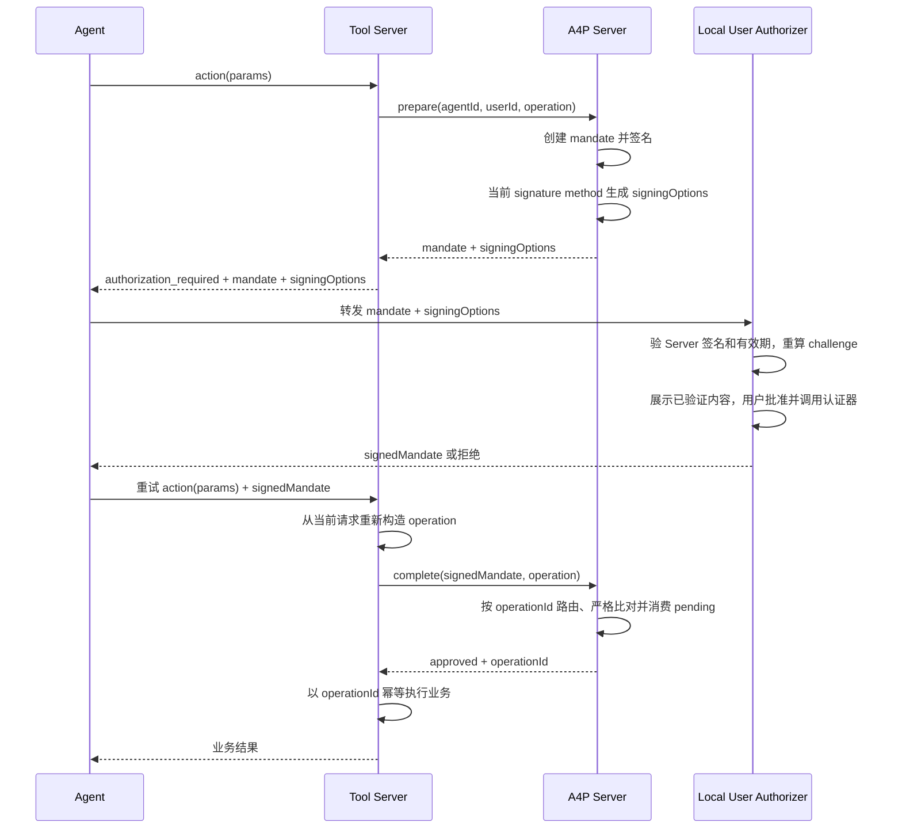
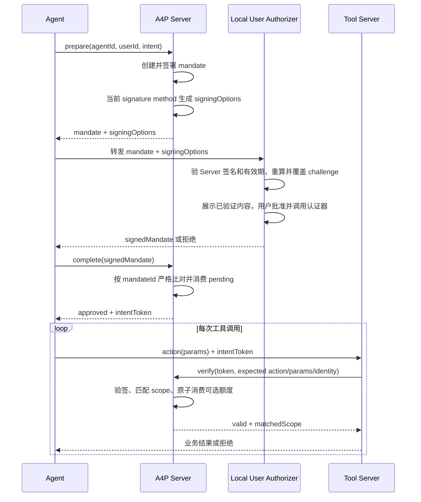

# A4P 协议

本文定义 A4P 的角色、授权对象、流程和安全验证规则。安装与运行见 [README.md](README.md)，Python SDK 实现边界见 [A4P_SDK_DESIGN.md](A4P_SDK_DESIGN.md)。

## 1. 协议模型

A4P 在 Agent 执行敏感操作前建立用户授权边界：

- **Operation Authorization**：一次批准一个精确的 `action` + `params`，成功 complete 后消费 pending。
- **Intent Authorization**：一次批准一组 `action` 和参数约束，成功 complete 后签发可复用的 intent token。

## 2. 协议角色

### Agent

Agent 发起工具调用，并编排 Intent 授权流程。它同时负责在各组件之间转发授权消息。

### A4P Server

A4P Server 是统一的授权服务。它生成 Mandate，验证用户批准，并根据授权类型完成一次性 Operation 授权或签发/验证 Intent Token。

### User Authorizer

User Authorizer 是用户设备上的本地授权组件。它验证 A4P Server 签署的 Mandate，向用户展示授权内容，并在用户同意后完成本地签名。

### Tool Server / MCP Server

Tool Server 执行实际业务操作。Operation 模式下，它根据当前调用申请并完成授权；Intent 模式下，它在每次执行前请求 A4P Server 验证 Token。只有 A4P Server 返回授权有效时，Tool Server 才执行业务。

## 3. 操作授权（Operation Authorization）

操作授权使用精确操作对象：

```json
{"action":"delete_note","params":{"note_id":"note-1"}}
```

### 流程



Prepare 请求包含 `agentId`、`userId`、`operation`，以及可选的 `validitySeconds`、`agentPublicKey` 和外部 `metadata`。响应一次返回：

```json
{
  "mandate": {
    "type": "a4p/v1/operation-mandate",
    "operationId": "op_<32-byte-random>",
    "server": "local://a4p",
    "subject": {"type": "agent", "id": "agent:demo-agent"},
    "operation": {"action": "delete_note", "params": {"note_id": "note-1"}},
    "validTime": {"until": "2026-07-22T04:00:00Z"},
    "userAuthorization": {
      "required": true,
      "signatureMethod": "webauthn",
      "methodPolicy": {"userVerification": "required"}
    },
    "displayText": "授权执行 delete_note(note_id=\"note-1\")（有效期至 ...）",
    "signatures": {
      "server": {"alg": "EdDSA", "keyId": "server#operation-mandate-k1", "signature": "..."},
      "user": {}
    }
  },
  "signingOptions": {
    "signatureMethod": "webauthn",
    "methodOptions": {
      "challenge": "...",
      "rpId": "localhost",
      "allowCredentials": [{"id": "...", "type": "public-key"}],
      "userVerification": "required"
    }
  }
}
```

Complete 请求为 `{"signedMandate": {...}, "operation": {...}}`。

A4P Server 从 submitted mandate 提取 `operationId` 用于 pending 路由，然后必须验证：当前 operation 等于 prepare operation；submitted mandate 等于 pending 中的 Server-signed mandate，仅允许新增 `signatures.user`；用户签名、Server 签名和有效期均合法。成功后先消费 pending，再返回 `operationId`。业务系统仍须用该 ID 实现持久化幂等。

## 4. 意图授权（Intent Authorization）

Intent 使用 action 白名单、参数约束和可选执行策略：

```json
{
  "actions": [
    {"name": "delete_note", "params": {"note_id": "note-*"}, "allowExtraParams": false}
  ],
  "executionPolicy": {"maxExecutions": 10}
}
```

参数约束中，`"*"` 允许任意参数；`{}` 不允许参数；对象字段值可为精确值、`"*"` 或大小写敏感 glob。对象默认拒绝未声明字段，除非设置 `allowExtraParams: true`。多个同名 action 按 OR 匹配。

### 流程



Prepare 响应与 Operation 一样一次返回 `mandate + signingOptions`。Intent mandate 使用高熵 `mandateId`，完整 `intent`、有效期、用户授权策略和最终 `displayText` 都进入 Server 签名。

Complete 请求仅为 `{"signedMandate": {...}}`。

成功 complete 后签发的 token 通过 `mandateId` 引用来源授权，并复制 subject、user、intent、有效期和执行策略。Tool Server 提交 token 及当前 `action + params`；A4P Server 验证 token 签名、有效期、身份绑定和范围。若存在 `maxExecutions`，所有无状态检查成功后必须原子消费一次额度；存储不可用时 fail closed。

## 5. 签名与 Challenge 规范

A4P 的授权证明分为两层：

- **Server 签名**：A4P Server 使用 Ed25519 签署 Mandate，证明其来源并防止内容被篡改。
- **用户确认**：证明用户批准了这份 Mandate，可使用 WebAuthn、Ed25519，或在明确配置后不使用加密签名。

### 5.1 Server 签名

Server 签名覆盖 Mandate 的全部授权内容，包括：

- Mandate 类型和 `mandateId` / `operationId`；
- Server、Agent、完整 Intent 或 Operation；
- 有效期和用户签名策略；
- 最终展示给用户的 `displayText`。

签名前，JSON 必须先规范化：对象键按字典序排列、移除无意义空白、使用 UTF-8，并拒绝 `NaN` 和无穷值。`signatures` 不进入 Server 签名输入。

### 5.2 用户确认方式

| 方式 | 用户设备上的操作 | A4P Server 的验证 |
| --- | --- | --- |
| WebAuthn | 使用 WebAuthn 签名载体完成用户验证并产生 assertion。 | 验证 challenge、RP ID、origin、credential 归属、用户验证和签名。 |
| Ed25519 | 使用调用方管理的 Ed25519 私钥签署 canonical payload。 | 按 `credentialId` 读取已注册的 OKP JWK 并验签。 |
| 无需加密签名 | `signatures.user` 保持为空。 | 仅在 Server 显式配置 `require_user_signature=false` 时接受。 |

无论采用哪种方式，User Authorizer 都必须先验证 Server 签名，再向用户展示授权内容。无需加密签名只表示没有用户私钥证明，不会跳过 Server 签名或 Mandate 校验。

### 5.3 WebAuthn Challenge

当使用 WebAuthn 作为签名方式时，签名的对象是一个 Challenge，即 Server-signed Mandate 的 SHA-256 摘要：

```text
webauthnChallenge = SHA256(
  UTF8(canonical_json({
    "scope": "a4p/v1/user-authorization",
    "mandate": serverSignedMandateWithoutUserSignature
  }))
)
```

其中 `serverSignedMandateWithoutUserSignature` 包含完整 Mandate 和 `signatures.server`，但不包含 `signatures.user`。

这样可以保证：

- 修改授权内容、展示文本、授权 ID 或 Server 签名，challenge 都会改变；
- 用户签名不参与自身 challenge 的计算，避免循环依赖。

SHA-256 的原始 32 字节直接交给 WebAuthn。通过 JSON 传递时，使用无填充 base64url 编码。

### 5.4 验证职责

User Authorizer 在用户确认前：

1. 使用本地信任公钥验证 Server 签名；
2. 检查 Mandate 有效期和签名策略；
3. 从 Mandate 派生 challenge，并写入 WebAuthn options；
4. 展示已验证的内容，用户同意后才调用认证器。

A4P Server 在 complete 时从 pending Mandate 重新派生同一个 challenge，并用它验证 WebAuthn assertion。Ed25519 对同一 canonical JSON 直接签名。

### 5.5 签名载体与凭据注册

一个 `A4PServer` 实例只配置一个 `A4PUserSignatureMethod`，当前内置 `ed25519` 和 `webauthn` 两种签名方法。Mandate 使用 `signatureMethod` 和 `methodPolicy`，用户签名统一使用：

```json
{
  "signatureMethod": "ed25519",
  "credentialId": "cred_xxx",
  "proof": {"alg": "EdDSA", "signature": "..."}
}
```

凭据注册时，Ed25519 使用一次注册接口提交 `userId + OKP JWK + metadata`；Server 生成随机 credential ID，同用户同公钥幂等，跨用户冲突返回 `CREDENTIAL_KEY_CONFLICT`。WebAuthn 保留 options/verify 两阶段注册。注册接口的认证、登录态、CSRF 和防滥用应由额外的部署层负责。

## 6. HTTP 端点

所有端点使用 JSON `POST`：

| 端点 | 调用方 | 作用 |
| --- | --- | --- |
| `/a4p/v1/operation-authorizations/prepare` | Tool Server | 创建 Operation pending，返回 mandate 和 signing options。 |
| `/a4p/v1/operation-authorizations/complete` | Tool Server | 验证并消费 Operation pending。 |
| `/a4p/v1/intent-authorizations/prepare` | Agent | 创建 Intent pending，返回 mandate 和 signing options。 |
| `/a4p/v1/intent-authorizations/complete` | Agent | 验证并消费 Intent pending，签发 token。 |
| `/a4p/v1/intent-tokens/verify` | Tool Server | 验证 token 与当前调用。 |
| `/a4p/v1/user-credentials/ed25519/register` | 凭据注册客户端 | 一次注册 Ed25519 OKP JWK。 |
| `/a4p/v1/user-credentials/webauthn/register/options` | 凭据注册客户端 | 获取注册 options 并转发给 User Authorizer。 |
| `/a4p/v1/user-credentials/webauthn/register/verify` | 凭据注册客户端 | 转发 registration credential，由 Server 验证并保存。 |

调用与当前实例载体不匹配的注册接口返回 HTTP 409、`SIGNATURE_METHOD_NOT_ENABLED`。当前用户没有已注册凭据时，prepare 返回 `USER_CREDENTIAL_NOT_REGISTERED` 且不创建 pending。JSON credential store 使用 `schemaVersion: 2`。
