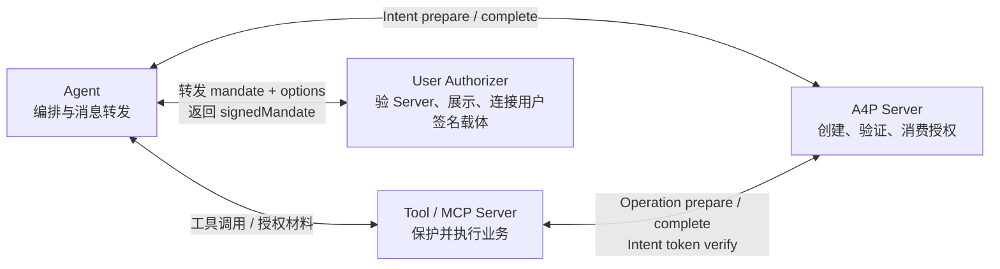
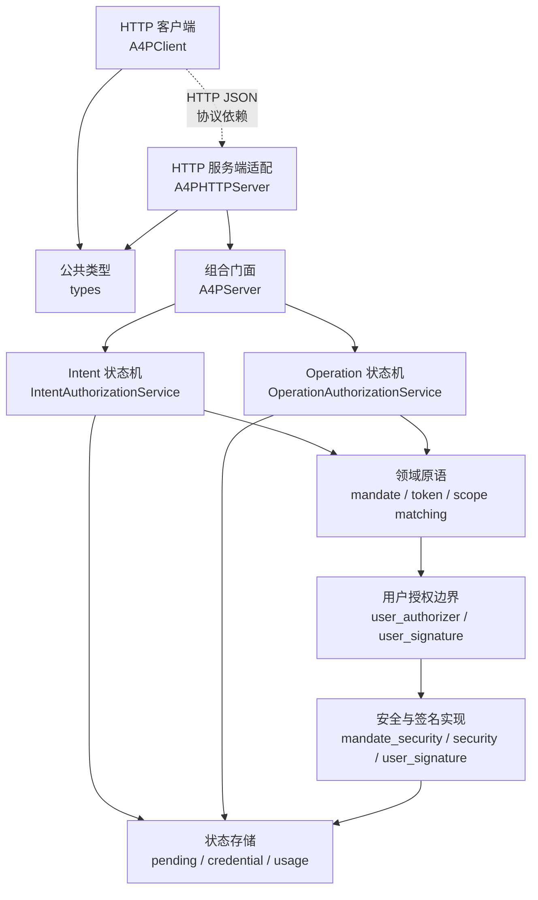
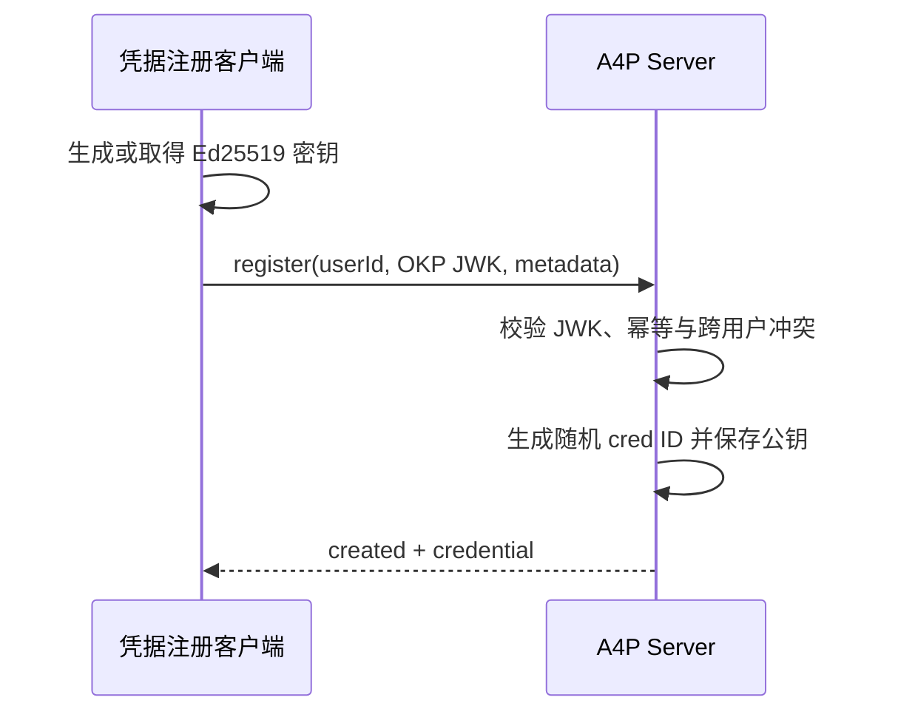
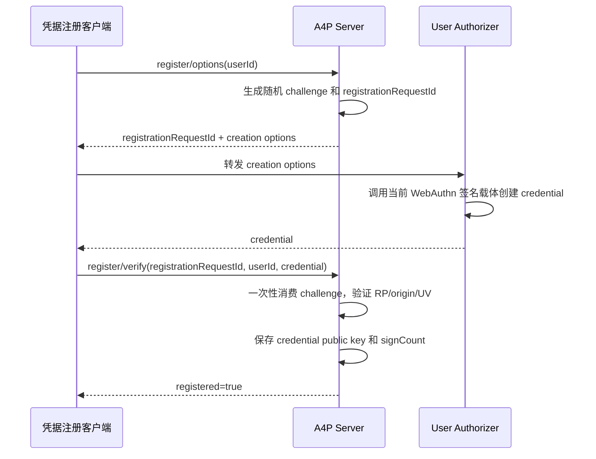
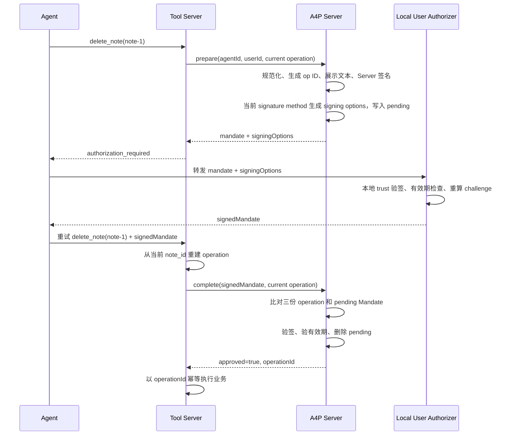
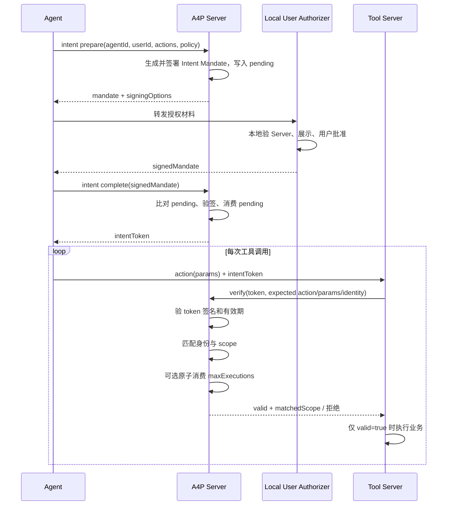

# A4P Python SDK 架构、接口与测试说明

本文以仓库当前代码为准，介绍 A4P Python SDK 的架构、接口与测试。协议说明见 [A4P_PROTOCOL.md](A4P_PROTOCOL.md)，简介及演示入口见 [README.md](README.md)。

## 1. 一句话理解 A4P

A4P 在 Agent 和敏感业务操作之间增加一个用户授权边界：A4P Server 先生成不可篡改的 Mandate（授权对象），本地 User Authorizer 验证并让用户批准，A4P Server 再决定本次操作是否放行，或签发一个可复用的 Intent Token。

当前 SDK 有两种授权模型：

| 模型 | 授权粒度 | 授权成功后的产物 | 是否可复用 | 典型场景 |
| --- | --- | --- | --- | --- |
| Operation Authorization | 精确的一个 `action + params` | `operationId` | 否，complete 成功即消费 | 删除指定笔记、支付指定订单 |
| Intent Authorization | 一组 action、参数约束及可选执行次数 | `intentToken` | 是，在有效期和额度内复用 | 批量处理同类对象、连续调用工具 |

测试时最重要的三条安全原则是：

1. Agent 只负责转发，不是可信授权判断方。
2. Mandate 的授权内容、展示文本和签名策略都受 Server 签名保护。
3. Tool Server 必须使用“当前业务请求”重新构造待执行操作，不能直接信任 Agent 或 Mandate 反向提供的业务参数。

## 2. 系统角色与仓库边界



| 角色 | 当前仓库中的对应实现 |
| --- | --- |
| Agent | `examples/note_mcp_a4p/agent_simulator.py` |
| A4P Server | `A4PServer`、`A4PHTTPServer`、Intent/Operation service |
| User Authorizer | `A4PUserAuthorizer` 协议及浏览器演示实现；内部连接 WebAuthn、Ed25519 或其他用户签名载体 |
| Tool Server | `examples/note_mcp_a4p/note_mcp_server.py` |


## 3. 仓库代码整体架构

### 3.1 目录结构

```text
A4P/
├── src/a4p/
│   ├── __init__.py                 # 根包公开导出
│   ├── types.py                    # wire 类型、请求/响应 dataclass
│   ├── server.py                   # A4PServer 组合根和进程内门面
│   ├── client.py                   # async HTTP client
│   ├── http_server.py              # 最小 JSON HTTP server
│   ├── errors.py                   # 稳定协议错误
│   ├── authorization_common.py     # 两类授权 service 的共享内部逻辑
│   ├── mandate_security.py         # 本地信任、Server 验签、challenge 派生
│   ├── user_authorizer.py          # 用户授权边界和签署辅助函数
│   ├── user_signature/
│   │   ├── __init__.py             # 用户签名公共导出
│   │   ├── contracts.py            # SignatureMethod / UserSigner 协议
│   │   ├── ed25519.py              # Ed25519 注册、签名和验签
│   │   └── webauthn.py             # WebAuthn 注册、签名和验签
│   ├── credential_store.py         # 通用 credential registry
│   ├── security.py                 # Ed25519 密钥和签验名基础函数
│   ├── intent/
│   │   ├── mandate.py              # Intent Mandate 原语
│   │   ├── scope.py                # Intent scope 规范化和参数匹配
│   │   ├── signing.py              # Intent Server 签名配置
│   │   ├── token.py                # Intent Token 原语
│   │   ├── service.py              # Intent prepare/complete/verify 状态机
│   │   └── usage_store.py          # Token 执行额度存储
│   └── operation/
│       ├── mandate.py              # Operation Mandate 原语
│       ├── signing.py              # Operation Server 签名配置
│       └── service.py              # Operation prepare/complete 状态机
├── tests/
│   ├── unit/                       # 单元测试
│   ├── integration/                # 状态机和 HTTP 集成测试
│   └── examples/                   # 示例组件测试
├── examples/ed25519_authorization.py
├── examples/note_mcp_a4p/
│   └── user_authorizer_assets/     # 授权器 HTML/CSS/JavaScript
├── A4P_PROTOCOL.md                 # 协议说明
└── A4P_SDK_DESIGN.md               # 本文
```

### 3.2 分层与依赖关系



## 4. 各模块的功能与关键接口

### 4.1 公共类型与导出

#### `src/a4p/types.py`

Mandate 和 Token 使用 `TypedDict` 描述，运行时仍是普通 JSON `dict`。请求/响应使用 `frozen=True` 的 dataclass。所有 wire 字段保持 `camelCase`。

| 类型 | 核心字段 | 用途 |
| --- | --- | --- |
| `IntentMandate` | `mandateId`、`subject`、`intent`、`validTime`、`userAuthorization`、`displayText`、`signatures` | 表达可复用意图授权 |
| `OperationMandate` | `operationId`、`subject`、`operation`、`validTime`、`userAuthorization`、`displayText`、`signatures` | 表达单次精确操作授权 |
| `IntentToken` | `tokenId`、`mandateId`、`subject`、`user`、`intent`、`expireAt`、`signature` | 承载授权后的可复用权限 |
| `VerificationResult` | `valid`、`reason`、`code`、`matchedScope` | 统一表达领域验证结果 |
| `UserAuthorizationRequest` | `mandate`、`signingOptions` | Agent 转发给本地授权器 |
| `UserAuthorizationResponse` | `approved`、`signedMandate`、拒绝信息 | 本地授权器返回给 Agent |

`to_payload()` 递归把 dataclass、字典和列表转换为可 JSON 序列化对象，并删除值为 `None` 的字段。

#### `src/a4p/__init__.py`

根包导出面向集成方的常用类型、`A4PServer`、`A4PClient`、存储实现、本地信任和用户授权辅助函数。`A4PHTTPServer` 没有从根包导出，需要从 `a4p.http_server` 导入。

### 4.2 组合门面与 HTTP 传输层

#### `src/a4p/server.py`

`A4PServer` 是主要调用入口。构造时完成以下组合：

1. 接收当前实例唯一的 `A4PUserSignatureMethod`；
2. 创建 Intent 和 Operation 两个 service；
3. 为两个 service 注入同一个 signature method；
4. 为 Intent service 注入 token usage store。

主要构造参数：

| 参数 | 默认值 | 测试关注点 |
| --- | --- | --- |
| `server_id` | `local://a4p` | 写入 Mandate，并用于本地 trust store 查找 |
| `user_signature_method` | `None` | 签名启用时必须显式传入；单实例只启用一种方法 |
| `require_user_signature` | `True` | 为 `False` 时 method 可为空，用户签名和 signing options 均为空 |
| `intent_token_usage_store` | `SQLiteIntentTokenUsageStore` | 有执行策略时原子消费额度 |
| `*_display_text_renderer` | `None` | 自定义文本必须在 Server 签名前生成 |

内置 method 为 `RegisteredEd25519Method` 和 `WebAuthnSignatureMethod`。WebAuthn 的 RP ID、RP name 和 origin 配置属于 `WebAuthnSignatureMethod`。

#### `src/a4p/client.py`

`A4PClient` 为所有 A4P HTTP 端点提供 async 方法。底层使用标准库 `urllib`，通过 `asyncio.to_thread()` 避免阻塞事件循环。

- 默认地址：`A4P_SERVER_BASE_URL`，未配置时为 `http://127.0.0.1:8961`；
- 默认超时：`A4P_HTTP_TIMEOUT_S`，未配置时为 300 秒，最小 1 秒；
- HTTP 非 2xx 或连接失败会转换为 `RuntimeError`；
- 领域拒绝通常仍是 HTTP 200，由响应中的 `approved`、`valid`、`verificationResult` 表达。
- `register_ed25519_credential()` 调用一次交互的 Ed25519 公钥注册接口。

#### `src/a4p/http_server.py`

`A4PHTTPServer` 基于 `asyncio.start_server()` 实现最小 HTTP/1.1 JSON POST server：

- `start()` / `stop()` 管理监听；
- `_dispatch_checked()` 把路径转发到 `A4PServer`；
- 非 POST 返回 405，未知路径返回 404；
- endpoint 抛出的普通 `ValueError` 返回 400；稳定协议冲突返回 409；未处理异常返回 500；
- 默认监听 `A4P_SERVER_HOST=127.0.0.1`、`A4P_SERVER_PORT=8961`。

它适用于本地集成和演示，不包含生产级 TLS、认证、限流、请求体上限或完整 HTTP 协议治理。

### 4.3 意图授权

#### `src/a4p/intent/mandate.py`

负责：

- 生成 `mdt_` 前缀的 32 字节随机 ID；
- 生成默认 3600 秒有效期和中文 `displayText`；
- 使用 Ed25519 给 Mandate core 添加 Server 签名；
- 验证 Server 签名、用户签名、Server ID 和有效期；
- 构建算法无关的 `UserSignatureContext`。

#### `src/a4p/intent/scope.py`

集中定义 `actions`、`params`、`allowExtraParams` 和 `executionPolicy` 的规范化与匹配。Mandate 和 Token 共同依赖该模块，不再通过 `intent.mandate` 的私有函数共享实现。

#### `src/a4p/intent/signing.py`

集中定义 Intent Mandate/Token 共用的 Server Ed25519 密钥来源、算法和 key ID。Token 不再跨模块导入 Mandate 的私有 `_server_signing_key()`。

Intent action 约束规则：

| 声明 | 语义 |
| --- | --- |
| `params: "*"` | 允许任意参数集合 |
| `params: {}` | 不允许任何参数 |
| 字段值为 `"*"` | 该字段允许任意值，但字段仍必须存在 |
| 字符串如 `note-*`、`*.md` | 大小写敏感的 glob 匹配 |
| 其他值 | Python 相等性精确匹配 |
| `allowExtraParams: false` | 默认拒绝未声明参数 |
| `allowExtraParams: true` | 可有额外参数，但已声明字段仍必须匹配 |

当前 `executionPolicy` 只规范化并支持 `maxExecutions` 正整数。未知策略字段会被忽略；显式提供 `executionPolicy` 却没有合法 `maxExecutions` 会拒绝 prepare。

#### `src/a4p/intent/token.py`

负责：

- 从已验证的 Intent Mandate 签发 `a4p/v1/intent-token`；
- 复制 subject、agent key、user、intent、有效期和执行策略；
- 验证 token 类型、算法、keyId、签名、有效期和身份绑定；
- 用 `params_match_intent_token()` 匹配 action/params；
- 同名 action 有多个约束时按 OR 语义逐个尝试。

注意：模块级 `verify_intent_token()` 只做无状态验证，不会消费 `maxExecutions`。需要执行额度语义时必须调用 `A4PServer.verify_intent_token()`。

#### `src/a4p/intent/service.py`

`IntentAuthorizationService` 维护 `_pending[mandateId]`，提供：

- `prepare()`：校验请求、创建并签署 Mandate、生成 signing options、最后写入 pending；
- `complete()`：按 submitted `mandateId` 查 pending，严格比对 Mandate，验签成功后删除 pending 并签发 token；
- `verify_token()`：先无状态验 token 和 scope，再原子消费可选执行额度；
- `_consume_token_usage()`：把使用量写入可替换 usage store，存储失败时 fail closed。

#### `src/a4p/intent/usage_store.py`

`A4PIntentTokenUsageStore.consume()` 要求原子完成“检查上限并递增”。默认 `SQLiteIntentTokenUsageStore` 使用 `BEGIN IMMEDIATE`，支持同一普通文件系统上的多进程竞争；同时清理过期记录，并检查数据库中保存的上限、过期时间是否仍与签名 token 一致。

### 4.4 操作授权

#### `src/a4p/operation/mandate.py`

负责：

- 规范化精确 `operation = {action, params}`；
- 生成 `op_` 前缀的 32 字节随机 ID；
- 生成默认 300 秒有效期和展示文本；
- 对 Operation Mandate core 添加 Server 签名；
- 验证 operation、Server 签名、用户签名和有效期。

Operation 不支持通配符 scope 语义。`params` 作为完整字典进行精确比较。

#### `src/a4p/operation/signing.py`

集中定义 Operation Mandate 的 Server signing key、算法、key ID 和公开 trust entry。Operation service 使用 `verify_operation_mandate_for_completion()`，不再依赖下划线私有验证函数。

#### `src/a4p/operation/service.py`

`OperationAuthorizationService` 维护 `_pending[operationId]`：

- `prepare()` 在创建新授权前清理已过期 pending；
- pending 保存原始请求、规范化 operation、Server-signed Mandate 和过期时间；
- `complete()` 要求同时提供 `signedMandate` 和 Tool Server 从当前请求重建的 `operation`；
- complete 严格比较 prepare operation、当前 operation、pending Mandate、submitted Mandate 内 operation；
- 全部验证成功后删除 pending，返回 `operationId`；
- 重放、进程重启后丢失 pending、过期 pending 都按未授权关闭。

SDK 保证同一进程内一个 pending 最多 complete 成功一次，但不保证授权消费和外部业务写入构成分布式事务。

### 4.5 用户授权与签名扩展点

#### `src/a4p/user_signature/contracts.py`

定义两个职责不同、运行位置不同的 Protocol：

```python
class A4PUserSigner(Protocol):
    signature_method: str
    def sign(self, context, *, signing_input=None) -> dict: ...

class A4PUserSignatureMethod(Protocol):
    signature_method: str
    def method_policy(self) -> dict: ...
    def signing_options(self, *, user_id, mandate) -> dict: ...
    def verify(self, context, signature) -> tuple[bool, str]: ...
```

二者区别：

| 接口 | 运行位置 | 是否接触私钥 | 主要职责 |
| --- | --- | --- | --- |
| `A4PUserSigner` | User Authorizer / 用户设备侧 | 是，或调用持有私钥的签名载体 | 根据 Mandate 和本地签名输入生成 `signatures.user` proof |
| `A4PUserSignatureMethod` | A4P Server 侧 | 否，只使用已注册公钥 | 声明方法策略、选择当前用户凭据、生成 signing options、验证 proof |

可以把 SignatureMethod 理解为“服务端验签与 credential 策略”，把 UserSigner 理解为“用户侧签名驱动”。它们通过 `signatureMethod + credentialId + proof` wire format 配对，但彼此不直接调用。

`UserSignatureContext` 只包含完整 Server-signed Mandate、`signatureMethod` 和 expected user。Ed25519 直接签署通用 canonical payload；WebAuthn 使用同一 payload 的 SHA-256 作为 challenge。显式无签名模式要求 `signatures.user={}`，不再使用 `alg=none`。

#### `src/a4p/user_authorizer.py`

- `A4PUserAuthorizer.authorize()`：设备/UI 侧的高层授权协议；
- `verify_local_user_authorization_request()`：展示前验证本地 trust、有效期、`signatureMethod` 并硬化 signing options；
- `sign_user_mandate_with_signer()`：Ed25519 和 WebAuthn 共用签署入口；
- `approve_user_mandate()`：显式无签名测试模式，保持用户签名为空；
- `ApprovingA4PUserAuthorizer` / `RejectingA4PUserAuthorizer`：测试辅助实现。

### 4.6 本地 Mandate 安全

#### `src/a4p/mandate_security.py`

- `canonical_json()`：排序 key、压缩空白、保留 UTF-8、拒绝 NaN；
- `StaticA4PServerTrustStore`：按 `serverId + keyId` 固定 Ed25519 公钥；
- `verify_trusted_server_mandate()`：只使用本地 trust anchor 验证 Server；
- `derive_user_authorization_challenge()`：从通用用户签名 payload 派生 SHA-256；
- `verify_mandate_valid_time()`：本地 fail-closed 有效期检查；
- `mandate_identifier()`：统一提取 `mandateId` 或 `operationId`。

通用用户签名 payload 的 scope 为 `a4p/v1/user-authorization`，包含 Mandate core 和 `signatures.server`，不包含 `signatures.user`。因此修改授权内容、展示文本、ID 或 Server 签名都会使 Ed25519 签名失效，也会改变 WebAuthn challenge。

本地 User Authorizer 必须按以下顺序处理：

1. 从本地 trust store 解析 `serverId + keyId`；
2. 验证 Server 签名；
3. 检查有效期、`signatureMethod` 和签名策略；
4. 重新派生 challenge；
5. 覆盖 Agent 转发的 `signingOptions.methodOptions.challenge`；
6. 强制 `userVerification=required`；
7. 验证成功后才展示 UI、调用认证器。

#### `src/a4p/security.py`

提供 Ed25519 私钥加载、签名、验签和公钥编码。私钥可用 PEM、base64url、`base64:` 或 `hex:` 配置。开发环境未配置密钥时会使用确定性开发 key 并记录 `CRITICAL/HIGH RISK`；生产环境检测到缺失或内置默认 key 时直接拒绝。

### 4.7 用户签名方法与存储

#### `src/a4p/user_signature/webauthn.py`

`WebAuthnSignatureMethod` 承担 A4P Server 侧三类工作：

1. 生成 registration options，并以随机 `registrationRequestId` 保存一次性 challenge；
2. 验证注册 credential 并写入 credential store；
3. 生成 authentication options，验证 assertion、RP ID、origin、用户归属和 sign count。

`WebAuthnUserSigner` 位于 User Authorizer 侧，只把浏览器 assertion 封装为统一的 `signatures.user`。

#### `src/a4p/user_signature/ed25519.py`

`RegisteredEd25519Method` 校验并登记 OKP JWK、生成允许使用的 credential ID 列表并验签。`Ed25519UserSigner` 使用调用方管理的私钥签署 canonical payload；SDK 不持久化或解锁生产私钥。

#### `src/a4p/credential_store.py`

`A4PCredentialStore` 提供 `save()`、`get()`、`list_for_user()`、`list_all()`。record 使用通用字段 `userId`、`credentialId`、`signatureMethod`、`publicKey`、`details`、`metadata`、`createdAt`；WebAuthn sign count 通过替换 record 更新。

| 实现 | 适用范围 | 主要限制 |
| --- | --- | --- |
| `InMemoryCredentialStore` | 单进程测试 | 重启丢失 |
| `JsonFileCredentialStore` | 本地 demo | schema v2；不是生产级并发存储 |


## 5. 对外接口总览

### 5.1 Python 与 HTTP 接口映射

所有 HTTP endpoint 都使用 JSON `POST`。

| Python 方法 | HTTP endpoint | 主要调用方 | 请求关键字段 | 成功结果 |
| --- | --- | --- | --- | --- |
| `prepare_intent_authorization()` | `/a4p/v1/intent-authorizations/prepare` | Agent | `agentId`、`userId`、`intent` | `mandate + signingOptions` |
| `complete_intent_authorization()` | `/a4p/v1/intent-authorizations/complete` | Agent | `signedMandate` | `approved + intentToken` |
| `verify_intent_token()` | `/a4p/v1/intent-tokens/verify` | Tool Server | `token`、`expected` | `valid + matchedScope` |
| `prepare_operation_authorization()` | `/a4p/v1/operation-authorizations/prepare` | Tool Server | `agentId`、`userId`、`operation` | `mandate + signingOptions` |
| `complete_operation_authorization()` | `/a4p/v1/operation-authorizations/complete` | Tool Server | `signedMandate`、当前 `operation` | `approved + operationId` |
| `register_ed25519_credential()` | `/a4p/v1/user-credentials/ed25519/register` | 凭据注册客户端（生产环境要求强登录态） | `userId`、OKP JWK、可选 metadata | `created + credential` |
| `webauthn_registration_options()` | `/a4p/v1/user-credentials/webauthn/register/options` | 凭据注册客户端（生产环境要求强登录态） | `userId`、可选用户名 | `registrationRequestId + options` |
| `verify_webauthn_registration()` | `/a4p/v1/user-credentials/webauthn/register/verify` | 凭据注册客户端（生产环境要求强登录态） | `registrationRequestId`、`userId`、`credential` | `registered + credential` |

Prepare 请求还支持可选的 `validitySeconds`、`agentPublicKey` 和 `metadata`。声明的 dataclass 不包含 `server`；虽然当前 service 对原始字典中的 `server` 有兼容读取逻辑，集成和测试不应把它当成稳定公开字段，Server 身份应由 `A4PServer.server_id` 决定。

Ed25519 注册不要求 PoP：同用户同公钥幂等，跨用户复用同一公钥返回 HTTP 409、`CREDENTIAL_KEY_CONFLICT`。调用与实例 method 不匹配的注册接口返回 HTTP 409、`SIGNATURE_METHOD_NOT_ENABLED`。注册接口的认证、CSRF 和防滥用由部署层负责。

### 5.2 关键请求/响应示例

Intent prepare：

```json
{
  "agentId": "demo-agent",
  "userId": "demo-user",
  "intent": {
    "actions": [
      {
        "name": "delete_note",
        "params": {"note_id": "note-*"},
        "allowExtraParams": false
      }
    ],
    "executionPolicy": {"maxExecutions": 2}
  },
  "validitySeconds": 600
}
```

Intent complete：

```json
{"signedMandate": {"type": "a4p/v1/intent-mandate", "...": "..."}}
```

Intent token verify：

```json
{
  "token": {"type": "a4p/v1/intent-token", "...": "..."},
  "expected": {
    "action": "delete_note",
    "params": {"note_id": "note-1"},
    "agentId": "agent:demo-agent",
    "userId": "demo-user",
    "agentKeyId": "agent-key-1"
  }
}
```

Operation prepare：

```json
{
  "agentId": "demo-agent",
  "userId": "demo-user",
  "operation": {
    "action": "delete_note",
    "params": {"note_id": "note-1"}
  },
  "validitySeconds": 300
}
```

Operation complete：

```json
{
  "signedMandate": {"type": "a4p/v1/operation-mandate", "...": "..."},
  "operation": {
    "action": "delete_note",
    "params": {"note_id": "note-1"}
  }
}
```

Mandate 中的用户签名策略统一为：

```json
{
  "required": true,
  "signatureMethod": "ed25519",
  "methodPolicy": {}
}
```

Signing options 和用户签名使用统一外层 envelope：

```json
{
  "signingOptions": {
    "signatureMethod": "ed25519",
    "methodOptions": {"allowedCredentialIds": ["cred_xxx"]}
  },
  "userSignature": {
    "signatureMethod": "ed25519",
    "credentialId": "cred_xxx",
    "proof": {"alg": "EdDSA", "signature": "..."}
  }
}
```

WebAuthn 的 `methodOptions` 保持原生 PublicKey request options，proof 为 `{"assertion": {...}}`。

### 5.3 常见验证结果码

| code | 典型触发条件 |
| --- | --- |
| `MANDATE_INVALID` | prepare 字段非法，或 submitted mandate 缺少必要字段 |
| `AUTHORIZATION_NOT_PENDING` | ID 未知、已过期、已消费、重放或服务重启丢失 pending |
| `MANDATE_PENDING_MISMATCH` | submitted mandate 与 prepare 时保存的内容不一致 |
| `OPERATION_INVALID` | complete 缺失或提交了非法当前 operation |
| `OPERATION_PENDING_MISMATCH` | 当前业务 operation 与 prepare operation 不一致 |
| `OPERATION_MANDATE_MISMATCH` | Mandate 内 operation 与当前 operation 不一致 |
| `MANDATE_SIGNATURE_INVALID` | Server/user 签名或签名算法不合法 |
| `MANDATE_EXPIRED` | Mandate 已过期 |
| `TOKEN_SIGNATURE_INVALID` | Token 签名或算法不合法 |
| `TOKEN_SCOPE_MISMATCH` | action、params 或身份绑定不匹配 |
| `TOKEN_USAGE_EXCEEDED` | `maxExecutions` 已耗尽 |
| `TOKEN_USAGE_STORE_ERROR` | usage store 不可用或状态不一致，按 fail closed 拒绝 |
| `USER_CREDENTIAL_NOT_REGISTERED` | 当前用户没有激活方法的 credential；prepare 不创建 pending |
| `SIGNATURE_METHOD_NOT_ENABLED` | 调用了非当前实例方法的注册接口 |
| `CREDENTIAL_KEY_CONFLICT` | 同一 Ed25519 公钥已注册给其他用户 |

部分 code 由 `authorization_common.error_code()` 根据 reason 文本映射。断言错误语义时优先检查稳定 code，同时保留对关键 reason 的校验。

## 6. 关键执行流程

### 6.1 Ed25519 凭据注册



生产环境必须由额外的部署层保护凭据注册接口。

### 6.2 WebAuthn 凭据注册



### 6.3 Operation 单次授权



完整成功路径中的 operation 有三份：prepare 保存的 operation、signed Mandate 内的 operation、complete 传入的当前 operation。任何一份不一致都必须拒绝。

成功 complete 先消费授权，再由业务侧执行。因此业务执行失败不会恢复授权。

### 6.4 Intent 授权和 Token 使用



额度只在所有无状态验证都成功后消费。没有 `executionPolicy` 的 token 不访问 usage store。

## 7. 状态、并发与故障语义

| 状态 | 索引 | 默认存储 | 生命周期和故障行为 |
| --- | --- | --- | --- |
| Intent pending | `mandateId` | service 内存字典 | complete 成功删除；重启丢失并拒绝 |
| Operation pending | `operationId` | service 内存字典 | 过期清理；complete 成功删除；并发只有一次成功 |
| Registration challenge | `registrationRequestId` | WebAuthn method 内存字典 | verify 时先 pop，一次性；重启丢失 |
| User credential | `credentialId` | 内存；demo 可用 schema v2 JSON | 通用 record；方法专属状态位于 `details` |
| Intent token usage | `tokenId` | SQLite | 原子检查并递增；跨同文件连接持久化 |
| Operation 业务结果 | `operationId` | SDK 不管理；demo 用内存字典 | 业务方负责幂等和结果缓存 |

多副本生产部署必须额外提供共享 pending、共享 credential 和共享 usage 存储。credential store 可以保存不同 `signatureMethod` 的记录，但当前 Server 实例只按已配置 method 筛选；SDK 尚未抽象 pending store。

## 8. 示例程序如何串起仓库模块

`examples/note_mcp_a4p` 提供一个笔记 MCP Server：`list_notes`、`get_note`、`add_note` 无需 A4P 授权，`delete_note` 需要 Operation Mandate 或 Intent Token。

| 文件 | 作用 |
| --- | --- |
| `run_authorization_server.py` | 用 `WebAuthnSignatureMethod` 启动 `A4PServer` 和 `A4PHTTPServer`，输出本地 trust 配置 |
| `run_user_authorizer.py` | 本地浏览器授权 service；在入队和展示前验证 Server-signed Mandate |
| `user_authorizer_assets/` | 独立 HTML 模板、CSS 和 WebAuthn JavaScript，由固定资源白名单提供 |
| `register_browser_key.py` | 演示显式 enrollment 和注册消息转发 |
| `note_mcp_server.py` | Tool Server；根据当前 `note_id` 构造 operation 或验证 intent token |
| `agent_simulator.py` | 模拟 Agent 转发 mandate、options、assertion 和 token |
| `smoke_test.py` | 无浏览器的端到端业务冒烟测试 |

此外，`examples/ed25519_authorization.py` 使用临时私钥演示一次 Ed25519 注册、prepare、签名和 complete。

Operation 模式第一次调用 `delete_note` 只返回 `authorization_required`，不删除笔记；第二次携带 signed Mandate 后，Tool Server 重新从当前 `note_id` 构造 operation，再调用 complete。

Intent 模式由 Agent 先取得 token，后续每次 `delete_note` 由 Tool Server 调用 `verify_intent_token()`，验证当前 note ID 是否落在 scope 内。

## 9. 现有自动化测试用例

当前 pytest 共 **126 个测试用例**。

### 9.1 `tests/unit/`

共 77 个测试用例，按领域拆分：

| 文件 | 用例数 | 验证内容 |
| --- | ---: | --- |
| `test_types_and_keys.py` | 4 | wire dict、默认 key 告警和生产 key 拒绝 |
| `test_client.py` | 6 | Client 默认值、HTTP/transport 错误和响应规范化 |
| `test_stores.py` | 7 | schema v2、旧格式拒绝及 SQLite usage 原子消费 |
| `test_intent_scope.py` | 5 | 通配符、glob、同名 action、额外参数和 scope 防篡改 |
| `test_intent_token_security.py` | 17 | Token 元数据、篡改、有效期、身份绑定和稳定 code |
| `test_mandate_security.py` | 6 | 随机 ID、本地 trust、Server 验签和 challenge 绑定 |
| `test_user_signatures_and_webauthn.py` | 32 | Server 配置、Ed25519 注册/授权、WebAuthn 回归、无签名模式 |

### 9.2 `tests/integration/`

共 46 个测试用例：

| 文件 | 用例数 | 验证内容 |
| --- | ---: | --- |
| `test_intent_authorization.py` | 23 | Intent prepare/complete、Token、额度、no-signature 和展示文本 |
| `test_operation_authorization.py` | 6 | Operation complete、重放、no-signature 和 WebAuthn |
| `test_operation_authorization_flow.py` | 10 | 三份 operation 比对、并发一次消费、过期和旧 API 移除 |
| `test_http.py` | 7 | HTTP 分发、真实 socket、Ed25519 注册、400/409 和生命周期 |

### 9.3 `tests/examples/`

共 3 个测试用例。`test_browser_user_authorizer.py` 验证独立授权器返回 signed Mandate、本地覆盖不可信 challenge、返回注册 credential，以及渲染页面只引用外部 JavaScript 而不再内嵌 WebAuthn 逻辑。

### 9.4 `examples/note_mcp_a4p/smoke_test.py`

该文件是独立运行的示例层业务冒烟测试，不计入上述 126 个 pytest 测试用例，覆盖：

1. Operation 用户签名后成功删除；
2. 当前 operation 参数与授权不一致时拒绝；
3. Intent Token 可删除多条笔记；
4. Intent action/params/身份约束不匹配时拒绝；
5. 首次无授权调用只返回 challenge，不执行业务。

## 10. 当前测试覆盖边界与建议补充

现有测试对状态机、防篡改、scope、额度、签名载体分流、注册和本地 challenge 绑定覆盖较完整；branch-aware 综合覆盖率为 **87%**，Ed25519 method 为 **100%**，WebAuthn method 为 **99%**。以下内容尚未形成完整自动化闭环：

- 真实浏览器/真实平台认证器的 WebAuthn E2E；当前多数 WebAuthn 用例通过 monkeypatch 或构造 assertion 验证分流边界；
- `A4PHTTPServer` 的超大 body、慢连接、并发压力和更完整的协议兼容性；
- 多主机/多副本下的共享 pending、credential 和 usage 一致性；
- `JsonFileCredentialStore` 多写进程竞争、任意文件损坏和原子落盘；
- 私钥轮换、多个 keyId 的灰度窗口和旧 token 验证策略；
- 生产 TLS、服务间认证、限流、审计落库和权限隔离；
- A4P 授权消费与业务事务之间的崩溃恢复、持久化幂等和补偿流程；
- fuzz/property-based 测试，例如深层 JSON、Unicode、极端 glob、NaN/Infinity 和 canonical JSON 边界。

建议测试串讲时明确区分：pytest 已验证的是 SDK 逻辑和本地集成边界，不等同于完整生产系统已经验证。

## 11. 本地验证命令

```bash
# 运行全部 pytest
uv run python -m pytest -q

# 静态检查
uv run --with ruff ruff check .

# branch-aware coverage
uv run --with pytest-cov python -m pytest --cov=a4p --cov-branch -q

# Python 编译检查
uv run python -m compileall -q src tests examples

# A4P + MCP 业务冒烟测试（需要 demo 依赖）
uv run --extra demo python examples/note_mcp_a4p/smoke_test.py
```

## 12. 生产接入前检查清单

- 配置独立 Ed25519 私钥，禁止生产环境使用内置开发 key；
- 通过受保护渠道预置 `serverId + keyId + publicKey`，不能接受 Agent 临时下发 trust key；
- 显式配置当前实例唯一的 user signature method；
- 使用强登录态保护 credential registration endpoint；
- WebAuthn 使用 HTTPS、真实 RP ID/origin；
- Ed25519 私钥由调用方的生产密钥系统管理，SDK 不负责持久化或解锁；
- 使用生产级共享 credential、pending 和 usage 存储；
- Tool Server 每次从当前请求构造 operation/expected scope；
- Operation complete 成功后以 `operationId` 做持久化幂等；
- 为 A4P Server 和 Tool Server 之间增加认证、网络保护、限流和审计；
- 把用户拒绝、授权验证、额度消费和业务执行结果写入外部审计系统。
