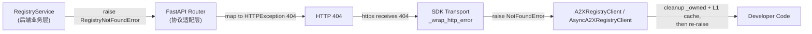
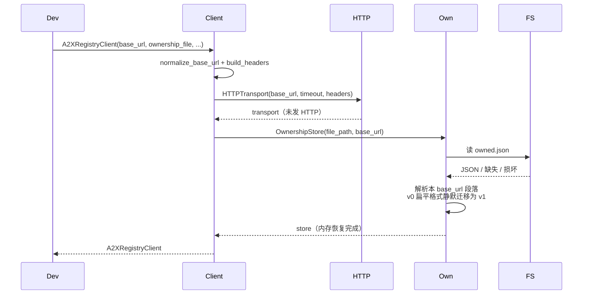
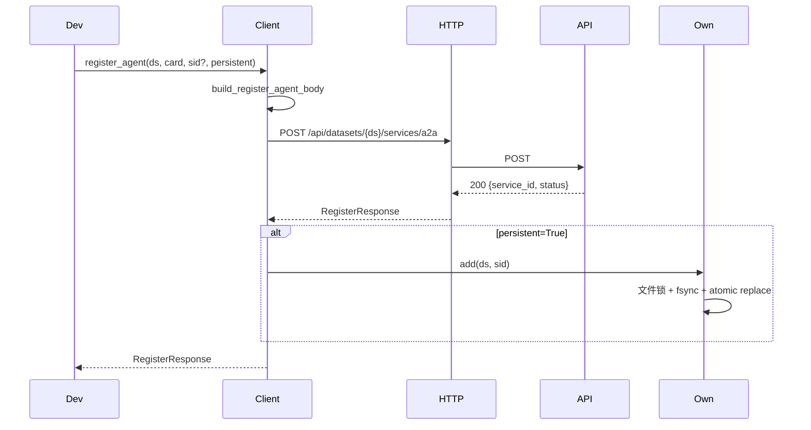
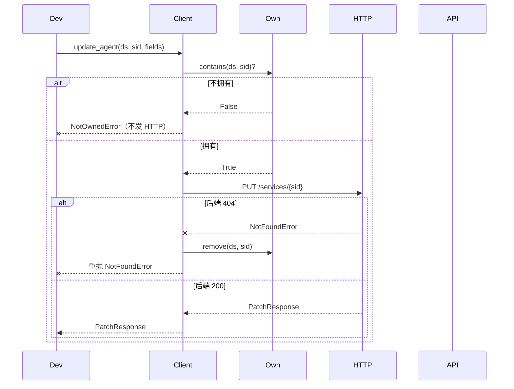
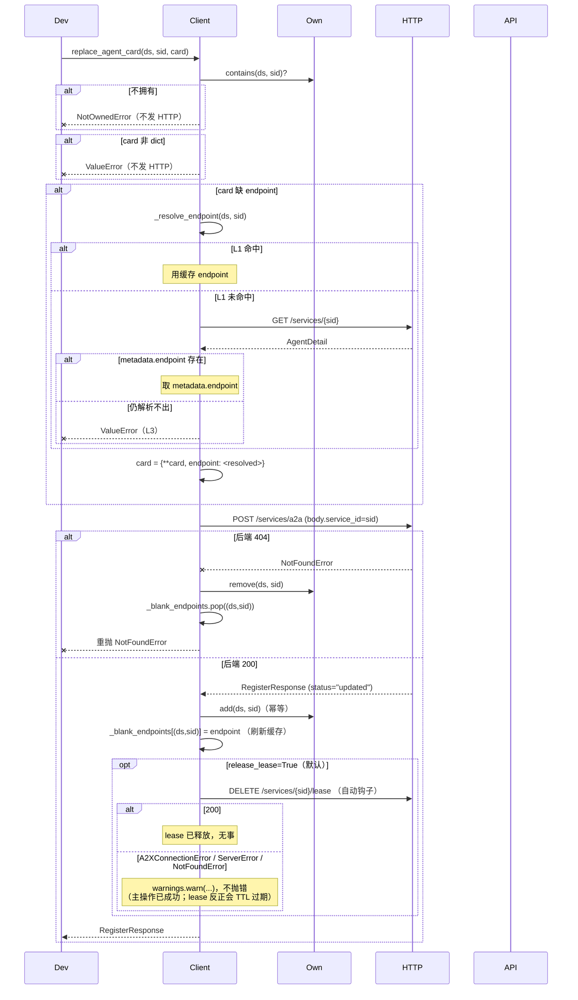
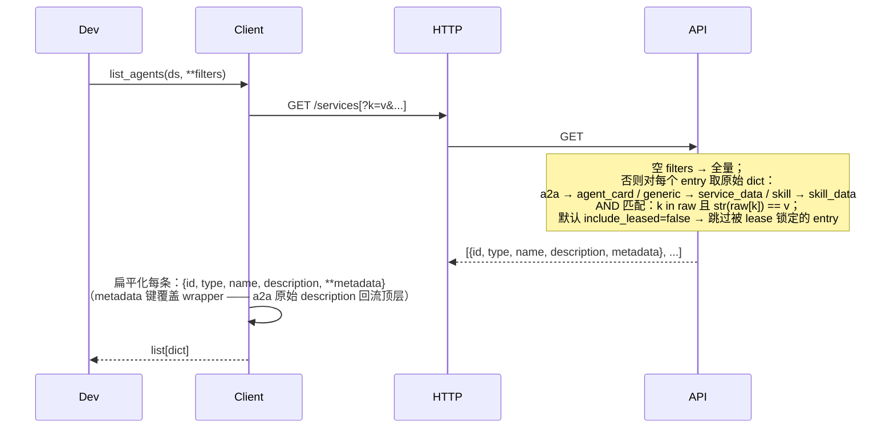

# A2X Registry Client SDK

A2X Registry 的 Python 客户端 SDK，把对 FastAPI 后端的 HTTP 请求包装成类型清晰、幂等安全的方法。

> Agent Team 动态组队的特化流程（空白 agent、空闲池、teammate/leader 协议）见独立文档 [README_agentteam.md](README_agentteam.md)。本文件只覆盖通用接口。

## 安装

从 GitCode 直接安装：

```bash
pip install "a2x-registry-client @ git+https://gitcode.com/openJiuwen/agent-protocol.git@develop#subdirectory=AgentRegistry/client"
```

Python ≥ 3.10，运行时仅依赖 `httpx`。

---

## 1. 整体介绍

A2X Registry 是面向 agent 与 agent-callable 服务的注册中心。Agent 把自己的能力（A2A agent card / generic service / skill）注册进 dataset；调用方按字段过滤发现，按 sid 读取详细信息，按需修改 / 注销自己的 entry，并可借助预约（reservation lease）机制对候选独占短时锁定。

本 SDK 是这一注册中心的 Python 客户端，把所有上述操作以类型安全、幂等友好的方法暴露：

- **同步 + 异步双入口**：`A2XRegistryClient`（`httpx.Client`）/ `AsyncA2XRegistryClient`（`httpx.AsyncClient`）。方法名、参数、返回类型、异常体系完全对称；async 版每个方法以 `async def` 定义，关闭方法为 `aclose()`。
- **本地 ownership 校验**：客户端记录"哪些 sid 是自己注册的"，并在 mutation（update / replace / deregister 等）前本地 fail-fast，避免误改他人的 entry。状态默认持久化到 `~/.a2x_registry_client/owned.json`。
- **可选鉴权 + 心跳**：注册中心支持 per-namespace 启用 API Key 鉴权与心跳保活，均为 opt-in。启用后 SDK 通过 `~/.a2x_registry_client/cli_token.json`（CLI 写入）或显式构造参数提供 token，并可让后台线程自动续约心跳。完整流程见 [§2 如何使用](#2-如何使用) 的三角色串联示例。
- **独立分发约束**：SDK 自包含，仅依赖 `httpx`（Python ≥ 3.10），不引用其他模块。使用 `from a2x_registry_client import ...`。

---

## 2. 如何使用

下面三节按 **admin → provider → user** 顺序串成一个完整闭环，覆盖鉴权与心跳两项可选特性。**照做完即可跑通 "启动注册中心 → 创建受保护 namespace → 注册自我维护的服务 → 用户发现并预约"**。

### 2.1 admin

下面 4 步分两台机器进行 —— **(1)(2) 在注册中心主机**，**(3)(4) 在 admin 自己的机器**。如果是单机调试，全部命令在同一台机器跑即可。

#### (1) [注册中心主机] 安装注册中心 + 生成 admin token

```bash
git clone -b develop https://gitcode.com/openJiuwen/agent-protocol.git
cd agent-protocol/AgentRegistry && pip install -e .
a2x-registry auth init
```

精简版安装即可覆盖本文档全部使用流程；需要向量检索 / 评估 CLI 时再装 `[full]` extras（见 [服务端 README](../README.md)）。

`auth init` 是**离线**操作：直接把首个 admin 凭据写入 `~/.a2x_registry/auth_data/`，不经 HTTP、与 server 进程无关。stderr 一次性打印 plaintext token（**全程仅此一次**），立即复制到密码管理器：

```
============================================================
First-run bootstrap admin key (save now, will not be shown again):
    a2x_pat_xxxxxxxxxxxxxxxxxxxxxxxxxxxxxxxxxxxxxxxxxxx
  scope:   admin  (namespaces=None → all)
============================================================
```

#### (2) [注册中心主机] 启动 server

```bash
a2x-registry --host 0.0.0.0 --port 8000
```

`--host 0.0.0.0` 监听所有网卡，方便其他机器的 provider / user 客户端连进来；防火墙 / 安全组要放行 8000。注册中心地址 = `http://<本机 IP 或域名>:8000`，下面记作 `$REGISTRY_URL`。本机调试只用 127.0.0.1 时去掉 `--host` 即可。

> server 进程随便起停都不影响已生成的 token —— token 在 `auth_data/` 文件里，不在内存。所以 (1) 和 (2) 可以颠倒顺序（先启 server 再 `auth init` 也行），但**先 `auth init` 拿 token 再起 server**是最常见的部署顺序。

#### (3) [admin 机器] 安装客户端 SDK + 登录

```bash
pip install "a2x-registry-client @ git+https://gitcode.com/openJiuwen/agent-protocol.git@develop#subdirectory=AgentRegistry/client"
a2x-registry-client login
```

按提示输入注册中心地址和 admin token：

```
Registry URL [http://127.0.0.1:8000]: $REGISTRY_URL    ← 注册中心地址
API key: ████████████████████████                       ← 粘 (1) 拿到的 admin token
✓ Saved to ~/.a2x_registry_client/cli_token.json
  Logged in as 'root' (role=admin)
```

之后所有 `A2XRegistryClient()`（不传参数）自动用这份配置。

#### (4) [admin 机器] 创建 namespace + 颁发 provider/user token

```python
from a2x_registry_client import A2XRegistryClient

admin = A2XRegistryClient()    # 从 cli_token.json 读 base_url + admin token

# 一次创建 namespace：同时开 auth 和 心跳保活
admin.create_dataset(
    "translators",
    auth_required=True,
    lease_config={
        "enabled":      True,
        "min_ttl":      10,
        "max_ttl":      600,
        "grace_period": 60,
    },
)

# Provider token：可注册 / 改 / 注销自己注册的服务，scope 到 translators
p = admin.create_principal("alice-provider", "provider", namespaces=["translators"])
provider_token = p.token       # plaintext 仅这一次出现

# User token：同 namespace，只读 + 预约
u = admin.create_principal("bob-user", "user", namespaces=["translators"])
user_token = u.token

admin.close()
print(f"Provider token: {provider_token}")
print(f"User token:     {user_token}")
```

把两条 plaintext token **带外**发给对应的同事（密码管理器 / 加密 IM / vault），plaintext 之后在服务端只剩 sha256 哈希。返回的 `PrincipalCreateResponse` 还包含 `principal_id` / `key_id` / `key_prefix`，方便事后撤销。

> `create_dataset` 的 `embedding_model` / `formats` 在纯注册场景（不跑 A2X 搜索 / 向量检索）下保持默认即可。`auth_required` 与 `lease_config` 均为 opt-in；不传 `lease_config` 时该 namespace 不接受 `lease_ttl`，事后改心跳边界用 `POST /api/datasets/{ds}/lease-config`。

### 2.2 provider

在 provider 自己的机器 / shell：

```bash
$ a2x-registry-client login        # 粘 provider token
```

```python
from a2x_registry_client import A2XRegistryClient

# 不传任何参数：从 cli_token.json 读 base_url + provider token
provider = A2XRegistryClient()

# ── 注册 + 启用后台自动心跳 ───────────────────────────────────
agent_card = {
    # A2A 必填字段
    "name":               "EN-ZH Translator",
    "description":        "Translate EN → simplified ZH.",
    "version":            "1.2.0",
    "url":                "https://translator-01.internal/a2a",
    "capabilities":       {},
    "defaultInputModes":  ["text/plain"],
    "defaultOutputModes": ["text/plain"],
    "skills": [{"id": "translate", "name": "Paragraph",
                "description": "段落翻译", "tags": ["en-zh"]}],
    # 业务自定义字段（自由扩展，可作为 list_agents 过滤键）
    "region":             "cn-east-1",
    "status":             "online",
}
resp = provider.register_agent(
    "translators", agent_card=agent_card,
    lease_ttl=60,        # 在 admin 设定的 [10, 600] 范围内
    auto_renew=True,     # SDK 起后台 daemon，每 20s 自动续约
)
my_sid = resp.service_id
print("registered:", my_sid, "lease expires at:", resp.lease_expires_at)

# ── 更新业务字段（PUT 顶层 upsert，只增不减） ─────────────────
provider.update_agent("translators", my_sid, {"region": "cn-east-2"})

# ── 自我禁用（不再接新流量，但保留 entry） ──────────────────
# user 默认查 status=online，会自动跳过 busy 的服务
provider.set_status("translators", my_sid, "busy")

# ...处理完手头积压的请求...

# ── 取消禁用，重新对外可用 ───────────────────────────────────
provider.set_status("translators", my_sid, "online")

# ── 注销 + 关闭客户端 ───────────────────────────────────────
provider.deregister_agent("translators", my_sid)
provider.close()    # 自动停止后台心跳线程；本地 ownership 缓存清理
```

要点：

- `lease_ttl + auto_renew=True` 是与心跳保活的唯一接触面；之后 `provider.close()` / `provider.shutdown()` 会停止后台线程
- `set_status("busy")` 仅是 `agent_card.status` 的一个字段更新；entry 仍存在、心跳照常续约。**仅靠 user 端默认的 `status="online"` 过滤实现"软隐藏"**
- `deregister_agent` 走本地 ownership 校验（只能注销自己 register 的 sid，否则 `NotOwnedError`，不发 HTTP）
- 若进程异常崩溃（来不及调 deregister），心跳停止 → TTL 过期 → 服务端自动 mark unhealthy → grace_period 后真删

### 2.3 user

```bash
$ a2x-registry-client login        # 粘 user token
```

```python
from a2x_registry_client import A2XRegistryClient

# ownership_file=False：user 不注册任何服务，关闭本地 owned.json 持久化
user = A2XRegistryClient(ownership_file=False)

# ── 列表条件查询：要 online 的，按业务字段过滤 ────────────────
# status="online" 享受"default-online"特例：服务的 agent_card 没声明
# status 字段时也算 online；明确声明 busy / offline 的会被排除。
hits = user.list_agents(
    "translators",
    status="online",
    region="cn-east-1",
)
for s in hits:
    print(s["id"], s["name"], s["url"])

# ── id 查询完整服务卡 ──────────────────────────────────────────
detail = user.get_agent("translators", hits[0]["id"])
print(detail.name)
print(detail.metadata)    # 完整 agent_card（含所有必填 + 业务字段）

# ── 预约：抢 1 个 60 秒独占；with 退出自动释放 ────────────────
# reserve 默认就跳过 unhealthy / 被其他人锁住的；业务条件用 extra_filters 加
with user.reserve_blank_agents(
    "translators", n=1, ttl_seconds=60,
    extra_filters={"region": "cn-east-1", "status": "online"},
) as r:
    if not r.agents:
        print("无可用 agent")
    else:
        target = r.agents[0]
        print("locked:", target["id"], "for 60s")
        # ...业务层 P2P 调 target["url"]，独占期 60 秒...

user.close()
```

要点：

- `list_agents` 过滤目标是 `agent_card` 的原始字段（含 provider 注册时塞进去的任何自定义字段 / 业务标签）；等值 AND 语义
- `status="online"` 的 **default-online 特例**：服务未声明 `status` 字段时算 online；显式 `busy` / `offline` 被排除。这就是 §2.2 里 provider `set_status("busy")` 起作用的关键
- `reserve_blank_agents` 自动跳过 unhealthy / 已被他人锁住的候选；`with` 退出 → best-effort 释放 lease（让别人能抢）

### 2.4 异步版

`AsyncA2XRegistryClient` 一对一镜像 `A2XRegistryClient`，方法名 / 参数 / 返回类型完全一致。改动只有两处：每个方法调用前加 `await`，关闭方法 `client.close()` 改成 `await client.aclose()`。其他逻辑无变化。

```python
import asyncio
from a2x_registry_client import AsyncA2XRegistryClient

async def main():
    async with AsyncA2XRegistryClient() as client:        # 同样从 cli_token.json 读
        resp = await client.register_agent(
            "translators", agent_card={...},
            lease_ttl=60, auto_renew=True,
        )
        await client.set_status("translators", resp.service_id, "busy")

asyncio.run(main())
```

### 2.5 全部 method 解释

下面列出本文档涵盖的通用方法。`AsyncA2XRegistryClient` 一对一镜像；调用形式改为 `await client.method(...)`、`close` → `aclose`。

**通用异常**（每个方法都可能发生，不重复列出）：
- `A2XConnectionError` — 网络 / 超时
- `A2XError` — 基类兜底

完整异常层级：

```
A2XError
├── A2XConnectionError                网络 / 超时
├── A2XHTTPError                      4xx/5xx 通用
│   ├── A2XAuthenticationError        401（token 缺失 / 无效 / 已撤销 / principal 已禁用）
│   ├── A2XAuthorizationError         403（角色不够 / namespace 不在范围 / owner 不匹配）
│   ├── NotFoundError                 404
│   ├── ValidationError               400 / 422
│   │   ├── UserConfigServiceImmutableError   user_config 来源不可改
│   │   ├── A2XHeartbeatNotSupportedError     400 / code=heartbeat_not_supported
│   │   ├── A2XTTLRequiredError               400 / code=ttl_required（含 min/max_ttl）
│   │   └── A2XTTLOutOfRangeError             400 / code=ttl_out_of_range（含 min/max_ttl）
│   ├── UnexpectedServiceTypeError    get_agent 收到非 JSON（skill ZIP）
│   └── ServerError                   5xx
└── NotOwnedError                     本地所有权校验失败，未发 HTTP
```

---

#### `__init__(base_url, timeout, api_key, ownership_file)`

构造客户端。不发 HTTP，仅建连接池 + 从磁盘恢复 `_owned`。

| 参数 | 类型 | 默认 | 说明 |
|------|------|------|------|
| `base_url` | `str \| None` | `None` | `None`→从 `cli_token.json` 读，缺则用 `"http://127.0.0.1:8000"`。显式传入则覆盖文件值。自动补尾斜杠，支持子路径挂载 |
| `timeout` | `float` | `30.0` | HTTP 超时（秒） |
| `api_key` | `str \| None` | `None` | `None`→从 `cli_token.json` 读；非空时加请求头 `Authorization: Bearer ...` |
| `ownership_file` | `Path \| str \| False \| None` | `None` | `None`=`~/.a2x_registry_client/owned.json`；`False`=仅内存；其他=显式路径 |

**返回**：`A2XRegistryClient`
**错误**：无（磁盘读失败降级为 warning）

---

#### `create_dataset(name, embedding_model, formats)`

创建数据集。SDK 默认 `formats={"a2a":"v0.0"}`（Agent 场景）；显式传 `None` 则省略，由后端三种类型全开。

**输入**：
- `name: str`
- `embedding_model: str = "all-MiniLM-L6-v2"`
- `formats: dict | None` — 允许的注册格式；省略走 SDK 默认

**返回**：`DatasetCreateResponse(dataset, embedding_model, formats, status)`
**错误**：`ValidationError`（名字非法 / formats 规范化后为空）

---

#### `delete_dataset(name)`

删除数据集全部数据。成功或 400（已不存在）都会清本地 `_owned[name]`。

**输入**：`name: str`
**返回**：`DatasetDeleteResponse(dataset, status)`
**错误**：`ValidationError`（数据集不存在）

---

#### `register_agent(dataset, agent_card, service_id=None, persistent=True)`

注册 A2A Agent。`agent_card` dict 整体透传后端。`persistent=True` 时成功后写入 `_owned`。

**输入**：
- `dataset: str`
- `agent_card: dict` — 至少含 `name` + `description`
- `service_id: str | None` — 省略由后端 `generate_service_id("agent", name)` 派生（SHA256 前 16 hex）
- `persistent: bool = True`

**返回**：`RegisterResponse(service_id, dataset, status)`，`status ∈ {"registered","updated"}`
**错误**：`ValidationError`（card 格式校验失败 / 数据集不存在 / 该类型未允许）

---

#### `update_agent(dataset, service_id, fields)`

部分字段更新（PUT 顶层 upsert，**只增不减**）。

**输入**：
- `dataset: str`
- `service_id: str`
- `fields: dict` — 任意 `{field: value}`

**返回**：`PatchResponse(service_id, dataset, status, changed_fields, taxonomy_affected)`
**错误**：
- `NotOwnedError` — sid 不属于本客户端（本地 fail-fast，**不发 HTTP**）
- `NotFoundError` — 后端 404；自动清 `_owned` 后重抛
- `ValidationError` — 未知字段 / 改名冲突
- `UserConfigServiceImmutableError` — 服务源于 `user_config.json`

---

#### `set_status(dataset, service_id, status)`

把 agent card 的 `status` 字段置为指定枚举值。Eureka 风格的可用性意图。

**输入**：
- `dataset: str`
- `service_id: str`
- `status: str` — 必须是 `"online"` / `"busy"` / `"offline"` 之一（本地 enum 校验）

**返回**：`PatchResponse`，`changed_fields=["status"]`，`taxonomy_affected=False`
**错误**：
- `ValueError` — status 非合法 enum 值（本地，先于 ownership 校验）
- `NotOwnedError` / `NotFoundError` — 同 `update_agent`

---

#### `list_agents(dataset, *, page=1, size=-1, **filters)`

列出服务，可选按字段等值筛选 + 服务端分页（直接打到 `GET /services?<filters>&page=&size=`）。**不传 filters** → 返回全部服务；**传 filters** → AND 语义、字符串等值。

**匹配目标**：后端对每个服务按类型取"原始 dict" —— a2a → `entry.agent_card`（原始 `description`，无 `build_description` 转换）；generic → `entry.service_data`；skill → `entry.skill_data`。字段**必须存在且值相等**才命中。

**分页**：`size=-1`（默认）跳过分页参数，后端一次性返回全量。`size > 0` 时按 `page`（1-indexed）切片返回；最后一页之后再翻一页 → 空列表，作为遍历终止信号。`page` / `size` 是**关键字 only**，与 `**filters` 不冲突；`page` / `size` / `fields` 仍是过滤键的保留字（不能用作 filter）。

**输入**：
- `dataset: str`
- `page: int = 1` — 1-indexed，要求 `>= 1`
- `size: int = -1` — `-1` 表示不分页（一次返回全部）；`>= 1` 启用分页
- `**filters: Any` — 可省；键不能是 `fields` / `page` / `size`（保留参数）；值不能是 `None`；列表/dict 类型不支持（query param 无法表达）

**返回**：`list[dict]` — 每项是扁平化的 `{id, type, name, description, ...card_fields}`。`metadata` 内的字段被合并上来，对 a2a 顶层 `description` 是**原始** card 描述（不是 `build_description` 加工后的那个）。对 generic/skill，wrapper 的 name/description 被保留（metadata 本来就没 name/description）。

**错误**：
- `ValueError` — `page < 1` / `size < -1` / filter 用了保留键 / None 值 / 空字符串键（本地）

**示例**：

```python
# 列出全部（无分页）
all_svcs = client.list_agents("translators")
for s in all_svcs:
    print(s["id"], s["type"], s["name"])

# 按单字段
online = client.list_agents("translators", status="online")

# 复合条件 + 分页（每页 50，第 3 页）
page3 = client.list_agents("translators", page=3, size=50,
                            status="online", region="cn")

# 遍历整库：循环到空列表为止
page = 1
while True:
    batch = client.list_agents("translators", page=page, size=100)
    if not batch:
        break
    ...
    page += 1
```

---

#### `get_agent(dataset, service_id)`

单个服务完整信息（`GET /services/{service_id}`，path-based）。

**输入**：
- `dataset: str`
- `service_id: str`

**返回**：`AgentDetail(id, type, name, description, metadata, raw)` — `metadata` 是完整 Agent Card，`raw` 保留原始响应
**错误**：
- `NotFoundError` — sid 不存在
- `UnexpectedServiceTypeError` — 服务是 skill 类型（后端返回 ZIP）

---

#### `deregister_agent(dataset, service_id)`

注销服务。成功后清本地 `_owned` + L1 endpoint 缓存。

**输入**：
- `dataset: str`
- `service_id: str`

**返回**：`DeregisterResponse(service_id, status)`，`status` 仅 `"deregistered"`（不存在的 sid 走 `NotFoundError` 分支，**不会返回 200 + `"not_found"`**）
**错误**：
- `NotOwnedError` — 本地未拥有
- `NotFoundError` — 后端 404（业务层 `RegistryNotFoundError` → 路由 404 → SDK `NotFoundError`，自动清本地后重抛）

---

#### `replace_agent_card(dataset, service_id, agent_card, release_lease=True)`

**整张覆盖** agent card（POST `/services/a2a` 同 sid → `_do_register` 全量替换 entry）。区别于 `update_agent` 的"只增不减"。

**Endpoint 自动补全**：如果 `agent_card` 缺 `endpoint` 字段（或字段为空 / 非字符串），SDK 自动从**上次的 endpoint** 补上 —— 三层回退（L1 内存缓存 → L2 `get_agent` → L3 `ValueError`）。意思是：调用方不必每次都把 endpoint 重新塞进去，原 endpoint 默认保留。**显式传 endpoint 则不触发自动补全**，按你给的值覆盖。

**自动 lease 释放钩子（`release_lease=True` 默认）**：成功 POST 后，SDK best-effort 调用 `release_my_lease(dataset, sid)` 释放任何被 leader reservation 锁住的 lease。如果业务上确实有 leader 通过预约抓到该 sid，那么自身覆盖 card 的瞬间也是协商完成的瞬间，把 lease 还回去即可，无需调用方记忆。

钩子失败处理：
- HTTP 200（lease 已释放或本来就没有）→ 无事发生
- `A2XConnectionError` / `ServerError` / `NotFoundError`（后端未启用此路由）→ `warnings.warn(...)`，**不**抛错（主操作 `replace_agent_card` 本身已成功；lease 反正会 TTL 过期）
- 不会触发 `NotOwnedError`（前面 `_assert_owned` 已通过）

需要纯净的 replace 行为时传 `release_lease=False`。

本地校验顺序：
1. `service_id` 必须属于本客户端 → 否则 `NotOwnedError`（不发 HTTP）
2. `agent_card` 必须是 `dict` → 否则 `ValueError`（不发 HTTP）
3. 如果 endpoint 缺 → 自动补全（可能发 1 次 GET）→ 仍解析不出则 `ValueError`

成功后 L1 endpoint 缓存被刷新为最终用上的 endpoint。

**输入**：
- `dataset: str`
- `service_id: str`
- `agent_card: dict` — `endpoint` 字段可省（自动补全）
- `release_lease: bool = True` — 是否在 POST 成功后自动调用 `release_my_lease`

**返回**：`RegisterResponse(service_id, dataset, status="updated")`
**错误**：
- `NotOwnedError` — sid 不属于本客户端（本地，最先触发）
- `ValueError` — `agent_card` 非 dict，或 endpoint 自动补全失败
- `NotFoundError` — 后端 404（auto-fill 的 GET 或最终 POST）；自动清 `_owned` + L1 缓存后重抛
- `ValidationError` — 后端 card 格式校验失败

---

#### `reserve_blank_agents(dataset, n=1, ttl_seconds=30, holder_id=None, extra_filters=None)`

从 idle pool 锁定 `n` 个匹配条件的 agent，时长 `ttl_seconds`。锁定期内，其他客户端通过 `list_agents` / 再次 `reserve_blank_agents` **看不到这些 agent**（后端 `include_leased=false` 默认过滤），避免双重分配。

默认 filter 是 `description=__BLANK__ AND status=online`（针对空白 agent 池，详见 [README_agentteam.md](README_agentteam.md)）。**任意其他业务场景**通过 `extra_filters` 追加字段即可，比如 `extra_filters={"role":"image-encoder","status":"online"}` 让默认的 BLANK 条件被实际想要的过滤条件覆盖（同名 key 后者覆盖前者）。

`holder_id=None` 时 SDK 让后端自动生成 `holder_<uuid>`；跨进程协调可显式传同一 ID。

返回的 `Reservation` 是 **context manager**（同步 `with` / 异步 `async with`），退出时 best-effort 释放 lease —— 谈判失败时不必手动清理：

```python
with client.reserve_blank_agents("workers", n=1, extra_filters={"role":"image-encoder"}) as r:
    if r.agents:
        target = r.agents[0]
        if negotiate_p2p(target):
            ...    # 谈判成功；被预约方在它自己的进程里调 replace_agent_card 时自动释放 lease
    # 失败 → with 退出 → release_reservation → 立刻让位（无需等 TTL）
```

**输入**：
- `dataset: str`
- `n: int >= 0`（默认 1）
- `ttl_seconds: int >= 1`（默认 30）
- `holder_id: str | None`
- `extra_filters: dict | None`

**返回**：`Reservation(holder_id, dataset, ttl_seconds, expires_at_unix, agents)`
**错误**：
- `ValueError` — `n` 或 `ttl_seconds` 非法（本地，无 HTTP）
- `A2XConnectionError` / `A2XHTTPError` — 网络 / 后端错

---

#### `release_reservation(reservation, service_ids=None)`

释放该 holder 在 dataset 内的 lease：

- `service_ids=None` → 释放**全部**（DELETE `/reservations/{holder_id}`）
- `service_ids=[...]` → 仅释放指定 sid（DELETE `/reservations/{holder_id}/{sid}` 每 sid 一次）

幂等：未持有的 sid 静默跳过。释放后将 `reservation._released = True`，context manager 退出变成 no-op。

返回实际释放的 sid 列表。其他 holder 持有的 sid 触发 `403 → A2XHTTPError`。

---

#### `extend_reservation(reservation, ttl_seconds=30)`

延长该 holder 全部 lease 的 TTL。返回新的 `expires_at_unix`，并更新 `reservation.expires_at_unix` / `reservation.ttl_seconds`。

如果 lease 已过期（已被 sweep）→ `NotFoundError(404)`，明确表示"工作窗口已丢失"——避免悄悄复活已超时的预订。

---

#### `release_my_lease(dataset, service_id)`

被预约方自释放：释放任何 holder 在自己 sid 上的 lease（DELETE `/services/{sid}/lease`）。无需知道 holder_id —— 因为 leader 是通过 HTTP 把 lease 注册到 backend，而不是通过 P2P 告诉被预约方。

授权由 SDK 的 `_owned` 检查兜底（必须是本客户端注册的 sid，否则 `NotOwnedError`，不发 HTTP）。

返回 `True` 如果有 lease 被释放，`False` 如果根本没 lease（idempotent）。

`replace_agent_card` 默认会自动调用此方法 —— 一般不需要显式调。

---

#### `close()` / `__enter__` / `__exit__`

关闭底层 `httpx.Client` 连接池。支持上下文管理器：

```python
with A2XRegistryClient(...) as client:
    client.register_agent(...)
# 退出时自动 close()
```

异步版对应 `aclose()` + `__aenter__` / `__aexit__`。

---

## 3. 整体架构

### 3.1 模块划分

```
a2x_registry_client/
├── __init__.py       # 导出 A2XRegistryClient / AsyncA2XRegistryClient / 异常 / dataclass
├── client.py         # A2XClient（同步入口）
├── async_client.py   # AsyncA2XClient（异步镜像）
├── transport.py      # HTTPTransport + AsyncHTTPTransport
├── ownership.py      # OwnershipStore（文件持久化 + 跨进程锁）
├── _internal.py      # 共享纯函数：URL / body / 校验 / 哨兵
├── models.py         # 响应 dataclass
└── errors.py         # 异常层级
```

**独立性自检**：`grep -rE "^(from|import) " a2x_registry_client/ | grep -v "^[^:]*:(from \.|from __future__|import (httpx|json|os|sys|asyncio|warnings|threading|contextlib|pathlib|typing|dataclasses|urllib))"` 应无命中 —— 即仅依赖 `httpx` 与标准库。

### 3.2 职责分层

| 模块 | 职责 | 依赖 |
|------|------|------|
| `client.py` / `async_client.py` | **业务编排**：参数校验、ownership 前置检查、响应解析、404/400 自动清本地 | `_internal` / `transport` / `ownership` / `models` / `errors` |
| `transport.py` | **HTTP 出口**：唯一网络入口；4xx/5xx 通过 `_wrap_http_error` 映射为 `A2XError` 子类 | `httpx` / `errors` |
| `ownership.py` | **本地状态 + 持久化**：内存 `{ds: {sid}}`；跨平台文件锁（POSIX `fcntl.flock` / Windows `msvcrt.locking`）+ `fsync` + atomic replace | stdlib |
| `_internal.py` | **共享纯函数**：URL 拼接、body 构造、blank card 模板、`endpoint` 字段校验、哨兵 | `httpx`（仅类型标注） |
| `models.py` | **响应 dataclass**：`from_dict` 容忍未知字段；`AgentDetail.raw` 保留原响应 | stdlib |
| `errors.py` | **异常层级**：基类 `A2XError` 携带 `status_code` / `payload` | stdlib |

**边界**：`client.py` 不直接 `httpx`、不做文件 I/O；`transport.py` 不知道"所有权"和数据模型；`ownership.py` 不知道 HTTP。

### 3.3 所有权与状态

`OwnershipStore` 维护 `_owned: {dataset: {service_id}}`，记录本客户端注册过的服务，默认持久化到 `~/.a2x_registry_client/owned.json`。

| 方法 | 写 `_owned` | 读 `_owned` |
|------|:-:|:-:|
| `register_agent(persistent=True)` | ✅ | — |
| `register_agent(persistent=False)` | — | — |
| `update_agent` / `set_status` | — | ✅ `NotOwnedError` |
| `replace_agent_card` | ✅（幂等） | ✅ 同上 |
| `deregister_agent` | 成功后移除 | ✅ 同上 |
| `release_my_lease` | — | ✅ 同上（被预约方只能释放自己 sid 上的 lease） |
| `delete_dataset` | 成功/400 均清整段 | — |
| `list_agents` / `get_agent` / `create_dataset` / `__init__` | — | — |
| `reserve_blank_agents` / `release_reservation` / `extend_reservation` | — | — |（leader 不必拥有候选，授权由 holder_id 兜底）

**自动同步本地与远端**：mutation 命中后端 404 → 自动 `_owned.remove(sid)` 再重抛 `NotFoundError`；`delete_dataset` 命中 400 同理。避免"永远 404 + 本地永远脏"。

**L1 endpoint 缓存**（独立于 `_owned`）：`_blank_endpoints: {(ds, sid): endpoint}`，仅内存、不持久化。**写入方**：`register_agent`（成功后写入卡片中的 endpoint，如有）、`replace_agent_card`（成功后刷新为新 card 的 endpoint）；**读取方**：`replace_agent_card`（auto-fill 缺失 endpoint）。`deregister_agent` / `replace_agent_card` 404 时一并清理。

### 3.4 NotFound 分层错误约定

`update_agent` / `set_status` / `deregister_agent` 等 mutation 在"目标 service 不存在"时遵循三层契约：



| 层 | 抛出 | 职责 |
|---|------|------|
| `RegistryService`（后端业务层） | `RegistryNotFoundError`（见 [a2x_registry/register/errors.py](../a2x_registry/register/errors.py)） | 只表达"业务上找不到"，不持有 HTTP 语义、不依赖 web 框架 |
| FastAPI Router（协议层） | `HTTPException(404, ...)` | 把业务异常翻译成统一 HTTP 状态码（见 [a2x_registry/backend/routers/dataset.py](../a2x_registry/backend/routers/dataset.py) 的 `_run` 包装器内） |
| SDK Transport（Python 层） | `NotFoundError` | 反向把 HTTP 404 映射成 SDK 异常 |
| A2XClient（业务方法层） | 重抛前清本地 `_owned` / L1 缓存 | 自动维护本地与远端的一致性 |

**设计原则**：

- **业务层不直接抛 `HTTPException`** —— 否则 `RegistryService` 依赖 `fastapi`，无法独立测试或被非 web 调用方复用
- **业务层不用裸 `KeyError`** —— 语义太泛（任何 `dict[bad_key]` 也会触发），且 `str(KeyError(...))` 文案带额外引号
- **不存在 → 404，而非 200 + `status="not_found"`** —— 否则 SDK 不能稳定触发 `NotFoundError` 分支与 ownership 自动清理；调用方还得多写一层 `if resp.status == "not_found":`

---

## 4. 对外接口 → 内部调用时序图

**图例**：`Dev` 调用方 · `Client` A2XRegistryClient · `Own` OwnershipStore · `HTTP` HTTPTransport · `API` FastAPI 后端 · `FS` 本地文件系统

**异步版差异**：`Client → HTTP` 所有调用前加 `await`；`Own` 的写操作通过 `await asyncio.to_thread(...)` 调度；只读 `contains` 仍同步。

仅画 5 个关键流程。未画方法的流程与其底层方法一致：`set_status` ≈ 4.3；`get_agent` 是直连 GET；`delete_dataset` / `deregister_agent` 与 4.3 的 404 自清模式相同。

### 4.1 `__init__`

不发 HTTP，仅建连接池 + 从磁盘恢复 `_owned`。



### 4.2 `register_agent`



### 4.3 `update_agent`

带 ownership fail-fast 和 404 自清。`set_status` 完全同构，仅 body 固定为 `{"status": <enum>}`。



### 4.4 `replace_agent_card`

整张覆盖 + endpoint 自动补全 + 自动 lease 释放钩子。Ownership 最先检查；缺 endpoint 时走 L1→L2 回退；404 自动清 L1 缓存。



### 4.5 `list_agents`

一次 HTTP，可选过滤；返回扁平化的 `list[dict]`。



---

## 相关

- **后端**：本 SDK 对接的 FastAPI 后端即本仓 `a2x_registry/`（同库、同版本号），文档见 [服务端 README](../README.md)
- **Agent Team 动态组队**：[README_agentteam.md](README_agentteam.md) — 空白 agent、空闲池、teammate/leader 协议
- **许可证**：[MIT](LICENSE)
