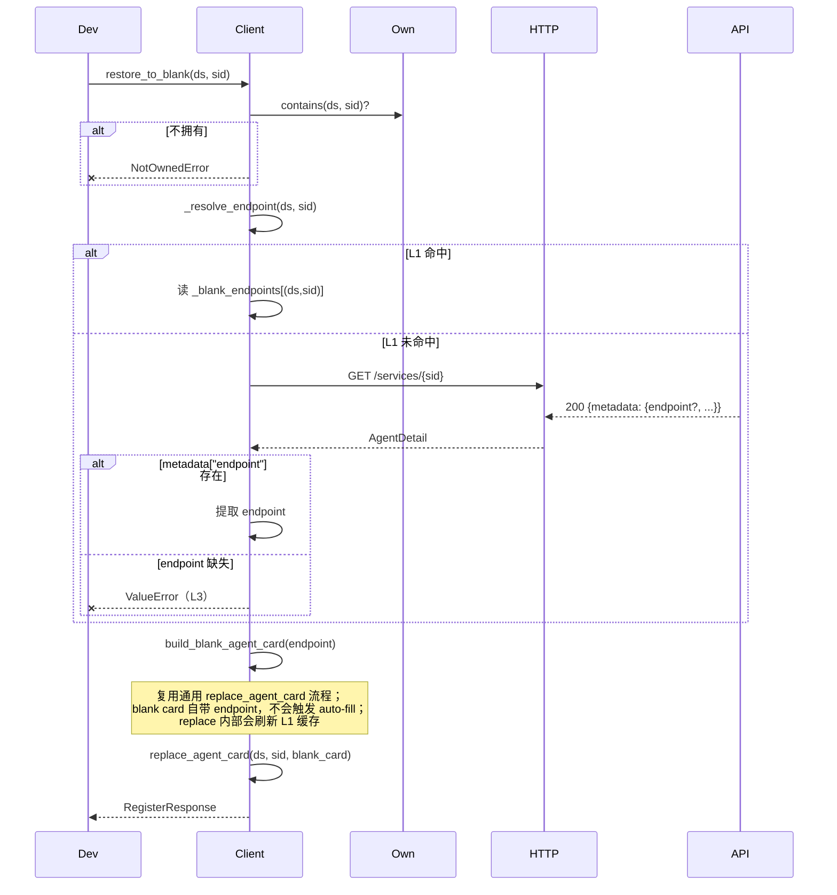
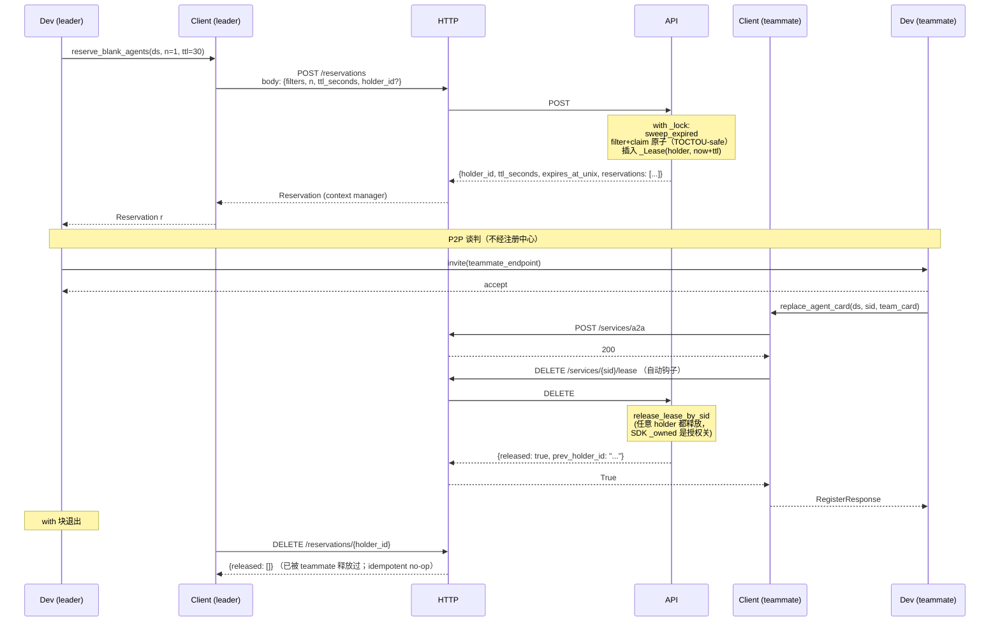

# A2X Registry Client SDK — Agent Team 动态组队

A2X Registry 之上的 Agent Team 动态组队工作流，以及为这一场景特化的 SDK 接口。

> 通用接口（注册、查找、状态更新、注销、reservation 原语、`replace_agent_card`、SDK 架构等）见 [README.md](README.md)。本文件只覆盖团队组队场景与其专用接口。

---

## 1. 场景介绍

**Agent Team 动态组队**：每个 Agent 以"空白 agent"身份进入空闲池；leader 通过预订（reservation lease，默认 30s 锁定）抢到候选；leader 与 teammate 走 P2P 协议谈判；teammate 接受后自己更新 card 的 `status`（`online` / `busy` / `offline`）并把 lease 还回去；解散后 teammate 恢复空白。

关键概念：

| 概念 | 含义 |
|------|------|
| **空白 agent** | `description="__BLANK__"`、占位 name 的 agent card，表达"我在线但还没被任何 team 招募" |
| **空闲池** | dataset 中所有 `description="__BLANK__"` AND `status="online"` 且**未被 lease 锁定**的 agent 的集合 |
| **Lease（预约）** | leader 对 N 个候选 agent 的短时独占锁，TTL 30s 默认，由后端 `_lock` 内的原子"过滤+认领"保证不重不漏 |
| **P2P 谈判** | leader 与 teammate 间直接走 A2A 协议交换组队信息，**不经注册中心** |
| **角色覆盖** | teammate 接受邀请后调 `replace_agent_card` 把整张 card 写为团队角色（含 `status=busy`） |
| **恢复空白** | 任务结束后 teammate 调 `restore_to_blank`，card 回到空白模板，重新可被发现 |

---

## 2. 经典流程代码

团队组队是 **两个独立进程协作** 的流程：teammate 把自己挂进空闲池，teamleader 发现并发起 P2P 协商，双方完成组队后各自更新自身状态，最后 teammate 退出时自行注销。下面按角色分两份示例展示。

### 2.1 一次性 setup（管理员，可选）

如果想用非默认的 embedding 模型或 formats，由管理员先显式创建：

```python
from a2x_registry_client import A2XRegistryClient

admin = A2XRegistryClient(base_url="http://127.0.0.1:8000")
admin.create_dataset("team_pool", embedding_model="bge-small-zh-v1.5")
admin.close()
```

不需要自定义时这一步可以**跳过** —— teammate 第一次注册时后端会自动用默认配置创建 dataset。事后想换 embedding 模型可调 `POST /api/datasets/{ds}/vector-config`。

### 2.2 Teammate 视角（`teammate_node.py`）

```python
from pathlib import Path
from a2x_registry_client import A2XRegistryClient

# 每个 teammate 进程用独立的 ownership 文件，避免互相干扰
client = A2XRegistryClient(
    base_url="http://127.0.0.1:8000",
    ownership_file=Path("/var/run/a2x_teammate1.json"),
)

# 注册为空白 agent，进入空闲池
# 如果 team_pool 这个 dataset 不存在，后端会用默认配置自动创建
# 默认 embedding 模型是 all-MiniLM-L6-v2，三种格式都允许；事后可改
resp = client.register_blank_agent("team_pool", endpoint="http://teammate_1:8080")
my_sid = resp.service_id

# 等待 teamleader 通过 P2P 协议发来组队邀请，业务层代码，不经注册中心
p2p_wait_for_team_invitation()

# 接受邀请后，把自己的 card 覆盖成团队角色，状态改为 busy
# endpoint 不传时 SDK 会从本地缓存自动补上
client.replace_agent_card("team_pool", my_sid, {
    "name": "Task Planner (team-1)",
    "description": "负责拆解任务",
    "status": "busy",
    "skills": [{"name": "plan", "description": "子任务拆解"}],
})

# 执行团队任务，等待 teamleader 通知解散，业务层代码，不经注册中心
p2p_wait_for_disband()

# 解散后恢复为空白 agent，重新进入空闲池
client.restore_to_blank("team_pool", my_sid)

# 进程退出前注销自己，把 sid 从注册中心移除
client.deregister_agent("team_pool", my_sid)
client.close()
```

### 2.3 Teamleader 视角（`teamleader_node.py`）

```python
from a2x_registry_client import A2XRegistryClient

# leader 不注册任何 agent，纯发现 + 协调，ownership_file=False 跳过持久化
client = A2XRegistryClient(base_url="http://127.0.0.1:8000", ownership_file=False)

# 预订 1 个空闲 blank agent，30 秒内其他 leader 看不到这个 sid
reservation = client.reserve_blank_agents("team_pool", n=1, ttl_seconds=30)
if not reservation.agents:
    client.close()
    return  # 池里暂时没人，稍后重试

teammate = reservation.agents[0]  # 扁平 dict：id / type / name / description / endpoint / ...
teammate_endpoint = teammate["endpoint"]

# 向 teammate 发起 P2P 组队请求，失败则立刻释放 lease 让位给其他 leader
if not p2p_send_team_invitation(teammate_endpoint):
    client.release_reservation(reservation)
    client.close()
    return

# 与 teammate 协作完成任务
# teammate 在接受邀请时已经调过 replace_agent_card，自动钩子把 lease 释放了
do_collaborative_work(teammate_endpoint)

# 任务结束，通知 teammate 解散，teammate 会自己调 restore_to_blank 回池
p2p_send_disband_request(teammate_endpoint)
client.close()
```

### 2.4 关键边界

- `replace_agent_card` 和 `restore_to_blank` 必须由 teammate 自己调用。SDK 的 ownership 检查只允许谁注册的谁修改，leader 没有 ownership，调用会本地 fail-fast 抛 `NotOwnedError`。
- P2P 组队邀请和解散通知都不经注册中心，是 teammate 和 leader 之间的 A2A 协议直连。注册中心只负责发现、状态广告和 lease 锁。
- Lease 释放时机：teammate 的 `replace_agent_card` 自动钩子会释放 lease，leader 端不必再显式调 `release_reservation`。失败路径下 leader 应主动调 `release_reservation` 让位，否则要等 30 秒 TTL 过期。
- 不需要 lease 锁的轻量场景仍可用 `client.list_idle_blank_agents("team_pool")`，但有双重分配风险，推荐默认用 `reserve_blank_agents`（见 [README.md](README.md)）。
- **鉴权（可选）**：当 `team_pool` 这个 namespace 由管理员声明为 `auth_required=true` 时（多团队共享同一注册中心的部署），所有 teammate 与 leader 都需要持 API Key 才能调用。teammate 需要 `provider` 角色（绑定到 `team_pool` namespace），leader 通常 `user` 角色（绑定到同一 namespace）。token 通过 `cli_token.json` 提供或直接传 `api_key=` 构造参数。详见 [README.md §2 如何使用](README.md#2-如何使用)。匿名 namespace（默认 `auth_required=false`）的 Agent Team 部署无需 token。
- **心跳保活（推荐）**：teammate crash / OOM / 网络断时不会自动从空闲池清理。当 `team_pool` 启用 `lease_config` 后，teammate 注册时加 `lease_ttl=N, auto_renew=True`，SDK 自动每 `N/3` 秒续约；teammate 进程意外终止 → 服务端 `N + grace_period` 秒后自动清理。Leader 不需要心跳。详见 [README.md §2 如何使用](README.md#2-如何使用)。

---

## 3. 专用接口

下面三个方法是**专为空白 agent 池场景设计的便捷壳**，建立在通用接口之上（详见 [README.md §2.5](README.md#25-全部-method-解释)）：

| 专用接口 | 底层通用接口 | 增量 |
|---------|--------------|------|
| `register_blank_agent` | `register_agent` | 自动构造 blank card 模板；记 L1 endpoint 缓存供 `restore_to_blank` 使用 |
| `list_idle_blank_agents` | `list_agents` | 固定 filter `description="__BLANK__" AND status="online"` |
| `restore_to_blank` | `replace_agent_card` | 三层 endpoint 回退后用 blank 模板覆盖 |

异常体系与通用接口一致（见 [README.md §2.5 异常层级](README.md#25-全部-method-解释)）。

---

### `register_blank_agent(dataset, endpoint, service_id=None, persistent=True)`

薄壳于 `register_agent`，构造 blank 模板：

```json
{"name": "_BlankAgent_<endpoint>", "description": "__BLANK__", "endpoint": "<endpoint>", "status": "online"}
```

成功后把 `(dataset, sid) → endpoint` 写入 L1 内存缓存，供 `restore_to_blank` 使用。同 endpoint 重复注册幂等（sid 基于 name 的 SHA256）。

**输入**：
- `dataset: str`
- `endpoint: str` — 非空字符串
- `service_id: str | None`
- `persistent: bool = True`

**返回**：`RegisterResponse(service_id, dataset, status)`
**错误**：
- `ValueError` — endpoint 空/非字符串（本地）
- `ValidationError` — 同 `register_agent`

---

### `list_idle_blank_agents(dataset, n=1)`

返回 N 个**真正空闲**的 blank agent。后端按 `description="__BLANK__"` **AND** `status="online"` 双条件过滤；SDK 默认 `n=1`（典型场景"取一个空闲队员"），可显式传入更大的 N。后端对 `status="online"` 应用 **default-online 规则**：缺 `status` 字段也算 online，所以未声明 `status` 字段的 blank 也能命中。

**调用方读法**（返回形状与 `list_agents` 一致）：

```python
# 默认取 1 个
agent = client.list_idle_blank_agents("team_pool")[0]
endpoint = agent["endpoint"]
sid      = agent["id"]

# 也可批量
for agent in client.list_idle_blank_agents("team_pool", n=3):
    ...
```

**输入**：
- `dataset: str`
- `n: int ≥ 0` — 默认 `1`

**返回**：`list[dict]` — 形状同 `list_agents`（扁平化的 `{id, type, name, description, ...card_fields}`）；**所有项 `status == "online"`**（或字段缺失，按默认值视作 online）
**错误**：`ValueError` — n 非法（本地）

> 与 `reserve_blank_agents` 的区别：本方法**只读、无锁**，适合监控 / 不需要独占的轻量场景；并发组队下两个 leader 会同时看到同一批 idle agent，可能双重分配。需独占时用 `reserve_blank_agents`（见 [README.md](README.md)）。

---

### `restore_to_blank(dataset, service_id)`

恢复为空白 agent（= 用 blank 模板调 `replace_agent_card`）。Endpoint 三层回退：

| 层级 | 数据源 | 何时命中 |
|------|--------|----------|
| L1 | 进程内缓存 `_blank_endpoints[(ds,sid)]` | 同进程 register → replace → restore，**0 次额外 HTTP** |
| L2 | `get_agent` 读 `metadata["endpoint"]` | 进程重启 / 缓存清空；依赖上游调用方在 replace 时保留 endpoint |
| L3 | `ValueError` | card 丢失 `endpoint` 字段（契约违反） |

**输入**：
- `dataset: str`
- `service_id: str`

**返回**：`RegisterResponse`
**错误**：
- `NotOwnedError` — 本地未拥有
- `ValueError` — L3 触发
- `NotFoundError` — L2 的 GET 或最终 POST 时 404

---

## 4. 对外接口 → 内部调用时序图

下面两个时序图针对 Agent Team 场景。通用方法的时序图见 [README.md §4](README.md#4-对外接口--内部调用时序图)。

**图例**：`Dev` 调用方 · `Client` A2XRegistryClient · `Own` OwnershipStore · `HTTP` HTTPTransport · `API` FastAPI 后端

### 4.1 `restore_to_blank`

L1 → L2 → L3 的 endpoint 回退链，末尾复用 `replace_agent_card`。



### 4.2 `reserve_blank_agents` + teammate 自释放（完整团队组队流程）

Lease 是 SQS visibility-timeout 风格的内存级短锁。`reserve` 在后端 `_lock` 内做"过滤+认领"原子操作，避免 leader 间双重分配。`Reservation` 是 context manager，退出时 best-effort 释放（idempotent）。



**失败路径**：谈判超时 / teammate 拒绝 / Leader 端异常 → `with` 退出仍会调 `release_reservation`，立刻把 lease 还回池里，其他 leader 可立刻重试（无需等 30s TTL）。

---

## 相关

- **通用接口与架构**：[README.md](README.md) — 注册、查找、状态更新、注销、reservation 原语、`replace_agent_card`、SDK 内部分层
- **后端**：本 SDK 对接的 FastAPI 后端即本仓 `a2x_registry/`（同库、同版本号）
- **许可证**：[LICENSE](LICENSE)
