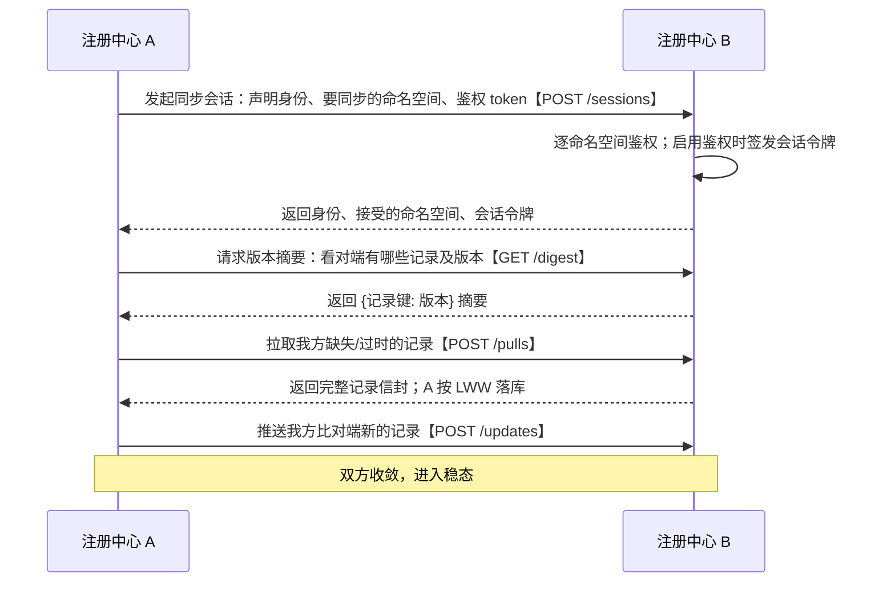
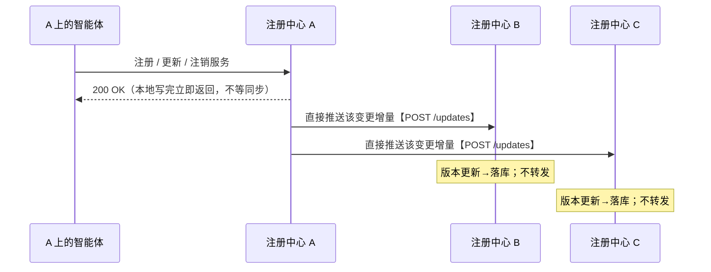
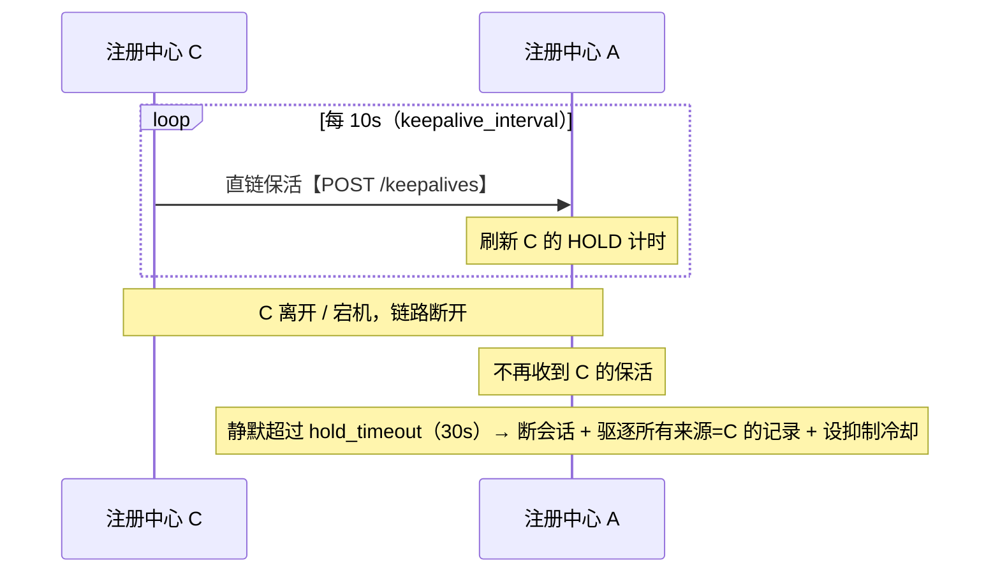
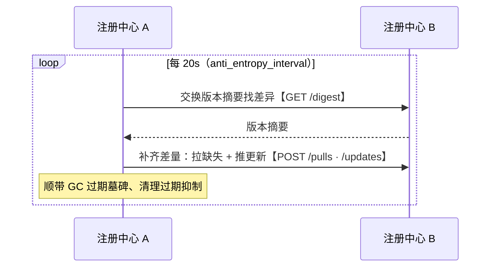
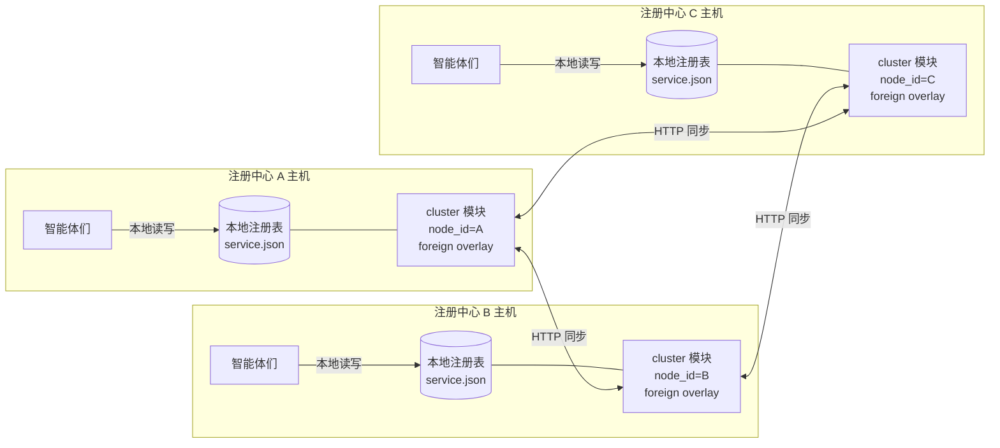
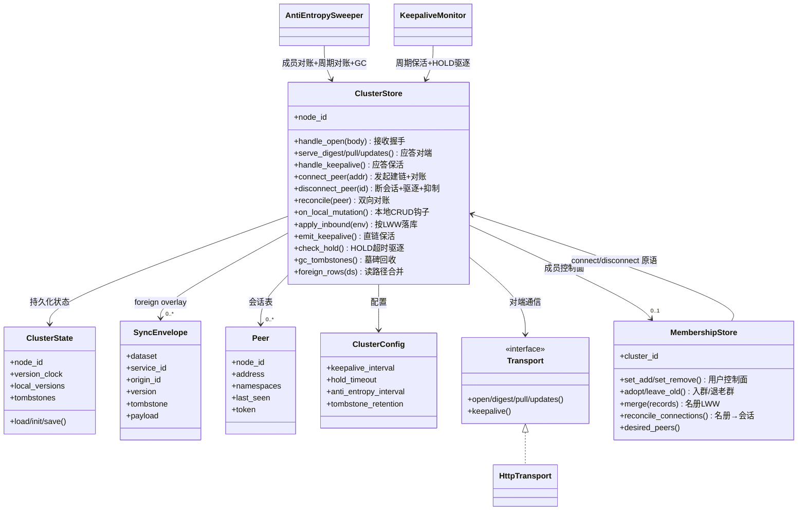

# Cluster 分布式同步模块设计

让多个 A2X 注册中心实例组成**全连接（full-mesh）**集群，彼此复制各自的注册表：查询任意一个实例都能拿到全网所有实例的服务；某实例离开或宕机后，其余实例靠直链 HOLD 超时删除它的数据。

模块是 **opt-in**：注册中心默认单机运行，直到执行 `a2x-registry cluster init` 生成 `cluster_state.json` 才启用。未启用时所有 `/api/cluster/*` 返回 404，读路径与单机完全一致。

> **部署前提：全连接。** 本模块采用直接广播、**不做转发（no relay）**：一条记录由它的来源实例直接发给所有 peer。因此每个成员与其它每个成员都建立会话。这由 **§5 声明式成员控制面**自动维护——用户在任一节点执行 `cluster set add`，系统据成员名册（roster）自动把全连接建好。规模化（并发广播 / 连接池 / Merkle 反熵）见 §6，目标 ~1000 节点。

---

## 1. 流程逻辑

### 1.1 整体介绍

- **拓扑**：全连接。每个成员与其它每个成员都有一条直连会话，互为直接 peer。
- **一致性**：AP / 最终一致。直接广播复制 + 最后写入者胜（LWW）版本判新，无共识 / 多数派。
- **写入**：origin-only。每条记录只在它的来源实例可写，其他实例持有**只读、仅内存**的副本。全局身份键 = `(dataset, origin_id, service_id)`，所以两个实例注册同名服务（同 `service_id`）也不会冲突，且不存在写-写冲突。
- **版本**：`(updated_at_ms, node_id)`，逐记录单调递增（本机时钟回拨也不会让它变小），按字典序比较。
- **传播**：本地 CRUD 后把增量**直发所有 peer**；入站只按 LWW 落库，**不转发**。全连接下来源的一次广播即覆盖全网，天然无环、无需水平分割。
- **删除**：墓碑携带版本，按 LWW 压过更旧的存活值；保留 `tombstone_retention`（= `hold_timeout + keepalive_interval`）后 GC。
- **失活驱逐**：**以注册中心节点为单位**，统一走 HOLD 一条路径。全连接下来源必是某条直连会话——该会话因 `rm-peer` 或 HOLD 超时断开，就是驱逐其全部记录的信号。驱逐后对该来源设一段**抑制冷却**，防止反熵在其它节点尚未驱逐时把它的记录重新拉回来（详见 §1.2 失活时序）。

三层职责：

| 层 | 职责 | 关键类型 |
|----|------|----------|
| L1 会话 | OPEN 握手 + 逐 namespace 鉴权、peer 表、keepalive/HOLD | `Peer`、`auth_handshake` |
| L2 存活 | 直链 keepalive 续 HOLD；静默超时则断会话并驱逐其记录 | `KeepaliveMonitor` |
| L3 复制 | 本地 CRUD 后直发所有 peer、入站按 LWW 落库、周期反熵兜底 | `SyncEnvelope`、`AntiEntropySweeper` |

**数据模型（同步信封 `cluster/envelope.py`）**

```
dataset: str
service_id: str
origin_id: str                 # 所属节点；全局键 = (dataset, origin_id, service_id)
version: (updated_at_ms, node_id)
tombstone: bool
payload: {"entry": <RegistryEntry>, "wrapped": <列表输出行>} | None
```

**持久化状态（`cluster_state.json`，`cluster/state.py`）** —— 唯一落盘的集群状态；foreign 副本不落盘（重连后重新同步）。

```
node_id: str                   # 稳定 UUID 身份
version_clock: int             # 最后发出的版本时间戳(ms)
local_versions: {dataset\0sid: [ms, node_id]}
tombstones:     {dataset\0sid: {version, deleted_at_ms}}
cluster_id: str|None           # 本节点所属 cluster（成员控制面，§5）；None=单机
last_roster: [{node_id,address}] # 最近名册，重启后据此自动重连全连接
my_membership_version: [ms,node_id] # 本节点 membership 记录版本（重启后保持单调）
```

位置：`A2X_REGISTRY_CLUSTER_STATE`，否则 `<A2X_REGISTRY_HOME>/cluster_state.json`。

**配置（`cluster/config.py` 默认值）**

| 字段 | 默认 | 含义 |
|------|------|------|
| `keepalive_interval` | 10s | 直链保活广播周期 |
| `hold_timeout` | 30s | 直链静默多久后断会话并驱逐其记录 |
| `anti_entropy_interval` | 20s | 反熵对账 + GC 周期 |
| `http_timeout` | 5s | 单次对端调用超时 |
| `broadcast_workers` | 32 | 并发广播/保活的线程池上限（§6） |
| `merkle_buckets` | 256 | Merkle 反熵桶数；须全网一致（§6） |

- 派生量 `tombstone_retention = hold_timeout + keepalive_interval`（默认 40s）：墓碑保留期，同时也是驱逐后的抑制冷却时长——保证所有 peer 都已检测到失活并驱逐其副本之后，才允许 GC / 解抑制，从而杜绝复活。
- 以上每项都可在启动 server 前用 `A2X_REGISTRY_CLUSTER_<字段大写>` 环境变量覆盖（如 `A2X_REGISTRY_CLUSTER_HOLD_TIMEOUT=60`，由 `ClusterConfig.from_env` 读取；非法值回退默认）。`A2X_REGISTRY_CLUSTER_ADVERTISE` 则设置对端访问本实例所用的 base URL。

### 1.2 时序图

每一步标注“做了什么【对应接口】”。

**建链 + 初始全量对账**（A 主动连接 B）



**本地 CRUD 增量直发（全连接，无转发）**



**失活驱逐（直链 HOLD）**——成员离开 / 宕机后删除它的数据



> 失活以**注册中心节点**为单位：断一条会话即驱逐该来源的全部服务，不逐服务保活。从物理断开算起，默认约 **30 秒**（≈ `hold_timeout`，±保活间隔/巡检粒度）后该来源的服务从其它实例删除；可在 `ClusterConfig` 调小。驱逐后对该来源设一段抑制冷却（`tombstone_retention`，默认 40s），期间反熵不会把它的记录重新拉回；该来源重新建链（`add-peer`）即解除抑制。

**周期反熵兜底**（修复推送丢包，保证最终收敛）



### 1.3 部署图

全连接：每对实例都直连。



- 每台主机 = 一组智能体 + 一个注册中心 server（FastAPI）+ 一个 cluster 模块（持有 foreign overlay 与会话表）。
- 智能体只与**本地**注册中心交互（注册 / 查询）；查询时本地把“本地 entry + foreign 副本”合并返回。
- 实例间只通过 HTTP `/api/cluster/*` 通信，**拓扑是全连接**（每对成员都建会话），由成员控制面（§5）据名册自动维护。注册中心**自身不做邻居发现**：成员的加入/移除由用户 `set add/remove`（或外部发现守护进程）触发一次，其余（建链、对账、失活清理）全自动。

### 1.4 类图

`ClusterStore` 是核心，聚合"持久化状态 + 会话表 + foreign 副本"，并通过 `Transport` 与对端通信；`MembershipStore` 是附着其上的成员控制面（决定连谁），两个后台守护线程驱动周期任务。



---

## 2. 对外接口

### 2.1 整体介绍（所有接口一览）

**用户 / 运维使用的接口**

| 接口 | 作用 |
|------|------|
| `a2x-registry cluster init` | 生成本实例 node_id，启用集群（opt-in 开关） |
| `a2x-registry cluster set add <addr...>` | **主用命令**：把成员加入本节点的 cluster，系统自动建全连接（§5） |
| `a2x-registry cluster set remove <node_id...>` | 从 cluster 移除成员（确定性，不靠失活） |
| `a2x-registry cluster set show` | 查看本节点的 cluster_id + 名册（roster） |
| `a2x-registry cluster status` | 查看本节点同步状态 |
| `POST /api/cluster/set/add` · `/set/remove` · `GET /api/cluster/set` | 上述命令的底层 HTTP |
| `GET /api/cluster/state` | HTTP 形式的状态快照 |
| `GET /api/datasets/{ds}/services`（既有） | 查询服务列表，**自动合并对端同步来的副本** |

> `add-peer`/`rm-peer`（`POST`/`DELETE /api/cluster/peers`）是**内部建连原语**：成员控制面据 roster 自动调用它们；也可手动用于调试。日常运维用 `set`。

**节点间协议接口**（由其它注册中心自动调用，用户一般不直接使用）

| 接口 | 作用 |
|------|------|
| `POST /api/cluster/sessions` | 接收握手，逐命名空间鉴权 + 签发会话令牌 |
| `GET /api/cluster/merkle` | 返回 `{桶: 哈希}` Merkle 摘要（反熵快路径，§6） |
| `GET /api/cluster/digest` | 返回 `{记录键: 版本}`；可带 `buckets=` 只取差异桶 |
| `POST /api/cluster/pulls` | 按键返回完整记录信封 |
| `POST /api/cluster/updates` | 接收增量（LWW 去重）；**不转发** |
| `POST /api/cluster/keepalives` | 直链保活，刷新 HOLD 计时 |
| `POST /api/cluster/join` | 成员控制面：被拉入某 cluster（鉴权后采纳，§5） |
| `POST /api/cluster/evicted` | 被移出 cluster → 退回单机 |
| `POST /api/cluster/leave` | 某 peer 优雅退出本 cluster → 写其墓碑 + 断连 |
| `GET /api/cluster/set/digest` · `POST /api/cluster/set/pull` · `/set/sync` | 成员名册增量反熵（§5） |

> 未执行 `cluster init` 时，所有 `/api/cluster/*` 返回 404。

### 2.2 用户接口详解（输入 / 输出示例）

**`cluster init`** —— 离线生成身份，不经 HTTP。

```bash
a2x-registry cluster init
```
```
Cluster initialized.
  node_id : reg-99f79b5f9d04
  state   : ~/.a2x_registry/cluster_state.json
```

**`cluster add-peer`** —— 连接对端 + 首次对账（主用命令）。全部字段：

```bash
a2x-registry cluster add-peer <address> [--namespaces a,b] [--token T] [--server URL]
```

| 字段 | 必填 | 不填时的效果 |
|------|------|--------------|
| `<address>` | ✅ | 对端 base URL，如 `http://10.0.0.2:8000` |
| `--namespaces a,b` | 可选 | **同步两端命名空间的并集（全部）** |
| `--token T` | 可选 | 只能同步对端**不要求鉴权**的命名空间；对端整体未启用鉴权时本就无需此项 |
| `--server URL` | 可选 | 默认本机 `http://127.0.0.1:8000` |

底层等价 HTTP `POST /api/cluster/peers`，请求体（`namespaces`、`token` 可省略，语义同上）：

```json
{ "address": "http://10.0.0.2:8000", "namespaces": ["translators"], "token": "a2x_pat_xxx" }
```

返回：

```json
{ "peer": { "node_id": "reg-b1c2d3", "address": "http://10.0.0.2:8000",
            "namespaces": ["translators", "default"] } }
```

**`cluster rm-peer`** —— 断开并清除该对端副本。

```bash
a2x-registry cluster rm-peer reg-b1c2d3
```
```json
{ "node_id": "reg-b1c2d3", "removed": true }
```

**`cluster status` / `GET /api/cluster/state`** —— 同步状态快照。

```json
{ "node_id": "reg-a1b2c3", "advertise": "http://10.0.0.1:8000",
  "peers": [ { "node_id": "reg-b1c2d3", "address": "http://10.0.0.2:8000",
               "namespaces": ["translators"] } ],
  "foreign_records": 12, "foreign_by_namespace": { "translators": 12 },
  "local_records": 5, "tombstones": 0 }
```

**`GET /api/datasets/{ds}/services`** —— 普通查询，集群启用后自动合并对端副本（客户端无需改动）。

```bash
curl http://127.0.0.1:8000/api/datasets/translators/services
```
```json
[
  { "id": "generic_8f3c", "name": "EN-ZH Translator", "source": "api_config" },
  { "id": "reg-b1c2d3:generic_1a2b", "name": "ZH-EN Translator",
    "origin_id": "reg-b1c2d3", "source": "cluster" }
]
```

> 带 `origin_id` 且 `source=cluster` 的是对端同步来的**只读副本**，id 形如 `对端node_id:服务id`，可直接传给 `GET /api/datasets/{ds}/services/{id}` 取详情。要修改它须到来源实例操作（origin-only）。

### 2.3 鉴权与会话令牌（仅在启用鉴权时生效）

- 握手时逐命名空间授权（复用 auth 模块；对端整体未启用鉴权 = 全放行）：对端**没有**的命名空间需 `admin` token 才创建临时副本；对端**有**的命名空间，不要求鉴权则放行，否则需该命名空间的 `provider`/`admin` token。即 `add-peer` 的 `--token`。
- 握手成功且对端启用鉴权时，对端签发一个会话令牌，双方留存；之后每次内部 RPC 经 `X-Cluster-Session` 头携带，对端据此校验 `from_node`。令牌无效 → 降级为匿名（只能访问非 `auth_required` 命名空间），从而伪造身份无法触达特权命名空间。
- **安全假设**：身份与授权由握手 token + 会话令牌保证；不对载荷做端到端加密，依赖部署层 TLS / 可信链路。

---

## 3. 使用流程

下面以**两台注册中心 A、B 互联**为例串成闭环：**启用集群 → 各自启动 → 建立连接 → 任一实例查询得到全网服务**。三台及以上同理——**全连接**要求对每一对成员各跑一次 `add-peer`。单机调试可在同一台机器用不同端口模拟。

> 跨机 / 本机多实例都先设 `export NO_PROXY=127.0.0.1,localhost`（避免系统代理拦截 localhost）。

### 3.1 [每个注册中心主机] 安装 + 启用集群

```bash
# 从 GitCode 克隆 feature/Agentregistry 分支后安装
git clone -b feature/Agentregistry https://gitcode.com/openJiuwen/agent-protocol.git
cd agent-protocol && pip install -e .

# 启用集群：生成本实例的 node_id（写入 <A2X_REGISTRY_HOME>/cluster_state.json）
a2x-registry cluster init
```

`cluster init` 是**离线**操作，只生成身份文件，不经 HTTP、与 server 进程无关：

```
Cluster initialized.
  node_id : reg-99f79b5f9d04
  state   : /home/you/.a2x_registry/cluster_state.json
Restart the registry server for the cluster module to load.
```

> 不执行 `cluster init` 的实例就是普通单机注册中心，`/api/cluster/*` 全 404，行为与今天一致。鉴权是另一项可选特性，需要时按 [服务端 auth 流程](auth_design.md) 先 `a2x-registry auth init`。

### 3.2 [每个注册中心主机] 启动 server（声明对外地址）

```bash
# A 主机
export A2X_REGISTRY_CLUSTER_ADVERTISE=http://<A 的IP>:8000
a2x-registry --host 0.0.0.0 --port 8000

# B 主机
export A2X_REGISTRY_CLUSTER_ADVERTISE=http://<B 的IP>:8000
a2x-registry --host 0.0.0.0 --port 8000
```

`A2X_REGISTRY_CLUSTER_ADVERTISE` = 对端回连本实例所用的 base URL；建链后两端互相记下对方地址用于同步。server 启动时会加载 cluster 模块并拉起后台守护线程（反熵 / keepalive）。本机多实例调试时给每个实例不同的 `A2X_REGISTRY_HOME`、`A2X_REGISTRY_CLUSTER_STATE`、端口与 advertise 即可。

### 3.3 [A 主机] 建立 cluster

在任一台上声明式地把其它成员加进来，系统自动建好全连接（§5）：

```bash
a2x-registry cluster set add http://<B 的IP>:8000 [http://<C 的IP>:8000 ...]
```

- 一条命令把列出的成员拉进同一 cluster；首次会自动铸一个 `cluster_id`。
- 全连接由成员控制面自动维护，**无需对每条链路手动 add-peer**。
- 若被加成员开启了鉴权，加 `--token <admin token>`（无鉴权则无需）。

### 3.4 验证

```bash
a2x-registry cluster set show      # 看 cluster_id 与 roster（成员都 alive）
a2x-registry cluster status        # foreign_records > 0
curl http://127.0.0.1:8000/api/datasets/translators/services
```

查询结果里 `source=cluster`、带 `origin_id` 的行即对端同步来的**只读副本**（id 形如 `对端node_id:服务id`）。客户端 SDK 的 `list_agents`/`get_agent` 也会自动看到这些副本，无需改代码。要修改某副本须到它的来源实例操作（origin-only），改动会增量同步回来。

### 3.5 移除 / 断开

```bash
a2x-registry cluster set remove reg-b1c2d3   # 确定性移除：全网名册删除 + 该成员退回单机
```

被动断开（成员离开 / 宕机但未 `set remove`）**无需任何操作**：其直连 peer 约 30s（`hold_timeout`）内收不到保活后自动断会话、删除其全部副本（并设抑制冷却防反熵复活）；成员恢复可达后，反熵 + 对账自动补齐。成员的 `cluster_id` 已落盘，重启即据持久化名册自动重连。

---

## 4. 鲁棒性

- 无单点：实例对等，任一宕机不影响其余实例本地读写；恢复后经对账重新收敛。
- 分区容忍：分区是常态，双方各自可用，愈合后最终收敛。
- 守护线程（`AntiEntropySweeper` / `KeepaliveMonitor`）每个 tick 都被 try/except 包裹，单次异常只记日志、不中断循环。
- 同步端点幂等；内存有界（foreign 记录随来源驱逐释放，墓碑按期 GC，抑制项过期清理）；推送 best-effort，由反熵保证最终收敛。
- 无环：全连接下来源直发、入站不转发，不存在泛洪回音；驱逐后的抑制冷却杜绝“一节点已驱逐、另一节点经反熵复活”的乒乓。

---

## 5. 声明式成员控制面（`cluster/membership.py`）

声明式集群成员管理：用户在任一节点 `set add/remove`，系统据成员名册（roster）自动维护全连接。成员面与数据面**解耦**——成员面决定"谁在 cluster、连谁"，数据面（§1）负责广播/失活/反熵。

### 5.1 成员记录（origin-only + LWW）

每个节点拥有**恰好一条** membership 记录，与服务记录**分开**存放在独立的 roster 叠加层（不走 `SyncEnvelope`、不进服务读路径、不受 namespace 鉴权门控、不随掉会话被驱逐——成员墓碑需在掉会话后仍存活传播）：

```
MembershipRecord { node_id, cluster_id|None, address, version=(ms,node_id), removed }
```

- **roster(C)** = 所有 `cluster_id==C 且 not removed` 的记录。"只属一个 cluster" = 每节点只有一条记录；并发由 LWW 裁决。
- `removed=True` 是**成员墓碑**：确定性移除，不靠 HOLD。跨来源墓碑（移除别人的记录）用 `next_version_after(目标版本)` 铸版本，保证一定压过目标（否则同毫秒下 node_id 字典序可能让墓碑落败）。
- `cluster_id = "clu-" + uuid`，仅 `set add` 首次建群时铸一次，不参与任何收敛分支。

### 5.2 复制：三条确定性路径

1. **bootstrap 直推**：`set add` 时发起方对每个新成员发 `join`（含当前 roster）——新成员尚未连入、只能直推。
2. **本地变更即时推**：`set add/remove`、退老 cluster 后，把变更记录并发推给所有 roster 成员（best-effort）。
3. **周期增量反熵**：反熵循环交换紧凑的 roster 版本图 `{node_id: version}`（O(N) 极小），只拉更新/缺失的记录，补丢包。

### 5.3 对账循环（roster → 会话）

`AntiEntropySweeper` 每个 tick 调 `MembershipStore.reconcile_connections()`：`desired = roster∩alive−{me}`；缺的 `connect_peer`（best-effort），多出且已移除/不在册的 `disconnect_peer`。**未建 cluster（cluster_id=None）时空操作**，不影响手动 add-peer。

### 5.4 主要流程

- **`set add(R, L)`**：R 无 cluster 则铸 `cluster_id` 写自己的记录 → 对每个新成员发 `join`（鉴权后采纳、写自己的记录、连 roster）→ 把成长后的 roster 即时推给全员。每成员回报成败，不静默半连接。
- **`set remove(R, L)`**：对每个 T 写 `removed` 墓碑（版本压过 T 现有记录）→ 通知 T（`evicted`，T 退回单机）→ 各方据墓碑 `disconnect_peer(T)`。墓碑随反熵传播、按 `tombstone_retention` GC。
- **退老 cluster（优雅）**：节点采纳新 cluster 前，**先**给老 cluster 各成员发 `leave`（让其立刻写墓碑+断连），**再**断开自己——先发后断，否则老成员无法鉴权该 RPC。失活（HOLD）只兜底"非优雅退出"。
- **重启重连**：`cluster_id` + `last_roster` 落盘；重启后首个反熵 tick 即据此自动重连全网（foreign 副本与 roster 版本经反熵重新收敛）。
- **并发 add 收敛**：membership 版本 LWW（`(ms,node_id)` 字典序，确定性 tiebreak），最后赋值者胜，全网收敛到同一 cluster_id。

### 5.5 鉴权（复用，零新增）

`join` 即"拉人入群"：开鉴权的节点要求指令携带 **admin** token（语义同 add-peer 创建临时命名空间的 admin 门控），否则拒绝；无鉴权节点直接接受。

---

## 6. 规模化（目标 ~1000 节点）

全连接直接广播稳态心跳是 O(N²)（用户已接受、确定性、无随机）。撑到 ~1000 的关键实现优化：

- **并发非阻塞广播**：`_broadcast`/`emit_keepalive`/成员即时推走有界线程池（`broadcast_workers`，默认 32）并发发全员并等齐，一次广播耗时 ~一个超时窗（而非 N 个串行超时之和）——单个死节点不会拖垮本地 CRUD。
- **连接池 / keep-alive**：`HttpTransport` 持有长生命周期 `httpx.Client`（`trust_env=False` + keep-alive 池），跨调用复用 TCP，免每调用握手；大集群需把 `ulimit -n` 调到 ≥ 2×N。
- **Merkle 反熵**：`reconcile` 先比 `merkle_buckets`（默认 256）个桶哈希（O(桶)），相等即收场；只有差异桶才传其记录行——稳态无变更时反熵几乎零传输。桶数须全网一致（不一致只是退化为更全的传输，仍正确）。
- **调大心跳周期**：最有效的杠杆。大集群把 `keepalive_interval`/`hold_timeout`/`anti_entropy_interval` 调到 30~60s，以可接受的失活延迟换数量级更低的稳态流量。
- **成员面**：roster 是 O(N) 极小，用版本图增量即可，**不需要 Merkle**。

> 硬顶约 1500~2000（N² 在 HTTP 上的极限）；超过须弃 N²（与"无随机"冲突，另案）。
