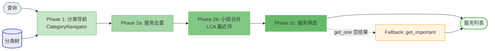
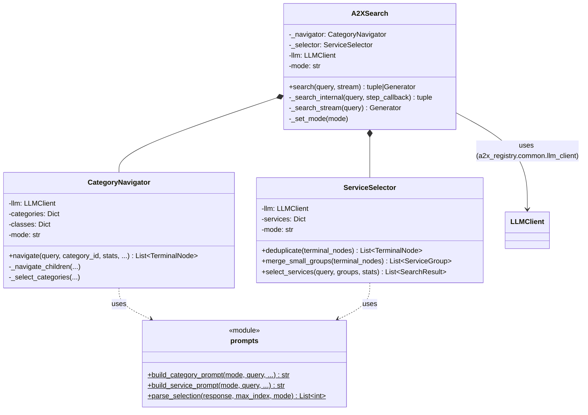

# A2X 搜索模块设计文档

**版本**: v0.1.1

本文档详细描述搜索模块（`a2x_registry/a2x/search/`）的设计。系统整体视图见 [a2x_design.md](a2x_design.md)，构建模块见 [build_design.md](build_design.md)。

---

## 1. 模块结构

```
a2x_registry/a2x/search/
├── __init__.py      — 公共 API: A2XSearch, SearchResult, SearchStats, NavigationStep
├── __main__.py      — CLI 入口 (python -m a2x_registry.a2x.search)
├── a2x_search.py    — 编排器: 组合 Navigator + Selector，管理搜索流程和流式输出
├── models.py        — 数据类: SearchStats, NavigationStep, TerminalNode, ServiceGroup (SearchResult 已移至 a2x_registry/common/models.py)
├── navigator.py     — Phase 1: CategoryNavigator (LLM 递归分类导航)
├── selector.py      — Phase 2+3: ServiceSelector (去重、分组合并、LLM 服务筛选)
└── prompts.py       — Prompt 模板 + 响应解析 (纯函数，无状态)
```

## 2. 搜索模式

| 模式 | 分类导航策略 | 服务筛选策略 | 适用场景 |
|------|-------------|-------------|---------|
| `get_all` | 选择所有可能相关的分类 | 包含所有可能相关的服务 | 高召回场景 |
| `get_important` | 选择明确需要的分类 | 只选用户确实需要的服务，去重同功能服务 | 平衡精度与召回 |
| `get_one` | 只选最匹配的一个分类 | 只选最匹配的一个服务 | 高精度场景 |

`get_one` 在结果为空时自动 fallback 到 `get_important`，取其第一个结果。

## 3. 流程逻辑

搜索分为两阶段：

**Phase 1（CategoryNavigator）**：LLM 从根节点出发，在每一层判断"哪些子分类与查询相关"，递归进入被选中的分支直至叶节点。多个分支的导航可并行执行。产出：一组终端节点，每个关联一批候选服务。

**Phase 2+3（ServiceSelector）**：
- 去重：跨终端节点先到先得去重
- 合并：将过小的服务组按 LCA 距离与最近邻合并（MIN_GROUP_SIZE=30）
- 筛选：对每个服务组并行调用 LLM 选出匹配结果

## 4. 对外调用接口

### Python 接口

```python
from a2x_registry.a2x.search import A2XSearch

searcher = A2XSearch(
    taxonomy_path="taxonomy.json",
    class_path="class.json",
    service_path="service.json",
    max_workers=20,
    parallel=True,
    mode="get_all",  # "get_all" | "get_important" | "get_one"
)

# 同步搜索
results, stats = searcher.search(query)

# 流式搜索（实时返回导航步骤，用于 UI 动画）
for msg in searcher.search(query, stream=True):
    if msg["type"] == "step":
        # {"parent_id": str, "selected": [str], "pruned": [str]}
    elif msg["type"] == "result":
        # {"results": [...], "stats": {...}}
```

### 数据类

```python
# SearchResult 定义在 a2x_registry/common/models.py，三个搜索方法共用
@dataclass
class SearchResult:
    id: str
    name: str
    description: str = ""

@dataclass
class SearchStats:
    llm_calls: int
    total_tokens: int
    visited_categories: List[str]
    pruned_categories: List[str]
    visited_category_ids: List[str]

@dataclass
class NavigationStep:   # UI 动画用
    parent_id: str
    selected: List[str]
    pruned: List[str]
```

### CLI

```bash
python -m a2x_registry.a2x.search --query "I need to book a flight" --mode get_important
python -m a2x_registry.a2x.evaluation --data-dir database/ToolRet_clean --max-queries 50 --mode get_all
```

## 5. 逻辑视图



## 6. 类图


