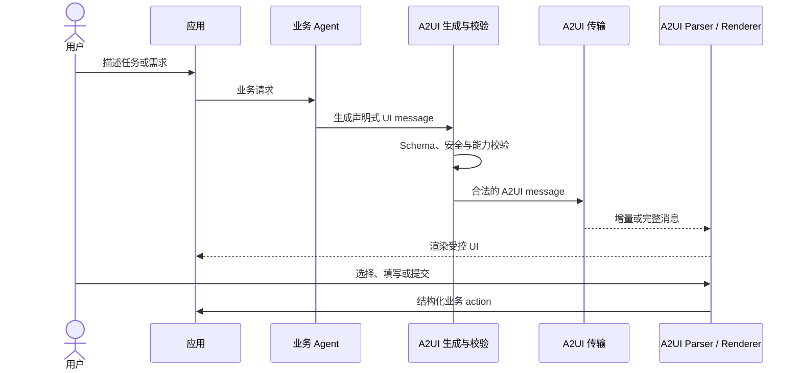
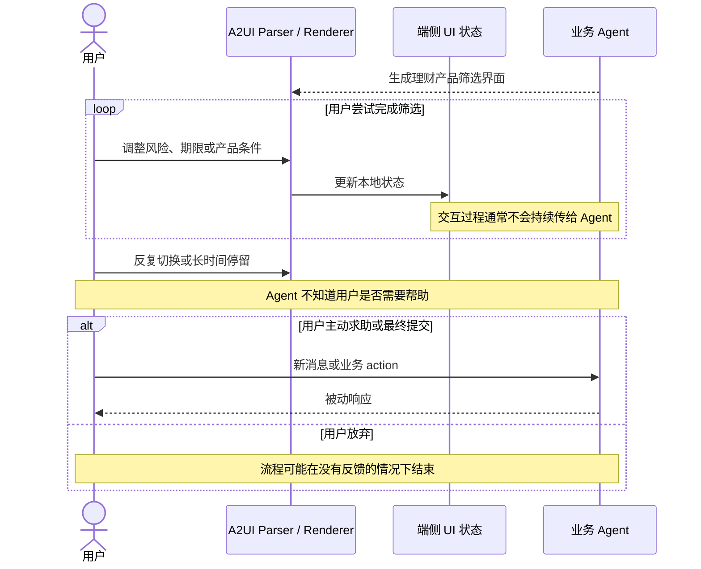
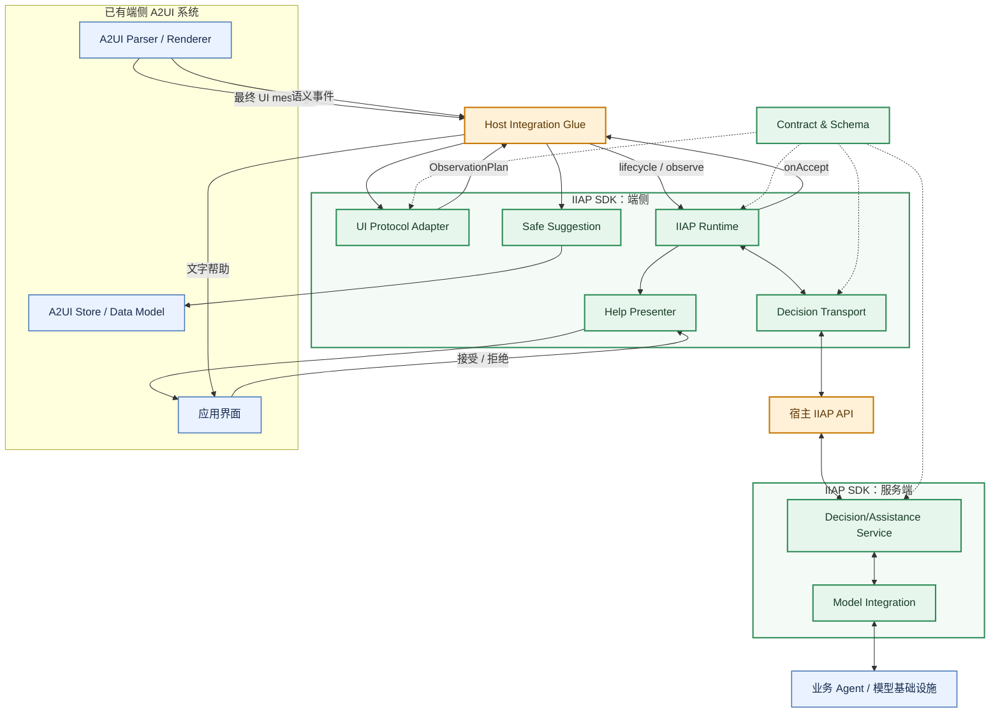
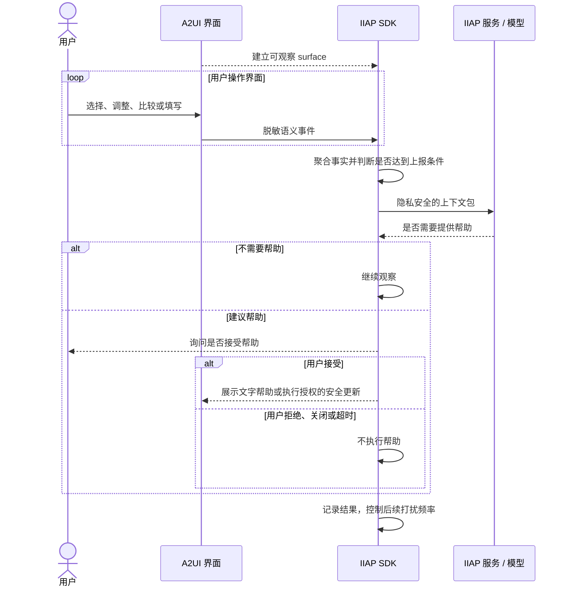
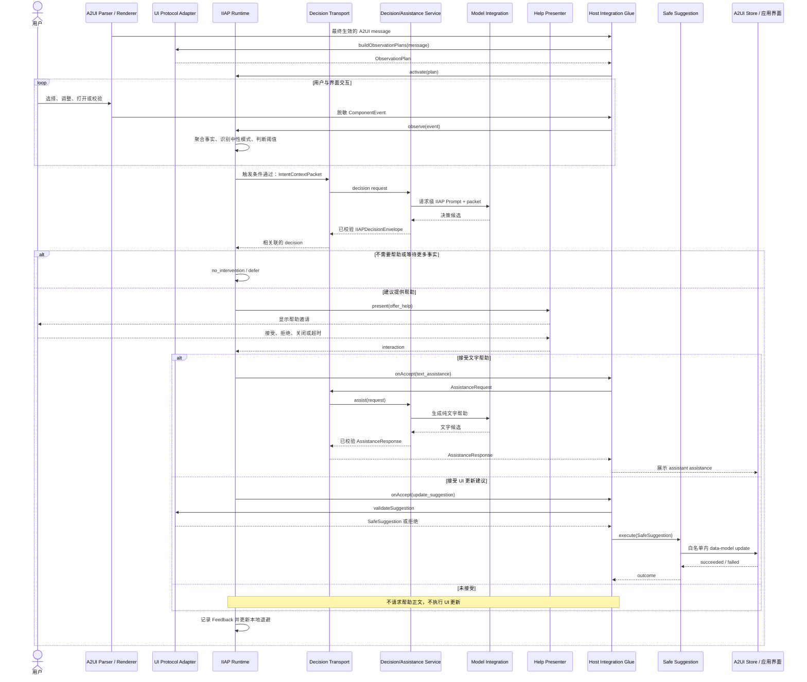
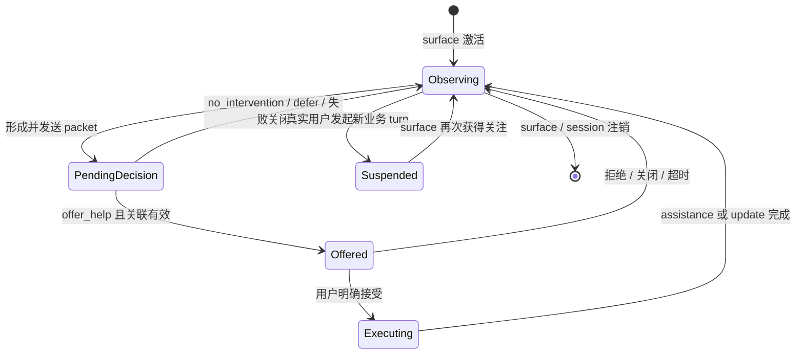
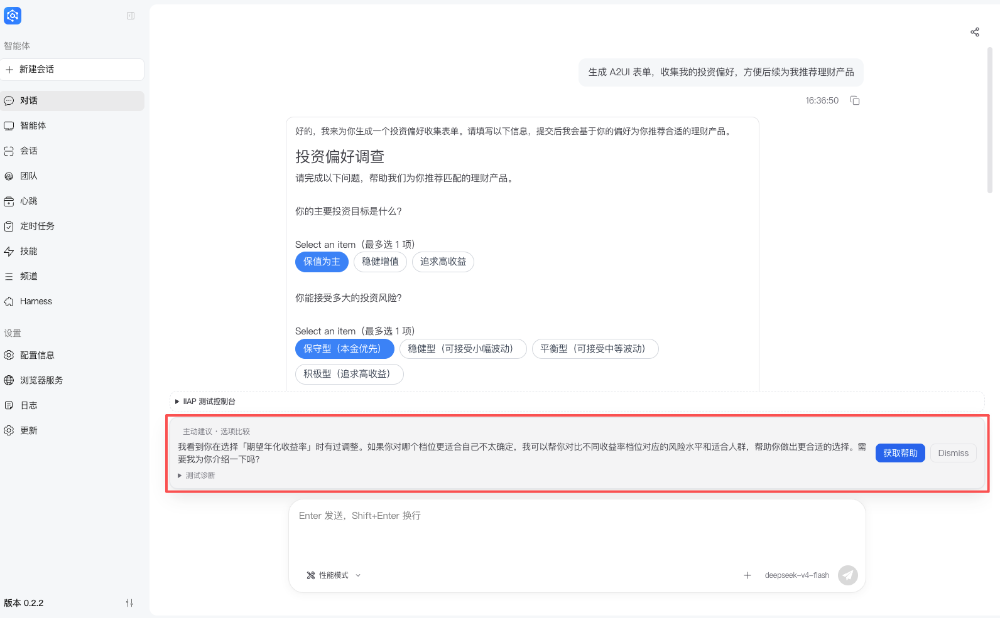
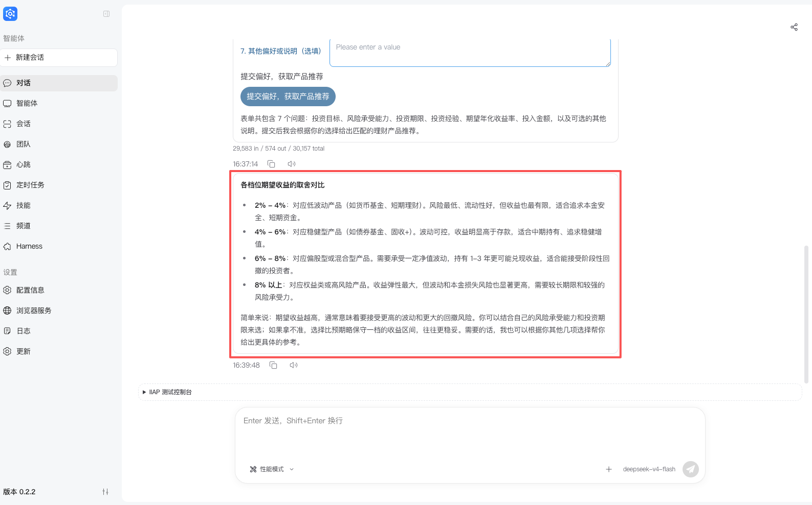

# IIAP：让生成式 UI 从“可展示”走向“会理解、能协助”

最后更新：2026-08-06

本文是 IIAP 的宏观导读。为便于连续阅读，文中会摘要架构、协议和模块设计；精确 API、Schema、算法和兼容范围以文末链接的专项文档及源码为准。

## 1. 背景

### 1.1 为什么需要生成式 UI

传统应用通常提前设计页面、字段和流程。这种方式适合稳定、高频的任务，但面对开放式需求时有两个限制：

- 用户目标多样，固定页面很难覆盖所有组合；
- 纯对话虽然灵活，但当任务涉及筛选、比较、填写和确认时，长文本来回沟通的效率较低。

以金融理财产品筛选为例，用户的真实需求可能同时包含风险承受能力、投资期限、流动性、收益目标、可投入金额和产品偏好。固定页面往往要么字段很多、认知负担高，要么需要经过多层导航；纯对话则需要多轮询问，用户也不容易直观看到当前筛选条件和候选产品之间的关系。

生成式 UI 的价值，是让 Agent 根据当前任务动态组织最合适的交互界面。例如：

1. 用户说“希望筛选风险较低、半年内可以赎回的产品”；
2. Agent 不只回复一段文字，而是生成包含风险等级、期限、流动性和金额等字段的筛选界面；
3. 用户通过选择、滑动和比较完成条件确认；
4. 系统继续使用这些结构化结果完成业务流程。

它把大模型的灵活理解能力与图形界面的可操作性结合起来，使“每次任务都开发一套页面”转变为“根据任务动态生成受控界面”。在金融场景中，生成式 UI 只负责提升筛选和信息交互效率，不替代适当性评估、合规校验、风险揭示或最终业务决策。

### 1.2 A2UI 是什么

A2UI 是 Agent 与前端之间的结构化 UI 协议。Agent 输出的不是可任意执行的前端代码，而是声明式 UI message；系统经过 Schema 校验、安全处理和必要的协议降级后，将 message 传给端侧 Parser/Renderer，由端侧使用受控组件渲染界面。



A2UI 解决的核心问题是“Agent 如何生成可控、可验证、可跨端渲染的 UI”。它并不天然解决“界面生成后，Agent 如何持续理解用户在界面里的操作过程”。

### 1.3 A2UI 单独使用时的不足

继续看金融理财产品筛选场景。系统已经生成一张筛选表单，用户开始调整风险等级、投资期限和流动性条件。在完成提交前，用户可能出现以下行为：

- 在两个风险等级之间反复切换；
- 多次调整期限，却始终没有提交；
- 连续触发字段校验错误；
- 多次打开产品说明或切换比较页签；
- 长时间停留在某一步，不确定如何继续。

这些行为可能意味着用户正在比较、对规则不理解，或者遇到了操作阻碍。但在常见 A2UI 流程中，它们只是端侧的局部状态变化：业务 Agent 通常只知道“界面已经生成”，直到用户主动发消息或最终提交，才重新获得上下文。



因此，A2UI 单独使用时仍存在一个交互缺口：它能生成 UI，却缺少一条安全、通用的机制去理解用户与 UI 的持续互动，并在合适的时候主动提供帮助。

IIAP 要补足的正是这个缺口。它不是替代 A2UI，而是作为 A2UI 的插件，让已经生成的界面具备“观察—判断—协助—反馈”的闭环。

### 1.4 IIAP 的价值落点

| 价值 | 具体表现 |
|---|---|
| 提升复杂任务的完成体验 | 用户在筛选、填写和比较过程中遇到困难时，系统可以在合适的时机提供帮助，而不是只能等待用户主动求助 |
| 延伸生成式 UI 的能力边界 | A2UI 从“一次性生成界面”扩展为“生成后仍能理解交互并形成闭环” |
| 兼顾智能与控制 | 模型负责理解复杂上下文，确定性规则、Schema、用户确认和白名单负责限制风险 |
| 形成可复用的平台能力 | 观察、协议、模型和展示均通过稳定边界解耦，可适配不同业务、A2UI 版本、传输方式和模型基础设施 |
| 为持续优化提供反馈 | 接受、拒绝、超时和执行结果形成结构化终态，可用于控制打扰频率并评估帮助策略 |

## 2. 补足 A2UI 交互闭环面临的挑战

直接把前端事件全部发送给大模型并不可行。一个可复用的解决方案必须同时处理以下问题：

| 挑战 | 为什么困难 | IIAP 对应设计 |
|---|---|---|
| 理解操作过程 | click、change 等底层事件缺少业务上下文；端侧固定规则又容易把猜测当事实 | `UI Protocol Adapter` 提取协议语义；packet 保留脱敏事件事实和可追溯的中性模式，由模型结合 UI 决策 |
| 控制隐私风险 | 表单可能包含金额、身份、偏好等敏感值，原始值不应被默认采集 | Renderer/Host 只构造脱敏语义事件；`IIAP Runtime` 在写入窗口和发送 packet 前拒绝禁止字段并检查体积 |
| 控制数据规模 | 高频交互会产生大量事件，逐条调用模型成本高、噪声大 | Runtime 使用观察窗口、阈值、quiet/idle、限流和报告历史，只在形成有效证据时上报 |
| 判断关注对象 | 会话历史中可能存在多个 A2UI surface，旧页面不能仅因超时持续触发 | 一个 session 可保留多个 surface，但只有 focused surface 拥有自动 timer；用户操作历史 surface 时焦点才转移 |
| 给模型完整上下文 | 单独的“点击了几次”无法解释用户面对什么界面 | `IntentContextPacket` 同时携带脱敏 surface 定义、当前事件、模式、此前最多三次报告和允许操作范围 |
| 避免模型误判 | 模型可能过度干预、生成不符合协议的结果，或受到 UI 文本中的指令影响 | 请求级 IIAP Prompt、few-shot、输入/输出 Validator 和 fail-closed 策略共同约束结果 |
| 不干扰正常业务 | IIAP 是插件，不能改变 Agent 人设，也不能让 IIAP Prompt 污染普通 A2UI 生成轮次 | Decision 和 Assistance 使用独立 operation 与请求级 Prompt；关闭 IIAP 后原业务链路保持不变 |
| 让帮助可控 | 系统不能在未经同意时替用户操作，更不能自动提交、支付或改页面结构 | `Help Presenter` 先征求用户意愿；只有明确接受后才提供文字帮助或进入安全更新流程 |
| 安全更新 UI | 模型建议的字段、值和目标 surface 都可能错误或过期 | Host 白名单、服务端校验、端侧复验、用户确认和 stale surface 防护共同限制 `Safe Suggestion` |
| 处理异步与反馈 | 模型响应可能迟到，用户也可能拒绝、忽略或接受后执行失败 | packet、decision、request、surface 多级关联；终态 Feedback 驱动本地退避并防止重复打扰 |
| 适配不同系统 | 不同客户使用不同 A2UI 版本、网络、模型和前端框架 | Adapter、Transport、Model Integration、Presenter 分别隔离协议、通信、模型和展示差异 |

这些挑战决定了 IIAP 不能只是一个提示词，也不能只是一个前端埋点模块。它需要同时覆盖端侧观察、跨端协议、服务端判断、用户确认和安全执行。

## 3. IIAP 方案介绍

### 3.1 Overview

IIAP 的核心思想可以概括为一句话：

> 在不采集原始输入、不改变原业务流程的前提下，观察用户与结构化 UI 的交互事实，在值得关注时请求模型判断是否需要帮助，并且只在用户明确接受后提供文字帮助或受限的 UI 更新。

IIAP 将一次主动帮助拆成四个阶段：

1. **观察**：从 A2UI Renderer 获得带完整归属的语义事件；
2. **判断**：聚合事件并形成隐私安全的上下文包，由模型判断是否值得介入；
3. **协助**：以非阻塞入口询问用户，接受后再提供帮助；
4. **反馈**：记录接受、拒绝、超时和执行结果，控制后续干预频率。

#### 3.1.1 功能模块架构

绿色模块由 IIAP SDK 提供；橙色部分由宿主系统负责连接；蓝色部分是已有 A2UI/业务能力。



| 大模块 | 一句话说明 |
|---|---|
| `UI Protocol Adapter` | 把 A2UI 或其他结构化 UI 协议转换成 IIAP 可以观察的统一模型，并在 UI 更新前进行协议级复验 |
| `IIAP Runtime` | 管理 session、surface、事件窗口、触发策略、隐私处理、异步关联和反馈，是端侧流程中枢 |
| `Decision Transport` | 隔离 HTTP、RPC、WebSocket 等通信差异，传输 decision、assistance 和可选 feedback |
| `Decision/Assistance Service` | 校验请求、构造本轮 Prompt、调用模型并把候选结果收敛为合法协议响应 |
| `Model Integration` | 将 IIAP 接到现有业务 Agent、独立模型或模型网关，不强制具体模型部署方式 |
| `Help Presenter` | 展示“是否需要帮助”的邀请并返回用户选择，不负责生成或展示最终帮助正文 |
| `Safe Suggestion` | 在用户接受 UI 更新后，再次校验目标和值，并通过 Host 提供的受控写入能力更新 data model |
| `Contract & Schema` | 定义端侧和服务端共同遵守的数据格式、枚举、大小限制和关联规则 |

`Host Integration Glue` 和宿主 IIAP API 不属于 SDK 模块。它们是接入方编写的少量连接代码，负责把已有 Renderer、Store、网络入口和业务模型基础设施接到 SDK 的稳定接口。

### 3.2 IIAP Workflow

IIAP 的流程可以先概括为五个动作：观察用户与 A2UI 的互动、形成脱敏上下文、判断是否需要帮助、征得用户同意后提供帮助、根据结果调整后续干预。

#### 3.2.1 简化流程



这幅图刻意省略了 Adapter、Transport、Service 等工程模块。它表达的核心是：**IIAP 不会仅凭一次点击就直接操作界面，而是先积累事实、再请求判断、然后征求用户同意，最后才提供帮助。**

#### 3.2.2 模块级详细流程

下面展开同一流程的工程细节。它从 A2UI surface 建立观察开始，展示各 SDK 模块如何参与模型决策、用户选择以及文字帮助/UI 更新两条分支。



需要特别区分两个 UI 输出：`Help Presenter` 展示的是“是否需要帮助”的邀请；用户接受文字帮助后，最终的 `assistant assistance` 由 Host 写入应用界面。两者不是重复模块，也不应把内部 AssistanceRequest 显示成用户消息。

### 3.3 IIAP 协议设计

#### 3.3.1 协议边界

IIAP 协议和 A2UI 协议解决不同问题：

- A2UI 负责传输“界面应该长什么样、如何更新”；
- IIAP 负责传输“用户如何与界面互动、是否需要帮助、帮助是否被接受和执行”。

两者可以复用同一条物理网络连接，但消息类型、请求关联和失败处理必须隔离。IIAP 不限定 HTTP、RPC 或 WebSocket；`Decision Transport` 只要求不同传输实现遵守相同 Schema。

#### 3.3.2 关键 Schema 与报文

| Schema | 消息类型 | 作用 |
|---|---|---|
| `packet-envelope.schema.json` | `iiap.intent_context_packet` | 包装一次端侧观察报告 |
| `intent-context-packet.schema.json` | packet body | 描述 surface、当前事实、中性模式、历史报告和允许操作 |
| `decision.schema.json` | `iiap.decision` | 返回 `offer_help`、`no_intervention` 或 `defer` |
| `assistance.schema.json` | `iiap.assistance.request/response` | 用户接受文字帮助后的独立请求与纯文本响应 |
| `feedback.schema.json` | `iiap.feedback` | 记录用户选择以及接受后的执行结果 |
| `error.schema.json` | `iiap.error` | 返回稳定、可诊断且不暴露敏感内容的错误 |

`IntentContextPacket` 是协议的核心。它不是原始前端日志，而是一份结构化、脱敏、可追溯的观察报告：

```json
{
  "type": "iiap.intent_context_packet",
  "iiapVersion": "0.1",
  "packet": {
    "iiapVersion": "0.1",
    "packetId": "pkt_01",
    "sessionId": "session_01",
    "messageId": "msg_01",
    "originalSurfaceId": "product_filter",
    "surfaceInstanceId": "msg_01:product_filter",
    "protocolVersion": "0.8",
    "timestamp": "2026-08-06T10:00:00.000Z",
    "window": {
      "startTime": "2026-08-06T09:59:55.000Z",
      "endTime": "2026-08-06T10:00:00.000Z",
      "durationMs": 5000
    },
    "surfaceContext": {
      "protocol": "a2ui",
      "protocolVersion": "0.8",
      "snapshotType": "sanitized_effective_definition",
      "definition": [],
      "redaction": {
        "dataModelExcluded": true,
        "actionContextValuesExcluded": true,
        "unreachableComponentsExcluded": true,
        "unknownCustomPropertiesExcluded": true,
        "truncated": false
      }
    },
    "observations": {
      "tokenScope": "component_within_surface_instance",
      "events": [],
      "completeness": {
        "complete": true,
        "droppedEventCount": 0
      }
    },
    "patterns": [],
    "reportHistory": [],
    "allowedOperations": {
      "updateTargets": []
    }
  }
}
```

其中：

- `surfaceContext` 告诉模型用户面对什么界面，但不包含当前 data model 和原始输入；
- `observations.events` 是本次窗口中的脱敏事实，是模型判断的首要依据；
- `patterns` 是由事件支持的中性索引，例如状态交替，不直接宣称“用户困惑”；
- `reportHistory` 默认在当前报告之外保留此前最多三次报告；
- `allowedOperations` 是 Host 授权上限，不表示模型应当执行更新。

服务端返回的 Decision 使用服务端生成的关联标识，不信任模型生成 ID：

```json
{
  "type": "iiap.decision",
  "iiapVersion": "0.1",
  "decisionId": "dec_01",
  "packetId": "pkt_01",
  "surfaceInstanceId": "msg_01:product_filter",
  "payload": {
    "decision": "offer_help",
    "reason": "comparison_need",
    "offerType": "text_assistance",
    "helpTopic": "compare_options",
    "uiStyle": "inline_card",
    "message": "我可以帮你梳理这些筛选条件。"
  }
}
```

用户接受文字帮助后发送独立的 `AssistanceRequest`。它通过 `packetId + decisionId + surfaceInstanceId` 引用已经接受的决策，不伪装成用户聊天消息，也不重新发送一份新的观察包。

#### 3.3.3 协议控制机制



协议通过以下机制控制风险：

1. **完整归属**：事件必须携带 message、surface instance 和 component owner，防止历史页面或同名组件串扰；
2. **多级关联**：packet、decision 和 assistance 各有独立 ID，并绑定同一 surface；
3. **时效检查**：surface 失焦、暂停、替换或注销后，迟到响应不能展示或执行；
4. **用户确认**：`offer_help` 只展示邀请，接受之前不生成最终帮助、不更新 UI；
5. **终态反馈**：接受、拒绝、忽略、超时和执行成败都会形成终态，用于本地退避；
6. **失败关闭**：Schema、隐私、关联或安全更新校验失败时，IIAP 停止本次动作，但不阻断原业务流程。

精确字段、枚举和大小限制见[Wire 协议与数据契约](sdk-design/02-wire-protocol-and-data-contracts.md)，机器校验以 `IIAP/contracts/schemas/` 为准。

### 3.4 详细设计

#### 3.4.1 总体分层

IIAP 采用“端侧观察、服务端判断、用户确认后执行”的分层方式：

- **端侧层**靠近真实 UI，掌握 surface 生命周期和交互事件，负责脱敏、聚合、触发和最终安全执行；
- **协议层**定义双方都能理解的数据格式、关联关系和错误边界；
- **服务端层**利用 UI 上下文和交互事实判断是否提供帮助，并生成受约束的结果；
- **宿主连接层**复用现有 Renderer、网络、Agent 和 Store，不把业务系统重新实现一遍。

以下各模块是职责边界，不表示客户需要安装多个 npm 包。TypeScript 端侧能力通过一个逻辑包交付，Python 提供服务端能力。

#### 3.4.2 UI Protocol Adapter

**总体职责**：隔离 A2UI 版本和不同结构化 UI 协议之间的差异。

它主要完成三件事：

1. 接收 Parser/Store 已经实际应用的最终 UI message，而不是观察模型草稿或未完成的 SSE 分片；
2. 重放 surface 生命周期，识别可观察组件，并为每个 surface 构造独立的 `ObservationPlan`；
3. 在 UI 更新路径中，把不可信的模型建议复验为 `SafeSuggestion`，不满足协议和白名单要求时返回拒绝。

Adapter 不抓取 DOM、不调用模型，也不判断用户是否需要帮助。A2UI v0.8 可以使用默认 Adapter；其他协议或自定义组件通过实现相同接口接入。

#### 3.4.3 IIAP Runtime

**总体职责**：在端侧管理一次 IIAP 观察和帮助的完整生命周期。

Runtime 内部包含四类逻辑：

- **Observation**：校验事件 owner，把事件写入正确的 session/surface/component 窗口；
- **Pattern**：从事实中提取状态交替、连续校验失败、重复打开等中性模式，所有模式都能回指原事件；
- **Policy**：管理阈值、quiet/idle timer、上报间隔、报告上限和反馈退避；
- **Privacy**：在事件进入窗口以及 packet 发出前执行禁止字段、裁剪和体积检查。

一个 Runtime 可以管理多个 session；一个 session 可以保留会话历史中的多个 surface，但同时只有 focused surface 使用自动 timer。用户直接操作历史 surface 时，关注权才转移过去，避免旧页面因为时间经过而不断触发。

Runtime 也是异步关联的责任方：只有仍属于当前 packet 和 surface 的 decision 才能进入 Presenter；迟到、重复或错配的结果全部失败关闭。

#### 3.4.4 Decision Transport

**总体职责**：把端侧 Runtime 与服务端 IIAP API 连接起来，同时隔离具体网络技术。

它提供三类语义调用：

- `decide`：发送观察包并获得是否帮助的决策；
- `assist`：用户接受文字帮助后请求最终帮助内容；
- `sendFeedback`：可选地上传终态反馈。

SDK 可以提供默认 HTTP 实现；已有 WebSocket、RPC 或其他通道的系统可以实现同一接口。Transport 只处理传输、关联和错误映射，不复制 Runtime 状态机，也不把 IIAP 消息混成普通 A2UI SSE 分片。

#### 3.4.5 Decision/Assistance Service

**总体职责**：把不可信的网络请求和模型候选结果收敛为合法、安全的 IIAP 响应。

`DecisionService` 的流程是：校验 packet → 构造本轮 IIAP Prompt → 调用 Model Integration → 校验业务 payload → 使用服务端 ID 包装 Decision Envelope。

`AssistanceService` 只在用户已经接受文字帮助后调用。它要求结果是纯文本，拒绝 A2UI message、结构化 UI、自动执行指令、空内容和超长内容。违规结果当前不重试、不截取局部文本，直接不展示并记录执行失败。

两种 Service 都使用请求级 Prompt，不向普通业务 Agent 安装全局 IIAP 人设，也不会让“Assistance 禁止生成 A2UI”的约束影响正常 A2UI 生成轮次。

#### 3.4.6 Model Integration

**总体职责**：把 IIAP Service 接到实际的模型或 Agent 基础设施。

IIAP 不强制决策和帮助来自独立模型，也不强制复用原业务 Agent。接入方可以根据已有架构选择：

- 复用业务 Agent 的底层模型调用能力；
- 使用独立模型；
- 由 `AgentRouter` 在两者之间路由。

无论选择哪种部署方式，Decision 与 Assistance 的输入上下文和 Prompt 都必须按各自 operation 隔离。Model Integration 只负责调用适配，协议校验仍由 Service 完成。

#### 3.4.7 Help Presenter

**总体职责**：以非阻塞方式询问用户“是否需要这项帮助”。

Presenter 输入 `offer_help` decision，展示轻量入口、卡片或弹窗，并返回 accepted、dismissed、rejected、ignored 或 timed_out。它不生成帮助内容，也不把最终帮助正文写入聊天历史。

当用户接受文字帮助后，Host 才调用 AssistanceService，并把通过校验的 `AssistanceResponse` 显示成 assistant message；当用户接受 UI 更新时，Host 才进入 Safe Suggestion 流程。因此“帮助邀请”和“最终帮助内容”是两个不同阶段。

#### 3.4.8 Safe Suggestion

**总体职责**：把模型建议与实际 UI 写入能力隔离开。

UI 更新默认没有权限。Host 必须为具体 surface、component 和 binding 显式提供允许值；服务端只能在这份上限内提出建议。用户接受后，端侧还要再次校验 surface 是否仍有效、path 和类型是否匹配、值是否在白名单中，最后才调用 Host 的 Store 写入 callback。

v0.1 只允许受限 data-model update，不允许自动执行 Button、submit、payment，不允许创建或删除 surface，也不允许修改页面结构。任何一步失败都不会降级为“尽量执行”。

#### 3.4.9 Contract & Schema

**总体职责**：保证 TypeScript、Python、不同 Transport 和自定义 Host 对同一消息有一致理解。

JSON Schema 定义 wire 类型、必填字段、枚举、未知字段策略和大小边界；TypeScript/Python DTO、Validator、fixtures 和 conformance tests 与其保持一致。模型只产生业务 payload，packetId、decisionId 等关联字段由可信的 Runtime/Service 生成，避免模型伪造控制信息。

#### 3.4.10 Host Integration Glue

**总体职责**：把 SDK 接到已有系统；它是客户代码，不是另一个 IIAP SDK 模块。

Host 需要完成的工作包括：

- 在最终 A2UI message 生效后调用 Adapter；
- 把 session、surface 生命周期和 Renderer 语义事件交给 Runtime；
- 将 Transport 接入已有鉴权和网络基础设施；
- 将 Presenter 挂载到应用界面；
- 用户接受文字帮助后显示 assistant assistance；
- 开启 UI 更新时提供明确白名单和 Store 写入 callback；
- 保证 IIAP 内部 assistance turn 不显示成 user message，也不终止原 surface 的观察。

具体函数、参数和默认实现见[SDK 模块、接口与数据结构开发参考](sdk-integration/02-sdk-modules-capabilities-and-interfaces.md)，面向现有系统的完整接入步骤见[SDK 集成指南](sdk-integration/README.md)。

## 4. Demo 介绍

目前 jiuwenswarm 已经打通 IIAP SDK 集成。我们在 jiuwenswarm 上测试了理财产品推荐场景，产生了一个较为复杂的 A2UI 表单。

1. 面对复杂表单和专业名词，用户一时不知如何填写，陷入反复纠结，甚至直接退出，影响业务完成率。
2. IIAP 感知到用户需要帮助，便主动弹窗提示用户（如下图）。



3. 用户点击“获取帮助“，agent 针对具体的“纠结点“提供定制化帮助（如下图）。



## 5. 进展与计划

1. SDK 开发进度 90%，核心功能已完成开发，测试中；
2. 已和小艺、交行等内外部客户进行多轮交流，收集了场景需求和反馈；
3. 后续计划在 openJiuwen/agent-protocol 仓开源，对外提供 SDK 能力。
