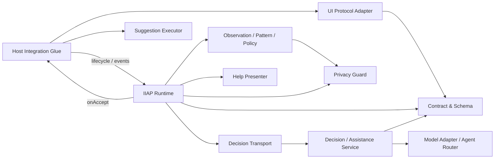
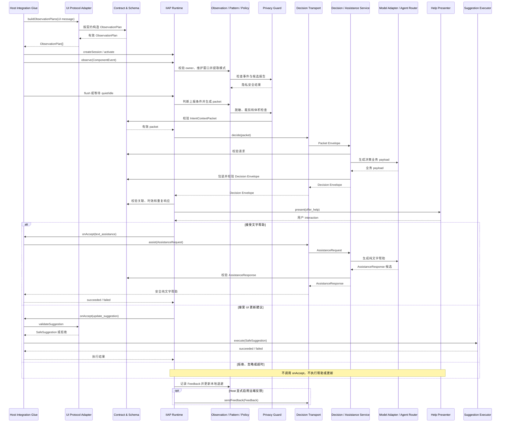

# 概述、架构与关键概念

最后更新：2026-08-06

## 1. 目的与产品边界

IIAP 是可插入结构化 UI 系统的智能交互帮助 SDK。宿主将 Renderer 中的交互归一化为不含原始输入的语义事件，IIAP 在端侧以确定性规则识别值得上报的行为模式，再由可替换的服务判断是否向用户提供文字帮助或受限的数据模型更新建议。

SDK 面向已经拥有或正在建设 A2UI/结构化 UI 能力的应用，不要求客户采用 JiuwenSwarm 的部署结构。同一 Core 支持两种交付方式：

- 已有 A2UI 系统只接入 IIAP 的 Runtime、Adapter 和服务接口；
- 尚未集成 A2UI 的系统使用 A2UI 与 IIAP 的便捷组合，但组合入口仍复用同一 IIAP Runtime。

IIAP 是宿主 Agent 的插件能力，不是独立产品人格，也不负责替代业务 Agent、业务校验或 A2UI 生成链路。

## 2. 核心设计原则

- **依赖单向**：Core 不依赖 A2UI、React、HTTP、SSE、模型 SDK或 JiuwenSwarm。
- **协议与部署可替换**：UI 协议差异由 `UIProtocolAdapter` 隔离；网络、模型、展示和执行分别由 Transport、Service/ModelAdapter、Presenter 和 Executor 隔离。
- **事实优先**：packet 保留脱敏事件事实和由事实支持的中性模式，不在端侧生成固定业务意图。
- **隐私最小化**：不采集原始输入、稳定哈希或当前 data model；裁剪和丢弃必须显式标记。
- **帮助非阻塞**：拒绝、忽略、超时、模型失败和不安全输出均不得阻塞业务流程。
- **执行默认拒绝**：更新建议只有在 Host 显式授权、服务端与客户端校验、用户明确接受后才能执行。
- **实例隔离**：Runtime、session、surface 和 Presenter 状态均由实例持有，不依赖模块级 singleton。

## 3. 关键概念

| 概念 | 定义 |
|---|---|
| `ObservationPlan` | 一个 session/message/surface 的可观察组件、语义能力、脱敏 surface 快照和安全更新目标。一个 plan 恰好属于一个 surface。 |
| `ComponentEvent` | Host Renderer 上报的语义事件，必须携带 message、surface instance 和 component owner。 |
| `ObservedEvent` | 当前观察窗口中经过脱敏、排序并带组件归属的交互事实。 |
| `BehaviorPattern` | 由事件引用支持的中性确定性索引，例如状态交替或连续校验失败；不是业务意图推断。 |
| `IntentContextPacket` | 发往 DecisionService 的隐私安全上下文，包含当前事实、最多三个历史报告、surface 定义和更新权限。 |
| `IIAPDecision` | `offer_help`、`no_intervention` 或 `defer` 的业务决策 payload。 |
| `AssistanceRequest` | 用户接受文字帮助后发起的独立请求；它不是用户聊天消息，也不是新的 IntentContextPacket。 |
| `Feedback` | 已展示建议的交互终态，以及 accepted 后的执行结果；默认只用于 session 内退避。 |
| focused surface | 当前获得自动 quiet/idle timer lease 的 surface；同一 session 同时最多一个。 |

公共函数、参数和使用责任见[SDK 模块、接口与数据结构开发参考](../sdk-integration/02-sdk-modules-capabilities-and-interfaces.md)，跨进程字段见[Wire 协议与数据契约](02-wire-protocol-and-data-contracts.md)，状态机、聚合和安全规则见[Runtime、观察、帮助与安全](03-runtime-observation-assistance-and-security.md)。

## 4. 模块与依赖方向

下图是 SDK 的内部职责分解，不等于客户必须逐模块接入。每个模块节点都与后续表格中的一行严格对应，连线表示调用或依赖方向；真正跨越客户系统边界的端口见[端到端架构、公共边界与系统插入点](../sdk-integration/01-end-to-end-architecture-and-boundaries.md)。

| 逻辑模块 | 稳定职责 | 对外级别 | 客户接触的入口 |
|---|---|---|---|
| Contract & Schema | 跨语言 wire 真源 | 支撑契约 | 跨进程、自定义服务或 CI 校验时使用；普通 Runtime 接入不直接调用 |
| IIAP Runtime | session/surface 生命周期、异步关联与端到端流程编排 | 典型接入 API | `createSession`、Session/Handle 生命周期方法 |
| Observation / Pattern / Policy | 维护事件窗口、提取中性模式、控制触发与退避 | SDK 内部 | 无独立入口；`observe`、`flush`、`focus`、`suspend` 实际属于 Runtime 返回的 Session/Handle |
| Privacy Guard | 禁止字段、体积和安全诊断 | SDK 内部；提供进阶 validator | Runtime/Service 强制执行；自定义边界可额外调用 `validatePrivacy` |
| Decision / Assistance Service | 构造请求级 prompt、路由模型并校验输出 | 典型服务端 API | `decide`、`assist` |
| Model Adapter / Agent Router | 把模型请求路由到业务 Agent、独立模型或宿主路由器 | 可替换 SPI | 客户实现 `generate_decision`、`generate_assistance`；Router 有默认组合能力 |
| UI Protocol Adapter | 从 UI message 构建观察计划并校验建议 | 默认实现或可替换 SPI | `buildObservationPlans`、`validateSuggestion` |
| Decision Transport | 客户端到服务端的调用边界 | 默认实现或可替换 SPI | `decide`、`assist`、可选 `sendFeedback` |
| Help Presenter | 展示 Offer 并返回用户 interaction | 默认实现或可替换 SPI | `present`、可选 `dismiss` |
| Suggestion Executor | 用户接受后执行已验证的数据更新 | 可选默认安全执行器 | SDK 校验执行流程；客户只提供实际 Store `apply` callback |
| Host Integration Glue | 连接会话、Renderer、Store、路由和日志 | 客户连接代码，不是 SDK 模块 | 调用稳定 API/SPI；v0.1 不定义统一 `attach/detach` |

这些名称表达职责边界，不代表独立发布包或同等公开等级。TypeScript v0.1 只有一个 npm 包，通过正式子入口组织默认 Adapter、Transport 和 Presenter；Python 提供独立的服务端参考包。事件聚合、策略、隐私流水线和反馈控制器由 Runtime 内部编排，客户不应直接依赖。

## 5. 端到端数据流

1. `Host Integration Glue` 接收结构化 UI message，并调用对应版本的 `UI Protocol Adapter`；`UI Protocol Adapter` 按 `Contract & Schema` 为每个 surface 生成独立 `ObservationPlan`。
2. `Host Integration Glue` 将 `ObservationPlan` 激活到 `IIAP Runtime`。`IIAP Runtime` 管理 session/surface 生命周期，并让最新或被用户直接操作的 surface 获得 focused timer lease。
3. `Host Integration Glue` 把 Renderer 产生且 owner 完整的语义事件交给 `IIAP Runtime`。`IIAP Runtime` 调用 `Observation / Pattern / Policy` 维护事件窗口和中性模式，并通过 `Privacy Guard` 在写入和上报前执行隐私约束。
4. quiet/idle 到期或 `Host Integration Glue` 显式请求 `flush()` 时，`Observation / Pattern / Policy` 判断是否达到上报门槛；`Privacy Guard` 裁剪并检查体积，`Contract & Schema` 校验后形成 `IntentContextPacket`。
5. `IIAP Runtime` 通过 `Decision Transport` 调用 `Decision / Assistance Service`。`Decision / Assistance Service` 校验请求、构造本轮 prompt，并通过 `Model Adapter / Agent Router` 获得模型业务 payload，随后按 `Contract & Schema` 包装和校验 Decision Envelope。
6. `Decision Transport` 把 Decision Envelope 返回 `IIAP Runtime`。`IIAP Runtime` 只接受仍与待处理 packet 和 surface 关联、未过期且未重复的响应；`offer_help` 交给 `Help Presenter`，其他结果结束本次请求。
7. `Help Presenter` 把用户 interaction 返回 `IIAP Runtime`。用户接受文字帮助时，`IIAP Runtime` 通过 `Host Integration Glue` 调用 `Decision Transport` 的 assistance 能力；用户接受更新建议时，`Host Integration Glue` 先调用 `UI Protocol Adapter` 二次校验，再调用 `Suggestion Executor`。
8. `IIAP Runtime` 将用户 interaction 和执行结果交给 `Observation / Pattern / Policy` 形成 Feedback 并更新本地退避；只有 `Host Integration Glue` 显式启用时，才通过 `Decision Transport` 远端上传。

### 5.1 端到端时序

下图使用与第 4 章完全相同的模块名称，展示一次观察上报、决策以及用户接受帮助后的两种执行分支。

## 6. 明确不支持的能力

IIAP v0.1.0 不负责：

- 生成业务 A2UI 或渲染通用组件；
- 自动执行 Button、submit、payment、action 或页面结构修改；
- 创建、删除 surface，或更新未在白名单中的数据；
- 采集原始字段值、原始文本、稳定哈希或构建跨用户画像；
- 提供统一 Host Adapter SPI、HarmonyOS/ArkTS 或 C++ 实现；
- 把 IIAP prompt 注入普通业务轮次或覆盖 Agent 人设。
