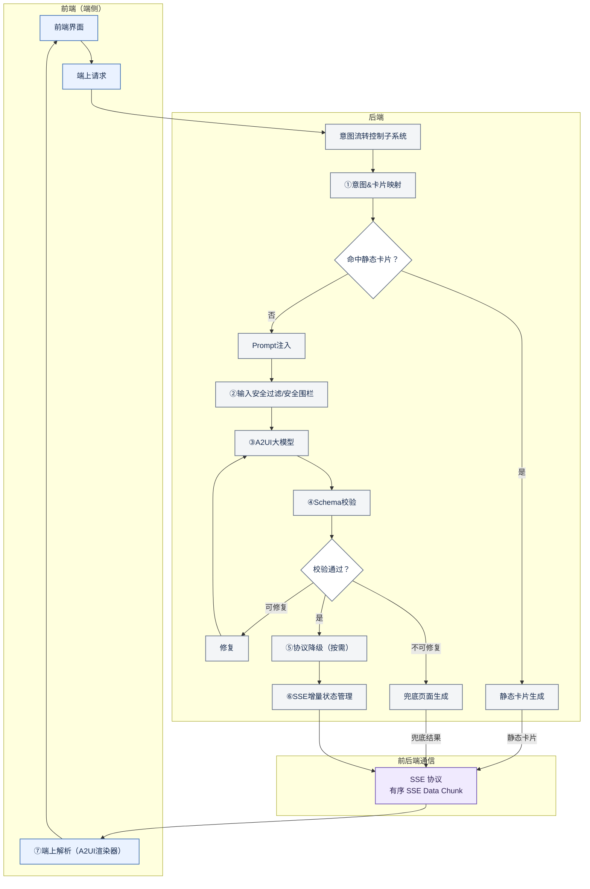
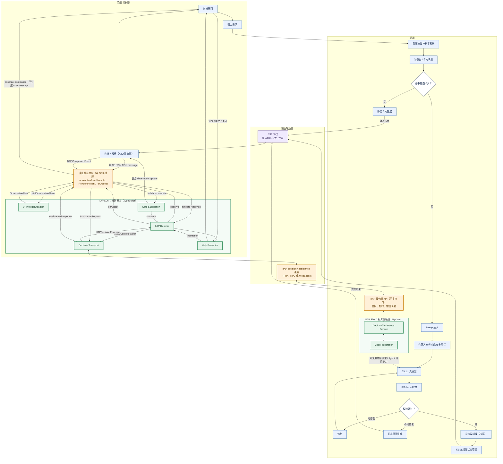
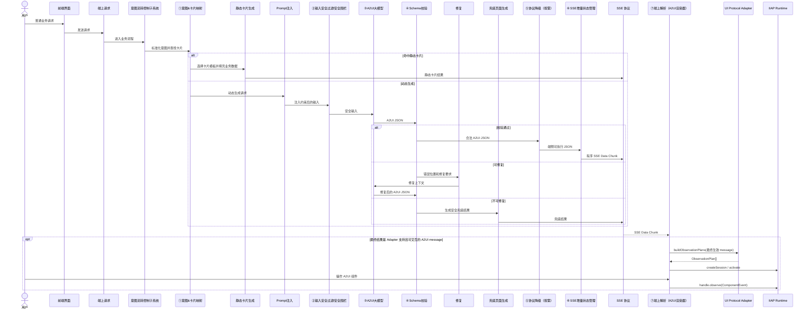
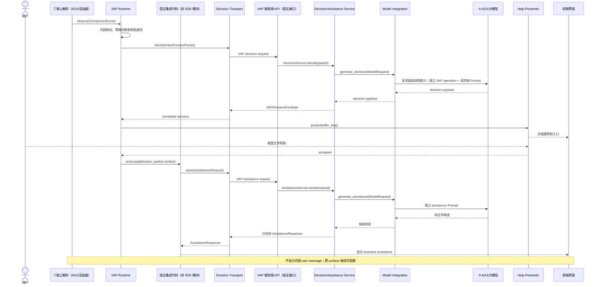
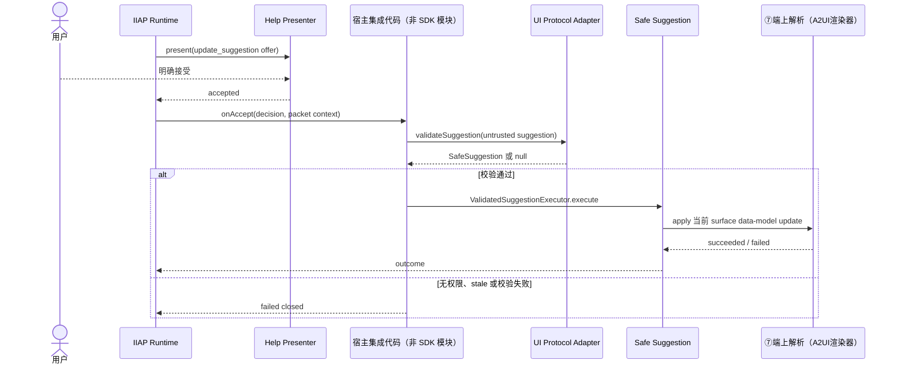

# 端到端架构、公共边界与系统插入点

最后更新：2026-09-18

## 1. 文档目标与命名规则

本文以一种典型的“后端生成 A2UI、通过 SSE 增量传输、端侧解析渲染”的系统为参考，说明如何在不重写原 A2UI 业务链路的前提下接入 IIAP。

本文严格区分两类名称：

- **参考系统模块**沿用其业务架构名称，例如“①意图&卡片映射”“⑥SSE增量状态管理”“⑦端上解析（A2UI渲染器）”；
- **IIAP SDK 模块**与[SDK 模块、接口与数据结构开发参考](02-sdk-modules-capabilities-and-interfaces.md)保持完全相同的名称：`IIAP Runtime`、`UI Protocol Adapter`、`Decision Transport`、`Help Presenter`、`Safe Suggestion`、`Decision/Assistance Service`、`Model Integration`。

“宿主集成代码”表示接入方需要编写的少量 glue code，不是 IIAP SDK 模块。Observation、Pattern、Policy、Privacy Pipeline 和 Feedback Controller 是 `IIAP Runtime` 内部实现，不在架构图中伪装成独立北向模块。

## 2. 参考系统原有 A2UI 链路

### 2.1 前后端边界

| 区域 | 原有模块 | 主要职责 |
|---|---|---|
| 前端（端侧） | 前端界面 | 接收用户操作，展示普通消息和 A2UI 控件 |
| 前端（端侧） | 端上请求 | 向后端发送用户请求，维护端侧请求关联 |
| 前端（端侧） | ⑦端上解析（A2UI渲染器） | 接收 SSE Data Chunk，维护端侧 A2UI 状态并渲染 UI |
| 前后端通信 | SSE 协议 | 把后端产生的有序 A2UI 分片流传到端侧 |
| 后端 | 意图流转控制子系统 | 根据业务域和用户请求选择业务流程 |
| 后端 | ①意图&卡片映射 | 把标准化业务意图映射到静态卡片模板；无法命中时进入动态生成 |
| 后端 | Prompt注入 | 为动态 A2UI 生成加入约束性 Prompt |
| 后端 | ②输入安全过滤/安全围栏 | 过滤 Prompt 注入、敏感数据泄露和危险输入 |
| 后端 | ③A2UI大模型 | 根据受控 Prompt 生成 A2UI JSON |
| 后端 | ④Schema校验+修复 | 校验结构、类型和必填项；可修复错误重新进入生成/校验 |
| 后端 | ⑤协议降级（按需） | 根据端侧能力裁剪或替换不可支持内容 |
| 后端 | ⑥SSE增量状态管理 | 给完整 JSON 建立序号并切分成可恢复的有序分片 |
| 后端 | 静态卡片生成 | 静态意图命中后生成预定义卡片 |
| 后端 | 兜底页面生成 | 动态生成无法通过时提供安全兜底内容 |

### 2.2 原链路及分支

IIAP 接入不能改变上述主链路：静态卡片、动态 A2UI 和兜底页面仍由原系统生成；安全过滤、Schema 校验、协议降级和 SSE 状态管理仍属于原系统。

## 3. 集成 IIAP 后的完整架构

### 3.1 前端、后端与 IIAP 模块总图

图中颜色表示模块归属：**蓝灰色**为原有系统模块，**绿色**为 IIAP SDK 提供的模块，**橙色**为接入 IIAP 时新增的宿主模块或通信端点，**紫色**为原有 A2UI 通信通道。菱形节点只是原链路的判断条件，不表示新增模块。

### 3.2 图中连接关系的关键约束

1. **观察最终结果，而不是生成草稿**：`UI Protocol Adapter` 只接收由⑦端上解析实际应用的最终 A2UI message。对动态生成分支而言，该消息已经经过④Schema校验、⑤协议降级和⑥SSE增量状态管理；不能观察③A2UI大模型的原始输出。
2. **Renderer 主动上报事件**：⑦端上解析（A2UI渲染器）在 change、validation、open、tab、media、scroll 等原事件入口构造脱敏 `ComponentEvent`；`IIAP Runtime` 不抓 DOM。
3. **A2UI SSE 与 IIAP Transport 是不同语义通道**：原 SSE 协议继续传递 A2UI Data Chunk；`Decision Transport` 传递 packet、decision 和 assistance。物理上可以复用同一网络连接，但 wire type、请求关联和错误处理必须隔离。
4. **模型能力可以复用，生成轮次不能混用**：`Model Integration` 可以连接③A2UI大模型背后的模型/Agent 调用能力，但必须使用 IIAP 请求级 Prompt 和 IIAP 输出校验；不能把普通 A2UI 生成 Prompt 注入 decision/assistance 轮次。
5. **IIAP 不回写 A2UI 生成链路**：文字帮助直接作为 assistant assistance 展示；UI 更新只通过 `Safe Suggestion` 写入当前端侧 data model，不返回③A2UI大模型重新生成 surface。
6. **静态卡片是否可观察取决于最终协议**：如果静态卡片最终被转换为 Adapter 支持的 A2UI message，按相同方式观察；如果只是非 A2UI 原生页面，则不进入 IIAP v0.1 观察范围。

## 4. IIAP 模块名称一致性核对

下表是本文架构图与 SDK 定义的名称真源。图、表和后续时序图不得使用近似但不同的名称代替。

| 图中规范名称 | SDK 文档中的同名模块 | 主要公共 API | 部署参考 | 当前交付状态 |
|---|---|---|---|---|
| `IIAP Runtime` | [IIAP Runtime 模块](02-sdk-modules-capabilities-and-interfaces.md#2-iiap-runtime-模块) | `createIIAPRuntime`、`IIAPSession`、`ObservationHandle` | 前端/端侧，TypeScript | 已实现 |
| `UI Protocol Adapter` | [UI Protocol Adapter 模块](02-sdk-modules-capabilities-and-interfaces.md#3-ui-protocol-adapter-模块) | `buildObservationPlans`、`validateSuggestion` | 前端/端侧，TypeScript | v0.8 已验证；v0.9.1 无公共 Adapter |
| `Decision Transport` | [Decision Transport 模块](02-sdk-modules-capabilities-and-interfaces.md#4-decision-transport-模块) | `decide`、`assist`、可选 `sendFeedback` | 前端/端侧，TypeScript | HTTP 默认实现已提供 |
| `Help Presenter` | [Help Presenter 模块](02-sdk-modules-capabilities-and-interfaces.md#5-help-presenter-模块) | `present`、可选 `dismiss` | 前端/端侧，TypeScript；默认 React | 已实现 |
| `Safe Suggestion` | [Safe Suggestion 模块](02-sdk-modules-capabilities-and-interfaces.md#6-safe-suggestion-模块) | `SuggestionPolicy`、`validateDataModelSuggestion`、`ValidatedSuggestionExecutor` | 前端/端侧，TypeScript | 可选能力，已实现安全执行骨架 |
| `Decision/Assistance Service` | [Decision/Assistance Service 模块](02-sdk-modules-capabilities-and-interfaces.md#7-decisionassistance-service-模块) | `DecisionService.decide`、`AssistanceService.assist` | 后端，Python | 已实现 |
| `Model Integration` | [Model Integration 模块](02-sdk-modules-capabilities-and-interfaces.md#8-model-integration-模块) | `ModelAdapter`、`AgentRouter` | 后端，Python | Adapter 由接入方实现；Router 已提供 |

以下名称只表示类、接口或宿主职责，不作为另一套 SDK 模块名：

- `IIAPRuntime`、`IIAPSession`、`ObservationHandle` 是 `IIAP Runtime` 的公共类型；
- `A2UIV08Adapter` 是 `UI Protocol Adapter` 的默认实现；
- `HTTPDecisionTransport` 是 `Decision Transport` 的默认实现；
- `ReactHelpPresenter` 是 `Help Presenter` 的默认实现；
- `ValidatedSuggestionExecutor` 是 `Safe Suggestion` 的执行组件；
- `DecisionService`、`AssistanceService` 是 `Decision/Assistance Service` 的公共类；
- `ModelAdapter`、`AgentRouter` 属于 `Model Integration`；
- “宿主集成代码”“IIAP 服务端 API”属于接入方，不属于 SDK。

## 5. 原有模块如何接入 IIAP

| 原有模块 | 保持不变的职责 | 接入 IIAP 后新增动作 | 对接的 IIAP 模块 | 是否改造原核心逻辑 |
|---|---|---|---|---|
| 前端界面 | 展示聊天消息和 A2UI 控件 | 挂载帮助入口；展示纯文字 assistant assistance | `Help Presenter` | 否 |
| 端上请求 | 发送普通业务请求 | 可为 IIAP 请求复用鉴权、trace 和物理连接 | `Decision Transport` | 否，wire 语义必须隔离 |
| ⑦端上解析（A2UI渲染器） | 解析 SSE 分片、维护状态并渲染 | 传递最终 message、surface 生命周期和脱敏 Renderer 事件；按需应用安全更新 | `UI Protocol Adapter`、`IIAP Runtime`、`Safe Suggestion` | 增加事件/lifecycle hook，不替换解析器 |
| ⑥SSE增量状态管理 | 切分、排序和恢复 A2UI 分片 | 无强制改造；IIAP 不应观察未完成分片 | 无直接 SDK 调用 | 否 |
| ⑤协议降级（按需） | 按端侧能力降级 | 保持原行为；Adapter 观察降级后的最终形态 | 间接影响 `UI Protocol Adapter` | 否 |
| ④Schema校验+修复 | 保证 A2UI 合法 | 保持原行为；不能由 IIAP validator 替代 | 无直接 SDK 调用 | 否 |
| ③A2UI大模型 | 生成业务 A2UI | 可由 `Model Integration` 复用其底层模型调用能力，但使用独立 IIAP operation/Prompt | `Model Integration` | 增加独立路由，不混用生成轮次 |
| ②输入安全过滤/安全围栏 | 保护普通 A2UI 生成输入 | 保留；IIAP Service 另执行 packet 隐私和模型输出校验 | `Decision/Assistance Service` | 否，两侧安全职责叠加 |
| Prompt注入 | 约束 A2UI 生成 | 保持只服务于普通 A2UI 生成；IIAP Prompt 由 Service 按请求构造 | `Decision/Assistance Service` | 不把两类 Prompt 合并 |
| ①意图&卡片映射 | 决定静态/动态卡片路径 | 无直接改造；最终是支持的 A2UI 才进入观察 | 无直接 SDK 调用 | 否 |
| 意图流转控制子系统 | 业务域路由 | 保持原有业务路由；可为 IIAP API 分配独立 operation | `Model Integration` | 仅按需增加 IIAP 路由 |

## 6. 端到端时序

### 6.1 正常 A2UI 生成与观察建立

### 6.2 IIAP 决策与文字帮助

### 6.3 可选的 UI 更新帮助

## 7. 公共接口边界

| 级别 | IIAP 模块/API | 接入方是否必须感知 | 说明 |
|---|---|---|---|
| 典型接入 API | `IIAP Runtime`、`Decision/Assistance Service` | 是 | UI 侧和服务侧根入口 |
| 默认实现 | `A2UIV08Adapter`、`HTTPDecisionTransport`、`ReactHelpPresenter` | 满足 A2UI v0.8 + HTTP + React 时直接使用 | 不需要重复实现 |
| 可替换 SPI | `UI Protocol Adapter`、`Decision Transport`、`Help Presenter`、`ModelAdapter` | 默认实现不适用时 | 分别适配协议、网络、UI 和模型基础设施 |
| 可选能力 | `Safe Suggestion` | 只在开放 UI 更新时 | 文字帮助不依赖它 |
| 进阶/测试 | validator、envelope helper、manual clock | 普通接入不需要 | 自定义边界和测试使用 |
| SDK 内部 | Observation、Pattern、Policy、Privacy、Feedback、Prompt builder | 否 | 不 deep import，不复制状态机 |

## 8. 生命周期与完成标准

### 8.1 生命周期

- 一个应用 conversation 对应一个 `IIAPSession`；会话真正结束时释放。
- 会话历史可保留多个可交互 surface；最新 surface 默认 focused，只有 focused surface 使用自动 quiet/idle 触发。
- 用户操作已注册的历史 surface 时，`IIAP Runtime` 把焦点转移到该 surface。
- 真实用户输入或显式业务 action 调用 `suspend()`；IIAP 自身 assistance turn 不调用。
- ⑦端上解析删除或替换 surface 时，释放对应 Handle；迟到 response 不得作用于新 surface。

### 8.2 接入完成标准

- 关闭 IIAP 时，原有①～⑦ A2UI 链路、静态分支和兜底分支行为不变；
- `UI Protocol Adapter` 观察的是⑦端上解析实际应用的最终消息，不是③A2UI大模型草稿或 SSE 半包；
- Renderer 事件能定位到正确 message/surface/component owner；
- `Decision Transport` 与原 A2UI SSE wire 语义隔离；
- `Decision/Assistance Service` 通过 `Model Integration` 调用独立 IIAP operation，不污染普通 A2UI Prompt；
- 内部 assistance request 不显示为 user message，IIAP assistance 不终止原 surface；
- UI 更新默认关闭；开启后经过用户接受、Adapter 复验和 `Safe Suggestion` 执行；
- 所有 IIAP 模块名称与第 4 章、SDK API 参考和源码导出保持一致；
- IIAP 任一异常失败关闭，不阻断原业务和 A2UI 主链路。

具体函数、参数和实现责任见[SDK 模块、接口与数据结构开发参考](02-sdk-modules-capabilities-and-interfaces.md)，实施步骤见[分步接入](03-step-by-step-integration.md)。
