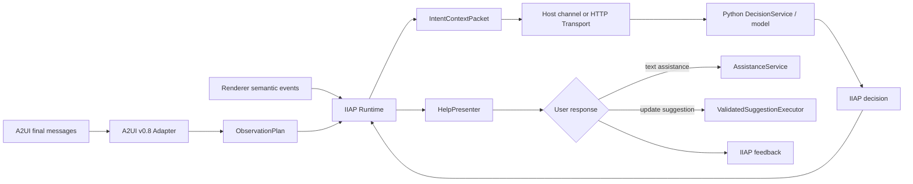

# IIAP SDK 结构、设计与文件职责

最后更新：2026-09-21

本文面向第一次阅读 IIAP（Implicit Intent Aware Protocol，隐式意图感知协议）源码的开发者，说明 SDK 的整体设计、模块依赖、运行时数据流，以及仓库中每个受版本控制文件的职责。

本文描述当前 `0.1.0-rc.1` 源码候选。协议字段以 `contracts/schemas/` 为准，公共接口以 [API 参考](api-reference.md)和实际发布制品为准，本文不重复定义协议。

## 1. 先理解 SDK 做什么

IIAP 的核心流程可以概括为：

1. Adapter 读取已经完成校验的 A2UI final message，生成单 surface 的 `ObservationPlan`；
2. Host/Renderer 把本地组件交互转换成不含原始值的 `ComponentEvent`；
3. Runtime 聚合事件，在达到阈值后生成 `IntentContextPacket`；
4. 后端校验 packet，调用模型判断是否提供帮助，并返回相关联的 decision；
5. Presenter 非阻塞地展示建议；
6. 用户接受文字帮助时请求 assistance，接受更新建议时按原 packet 白名单再次校验并原子应用；
7. 用户的接受、关闭、拒绝、超时及执行结果形成 feedback。



SDK 不负责真实 A2UI 渲染、业务 WebSocket、聊天历史、模型账号配置或业务 action。这些属于 Host。SDK 也不会自动提交表单、支付、下单或执行 action。

## 2. 目录结构与依赖方向

```text
IIAP/
├── contracts/                 跨语言 wire Schema 与 canonical fixtures
├── implementations/
│   ├── typescript/            浏览器/Node Runtime 与 npm 发布工程
│   └── python/                模型侧 Service、prompt 与校验
├── adapters/a2ui-v0.8/        A2UI v0.8 → IIAP ObservationPlan
├── transports/http/           默认 HTTP 客户端
├── presenters/react/          可选 React 非阻塞帮助卡
├── examples/                  无凭据的本地接入示例
├── tests/                     测试层次与执行入口说明
├── scripts/                   契约、文档和发布制品检查
└── docs/                      中英文使用与设计文档
```

TypeScript 依赖方向：

```text
Host
 ├─> @openjiuwen/iiap                Core
 ├─> @openjiuwen/iiap/a2ui-v08      Adapter ─> Core types/validators
 ├─> @openjiuwen/iiap/decision      Decision parser ─> Core
 ├─> @openjiuwen/iiap/http          HTTP ─> Decision parser + Core
 └─> @openjiuwen/iiap/react         Presenter ─> Core ports
```

Python 包不依赖 TypeScript 包。两端通过 JSON Schema、fixtures 和一致的校验语义对齐。`implementations/python/src/iiap/schemas/intent-context-packet.schema.json` 是进入 wheel 的发布副本，`scripts/check_contracts.py` 保证它与 canonical Schema 相同。

## 3. 功能模块速览

| 功能 | 主要文件 | 责任边界 |
|---|---|---|
| Wire contract | `contracts/schemas/*.json` | 定义 packet、decision、assistance、feedback 的跨语言形状 |
| A2UI 解析 | `adapters/a2ui-v0.8/src/index.ts` | 解析 final messages、建立 surface/组件观察计划、脱敏 UI 定义 |
| 本地感知 | `core/src/runtime.ts`、`aggregation.ts` | 接收语义事件、聚合行为模式、控制 timer/阈值/历史 |
| 隐私保护 | `core/src/privacy.ts`、Python `privacy.py` | 禁止敏感字段、非有限数、循环值和超限数据 |
| 决策 | `decision-client/src/index.ts`、Python `validation.py` | 解析模型输出、规范化 decision、非法结果 fail closed |
| 模型服务 | Python `services.py`、`prompts.py` | packet 校验、prompt 构造、ModelAdapter 调用、envelope 封装 |
| UI 建议执行 | `core/src/suggestion.ts`、`executor.ts` | 接受时按 surface/path/value 白名单复验并原子执行 |
| 文字帮助 | `core/src/assistance.ts`、Python `assistance.py` | 拒绝空内容、超长内容和 A2UI 内部消息 |
| 展示 | `presenters/react/src/index.tsx` | 默认 React 卡片、TTL、接受/关闭/拒绝反馈 |
| 网络 | `transports/http/src/index.ts` | `/decision`、`/assistance`、`/feedback` HTTP 调用和稳定错误 |
| 发布验证 | `scripts/check_packages.mjs` | 对真实 npm tarball/Python wheel 做 clean-install smoke |

## 4. 根目录文件

以下路径均相对于 `IIAP/`。

| 文件 | 作用 | 相关功能 |
|---|---|---|
| `.gitignore` | 排除 `node_modules`、`dist`、`build`、虚拟环境和测试缓存等生成物 | 仓库卫生 |
| `README.md` | 英文项目入口，概述能力、模块、快速运行、示例和测试 | 开源入口 |
| `README_zh.md` | 中文项目入口 | 开源入口 |
| `VERSION` | SDK 源码候选版本的单一文本标识 | 发布版本 |
| `CHANGELOG.md` | 记录版本能力、兼容范围和重要变更 | 版本演进 |
| `LICENSE` | SDK 根目录 Apache-2.0 许可证 | 开源合规 |
| `THIRD_PARTY_DEPENDENCIES.md` | TypeScript/Python 直接依赖、用途和发布形态清单 | 第三方合规 |
| `package.json` | 顶层 npm workspace 与统一 build/test/contracts/docs/package-smoke/demo 命令 | 构建编排 |
| `package-lock.json` | 固定 Node 开发和构建依赖版本；不是运行时算法代码 | 可重复构建 |

## 5. Wire contracts

### 5.1 Schema

| 文件 | 定义内容 | 关键约束 |
|---|---|---|
| `contracts/schemas/intent-context-packet.schema.json` | `IntentContextPacket` | owner、surface context、事件、pattern、三轮历史、更新白名单、可选测试场景 |
| `contracts/schemas/packet-envelope.schema.json` | `iiap.intent_context_packet` 外层 envelope | 固定 type/version 并引用 packet Schema |
| `contracts/schemas/decision.schema.json` | 服务端 decision envelope | 三类 decision 组合互斥；文字帮助必须有 topic；更新帮助必须有 suggestion |
| `contracts/schemas/assistance.schema.json` | assistance request/response | request 带完整关联 ID；response 按 requestId 关联且正文限长 |
| `contracts/schemas/feedback.schema.json` | 用户 interaction 和执行 outcome | accepted 必须带 outcome；非 accepted 不得带 outcome |

Schema 使用 `additionalProperties: false` 限制未知字段。修改任何 wire 字段时，必须同时更新类型、Python 校验、fixtures 和跨语言测试。

### 5.2 Canonical fixtures

| 文件 | 作用 |
|---|---|
| `contracts/fixtures/packet.valid.json` | 合法 packet 最小样例，也是多项校验测试的基础输入 |
| `contracts/fixtures/packet-envelope.valid.json` | 合法 packet envelope 样例 |
| `contracts/fixtures/decision.valid.json` | 合法文字帮助 decision 样例 |
| `contracts/fixtures/assistance-request.valid.json` | 合法 assistance request 样例 |
| `contracts/fixtures/assistance-response.valid.json` | 合法 assistance response 样例 |
| `contracts/fixtures/feedback.valid.json` | 合法 feedback 样例 |
| `contracts/fixtures/assistance-text-validation.corpus.json` | TypeScript/Python 共用的帮助正文安全语料，防止两端规则漂移 |

`contracts/generated/README.md` 说明 generated 目录的定位。当前不提交自动生成源码；构建产物进入被忽略的 `build/` 或 `dist/`。

## 6. TypeScript Core

Core 源码位于 `implementations/typescript/packages/core/src/`，由 npm 根入口 `@openjiuwen/iiap` 发布。

| 文件 | 主要职责 | 与其他文件的关系 |
|---|---|---|
| `index.ts` | 选择性导出稳定根 API 和公共类型 | npm 根入口；控制公共 API 面，不应随意导出内部 helper |
| `types.ts` | 定义 packet、decision、feedback、event、plan、Runtime/Session/Adapter/Transport/Presenter 等 TypeScript 契约 | 几乎所有 TS 模块依赖；需与 JSON Schema 对齐 |
| `runtime.ts` | SDK 的状态编排中心：session/surface 生命周期、focus、quiet/idle timer、事件窗口、packet、pending decision、stale/duplicate、Presenter 和 feedback | 调用 aggregation、privacy、policy、feedback；通过 ports 连接 Host/Transport/Presenter |
| `aggregation.ts` | 按组件 capability 把事件序列聚合为中性 `BehaviorPattern` | Runtime flush 时调用；不推断业务意图 |
| `policy.ts` | 默认 quiet/idle、报告次数、事件上限、历史长度、反馈退避和各 capability 阈值 | Runtime 初始化时合并 Host overrides |
| `privacy.ts` | 检查禁止字段、非有限数字、循环/不可序列化数据及 UTF-8 字节大小 | Runtime 发 packet 前调用；也向 Host 提供公共校验 |
| `suggestion.ts` | 校验 canonical data-model update 的接受状态、owner、surface/path/value、单多选形状、去重和批次数 | Decision parser 和 Executor 共用的安全规则 |
| `executor.ts` | `ValidatedSuggestionExecutor`：执行前再次校验 suggestion，并且只调用一次 Host 原子 batch callback | update suggestion 的最终执行边界 |
| `assistance.ts` | 校验文字帮助非空、长度不超限、不包含 A2UI tag/内部 message key | HTTP Transport 和 Host 可复用 |
| `model-output.ts` | 从裸 JSON、fenced JSON 或带说明文字的模型输出中结构化恢复对象，并提供不含正文的诊断分类 | Decision parser 使用；不能把任意文本猜成 decision |
| `feedback.ts` | 依据 accepted/dismissed/rejected/ignored/timed_out/execution_failed 更新退避截止时间 | 每个 Session 持有独立实例 |
| `errors.ts` | `IIAPError` 和稳定错误码 | HTTP、suggestion executor 等公共失败路径 |
| `clock.ts` | 系统时钟和确定性手工时钟 | Runtime timer 抽象；测试不依赖真实时间等待 |
| `testing.ts` | 只重导出 `createManualClock` | npm `/testing` 子入口，避免测试工具进入根入口 |

### 6.1 Runtime 的关键对象

| 对象 | 生命周期与责任 |
|---|---|
| `IIAPRuntime` | 一个应用级实例；创建 session，最终统一 dispose |
| `IIAPSession` | 一个业务 session；管理多个历史 surface，但只有一个 focused surface 拥有自动 timer |
| `ObservationHandle` | 一个 surface plan 的句柄；接收事件、手工 flush、单独 deactivate |
| `ObservationPlan` | Adapter 输出的单 surface 静态观察定义，不保存运行时事件 |
| `IntentContextPacket` | 达到本地阈值后生成的一次脱敏报告 |

Runtime 支持三种配置形态：Host 托管 `onPacket`、SDK 托管 `transport`、或无发送器的 packet-only 模式。`onPacket` 与 `transport` 互斥。

## 7. TypeScript 可选模块

### 7.1 A2UI v0.8 Adapter

| 文件 | 作用 |
|---|---|
| `adapters/a2ui-v0.8/src/index.ts` | 顺序处理 A2UI v0.8 lifecycle message；维护 surface/component/action；删除 surface 时清理旧状态；只保留可达组件；生成脱敏 definition；映射组件 capability；通过 Host `SuggestionPolicy` 生成有限 update target；把安全 canonical update 编码回 A2UI data-model message |

该文件是 npm `/a2ui-v08` 子入口。当前没有官方 v0.9.1 Adapter；`ProtocolVersion` 中保留 `0.9.1` 不代表默认支持。

### 7.2 Decision Client

| 文件 | 作用 |
|---|---|
| `implementations/typescript/packages/decision-client/src/index.ts` | 把模型或服务端返回解析为 canonical decision；推导 Host-owned `uiStyle`；校验 update suggestion；非法结果退化为 `no_intervention`；校验 envelope 与原 packet 的关联 |

该文件发布为 npm `/decision` 子入口，并被默认 HTTP Transport 使用。

### 7.3 HTTP Transport

| 文件 | 作用 |
|---|---|
| `transports/http/src/index.ts` | 实现 `/decision`、`/assistance`、`/feedback` POST；支持 headers、自定义 fetch 和 timeout；把网络、HTTP、超时和非法输出映射为稳定错误 |

该文件发布为 npm `/http` 子入口。认证、服务端路由和部署策略仍由 Host 决定。

### 7.4 React Presenter

| 文件 | 作用 |
|---|---|
| `presenters/react/src/index.tsx` | `ReactHelpPresenter` 管理当前 offer、替换旧卡、TTL 和 Promise feedback；`IIAPHelpHost` 渲染最小非阻塞卡片，并提供接受/关闭/拒绝交互 |

该文件发布为 npm `/react` 子入口。它不渲染 A2UI 表单，只渲染 IIAP 帮助建议。

## 8. TypeScript 构建与测试文件

| 文件 | 作用 |
|---|---|
| `implementations/typescript/package.json` | TypeScript 子工作区的 build/test 命令与开发依赖 |
| `implementations/typescript/tsconfig.json` | 编译全部 TS 源码、Adapter、Transport、Presenter、示例和测试到统一临时 `dist` |
| `implementations/typescript/packages/core/package.json` | 实际 npm 制品元数据、exports、peer dependency 和发布文件白名单 |
| `implementations/typescript/packages/core/README.md` | 随 npm tarball 发布的简短包说明 |
| `implementations/typescript/scripts/clean-dist.mjs` | 编译前删除统一临时输出，防止已删除源码留下“幽灵” JavaScript/测试 |
| `implementations/typescript/scripts/build-artifacts.mjs` | 把统一编译结果整理到 npm package `dist`，复制各 subpath 和 LICENSE |
| `implementations/typescript/tests/core.test.ts` | Core、Adapter、Decision、HTTP、隐私、suggestion、owner、timer、history、feedback 等主测试集 |
| `implementations/typescript/tests/react-presenter.test.ts` | Presenter 实例隔离、旧 offer、dismiss、TTL 和边界值测试 |
| `implementations/typescript/tests/public-api.test.ts` | 从源码和构建制品核对根导出、subpath 导出与禁止导出 |
| `implementations/typescript/tests/fixtures/public-api.snapshot.json` | 冻结 npm 根值、根类型和 exports 子路径，防止无意扩大或破坏公共 API |

`dist/`、`packages/core/dist/` 和顶层 `build/` 都是生成目录，不受 git 跟踪。

## 9. Python 包

Python 源码位于 `implementations/python/src/iiap/`，发布包名为 `openjiuwen-iiap`，导入名为 `iiap`。

| 文件 | 主要职责 | 相关功能 |
|---|---|---|
| `__init__.py` | 汇总 Python 根入口的公开 Service、Model port、prompt 和 validator | 公共 API |
| `models.py` | 定义 `ModelRequest`、异步 `ModelAdapter` Protocol 和可选 `AgentRouter` | 模型适配 |
| `services.py` | `DecisionService` 先校验 packet/隐私再调用模型并封装 decision；`AssistanceService` 校验请求、模型响应和帮助正文 | 服务端主入口 |
| `prompts.py` | 构造中英文 decision prompt、production/test 差异和结构化 assistance prompt | 模型输入契约 |
| `packet.py` | 从 wheel 资源加载 canonical packet Schema 并执行 Draft 2020-12 校验；失败只暴露稳定 `INVALID_PACKET` | packet 边界 |
| `validation.py` | 恢复模型 JSON、分类拒绝原因、规范化 decision、推导 topic/style、校验安全 update、创建相关联 envelope | decision 安全边界 |
| `a2ui_v08.py` | 在 canonical update 和 A2UI v0.8 data-model message 之间转换，并复用 decision 校验 | v0.8 服务端兼容 |
| `privacy.py` | Python 侧禁止字段、JSON 可序列化、有限数和字节大小检查 | 隐私保护 |
| `assistance.py` | Python 侧文字帮助安全校验；规则与共享 corpus 对齐 | assistance 安全 |
| `schemas/__init__.py` | 将 `schemas` 标记为可通过 `importlib.resources` 读取的包资源 | wheel 资源 |
| `schemas/intent-context-packet.schema.json` | packet Schema 的 wheel 内置副本，使安装后的包可离线校验 | 发布制品 |

### 9.1 Python 工程与测试

| 文件 | 作用 |
|---|---|
| `implementations/python/pyproject.toml` | wheel 元数据、Python 版本、依赖、可选测试依赖和项目链接 |
| `implementations/python/uv.lock` | 固定 Python 构建和测试依赖版本 |
| `implementations/python/README.md` | 随 wheel/sdist 发布的包说明 |
| `implementations/python/LICENSE` | 进入 Python 制品的 Apache-2.0 许可证副本 |
| `implementations/python/tests/test_services.py` | 覆盖 Service、Router、Schema、隐私、decision、assistance、A2UI v0.8 update 和诊断分类 |

## 10. Examples

| 文件 | 作用 | 是否产生真实 UI |
|---|---|---|
| `examples/README.md` | 英文示例总览、环境、命令和预期输出 | — |
| `examples/README_zh.md` | 中文示例总览 | — |
| `examples/typescript/complete-v08.ts` | 内存构造 A2UI messages，模拟事件、Transport、Presenter 接受、assistance 和安全更新 | 否，只输出终端日志 |
| `examples/typescript/minimal.ts` | 最小 Adapter/Runtime 创建、激活和释放片段 | 否 |
| `examples/python/complete_service.py` | 使用 deterministic ModelAdapter 跑通 DecisionService 与 AssistanceService | 否，只输出 envelope |
| `examples/python/minimal.py` | 展示 Host 如何把 model adapter 和 packet 交给 DecisionService | 否，不是独立程序 |
| `examples/browser/index.html` | Vite 浏览器 Demo 的 HTML 入口和挂载节点 | 是，仅 IIAP 卡片 |
| `examples/browser/src/main.tsx` | 创建 ReactHelpPresenter，依次演示接受和关闭反馈 | 是，但不含真实 A2UI Renderer/模型 |

完整示例刻意使用内存 fake，因此不依赖 JiuwenSwarm、模型凭据或外部服务。要验证真实 A2UI UI、DOM 事件、WebSocket 和模型，需要 Host 集成工程。

## 11. 检查和发布脚本

| 文件 | 作用 |
|---|---|
| `scripts/check_contracts.py` | 校验六个 canonical fixture、负向 Schema 约束、跨文件枚举一致性；可用 `--packet` 校验真实抓取 packet |
| `scripts/check_docs.py` | 检查 `docs/` 下中英文 Markdown 的更新日期和本地链接 |
| `scripts/check_packages.mjs` | 构建并打包 npm tarball/Python wheel，在全新临时消费者中安装、导入并检查文件清单 |

这些脚本是发布门的一部分，不进入 SDK 运行时。

## 12. 顶层测试说明

| 文件 | 作用 |
|---|---|
| `tests/conformance/README.md` | 说明 Schema/fixture/跨语言一致性测试在哪里、如何运行、覆盖什么 |
| `tests/integration/README.md` | 说明 Runtime、HTTP、React、Python Service、示例和 Host 浏览器验收的分层边界 |

实际可执行测试靠近各语言实现存放，顶层目录只提供发现入口，避免复制第二套测试代码。

## 13. 文档文件

### 13.1 中文

| 文件 | 作用 |
|---|---|
| `docs/zh/README.md` | 中文文档门户、模块摘要和权威入口 |
| `docs/zh/quickstart.md` | 构建、最小示例、Runtime 模式、观察、更新和 Python 接入 |
| `docs/zh/api-reference.md` | TypeScript/Python 稳定公共接口索引 |
| `docs/zh/protocol-and-security.md` | 数据流、packet、pattern、owner、suggestion、assistance 与安全边界 |
| `docs/zh/testing-and-compatibility.md` | 支持版本、测试命令、覆盖范围、发布门和 Host 验收项 |
| `docs/zh/sdk-structure-and-file-guide.md` | 本文；解释目录、设计、依赖和逐文件职责，不重新定义 API |
| `docs/zh/documentation-maintenance.md` | 文档权威归属、同步规则、过期治理和变更检查清单；属于维护规则而非产品说明 |

### 13.2 English

| 文件 | 作用 |
|---|---|
| `docs/en/README.md` | English documentation portal |
| `docs/en/quickstart.md` | Build and first integration path |
| `docs/en/api-overview.md` | Public package/subpath overview |
| `docs/en/compatibility-and-security.md` | Supported protocol and security boundaries |
| `docs/en/testing-and-release.md` | Verification and release gates |

中文文档提供完整设计与接入细节；英文文档保持关键入口和发布信息，不复制第二套算法定义。

## 14. 一次请求如何穿过这些文件

以一次 A2UI 多选交互触发文字帮助为例：

1. `adapters/a2ui-v0.8/src/index.ts` 解析 `MultipleChoice`，创建 component observation 和脱敏 surface context；
2. Host 把 Renderer change 转成 `ComponentEvent`，交给 `runtime.ts`；
3. `aggregation.ts` 根据 `policy.ts` 的阈值判断是否形成 `selection_reversal`；
4. `privacy.ts` 检查 packet，`runtime.ts` 通过 `onPacket` 或 Transport 发出；
5. Python `packet.py` 按 Schema 校验，`services.py` 使用 `prompts.py` 构造模型请求；
6. Python `validation.py` 把模型结果规范化并封装为相关联 decision；
7. TypeScript `/decision` 或 Runtime 校验 owner 和 stale 状态；
8. `presenters/react/src/index.tsx` 或 Host Presenter 展示建议；
9. 用户接受后，Host 调用 assistance；两端 `assistance.ts/.py` 检查正文；
10. Runtime 用 `feedback.ts` 更新退避，并按配置通过 Transport 上传 feedback。

如果 decision 是 `update_suggestion`，第 9 步改为由 `suggestion.ts`/`executor.ts` 按原 packet 白名单复验，再交给 Host 原子应用。

## 15. 修改某项能力时应看哪些文件

| 修改目标 | 首先检查 | 必须同步检查 |
|---|---|---|
| 新增/修改 wire 字段 | `contracts/schemas/` | `types.ts`、Python validator、fixtures、`check_contracts.py`、协议文档 |
| 调整本地触发阈值 | `policy.ts` | `aggregation.ts`、Runtime tests、Host production/test profiles |
| 新增组件观察能力 | A2UI Adapter | `types.ts` capability/event、aggregation、DOM bridge、测试 |
| 修改 packet 内容 | `runtime.ts` | Schema、privacy、Python packet/prompt、fixtures |
| 修改 decision | Schema、TS/Python validation | Runtime envelope validation、Presenter、Host 转换、测试 |
| 修改 update suggestion | `suggestion.ts`、Python `validation.py` | Adapter encoding、Executor、Schema、跨语言测试 |
| 修改文字帮助 | assistance Schema、两端 assistance validator | Service/HTTP、共享 corpus、Host history/display |
| 修改 npm 公共 API | `core/src/index.ts`、subpath source | package exports、public API snapshot、tarball smoke、API 文档 |
| 修改 Python 公共 API | `iiap/__init__.py` | Python README、wheel smoke、API 文档 |
| 修改发布文件 | package metadata/build scripts | `check_packages.mjs`、THIRD_PARTY、VERSION/CHANGELOG |

## 16. 验证入口

在 `IIAP/` 目录执行：

```bash
npm test
uv run --project implementations/python pytest implementations/python/tests -q
uv run --with jsonschema python scripts/check_contracts.py
uv run python scripts/check_docs.py
npm run packages:smoke
npm run demo:build
```

各命令的证明范围和仍需 Host 验收的项目见[测试与兼容性](testing-and-compatibility.md)。
